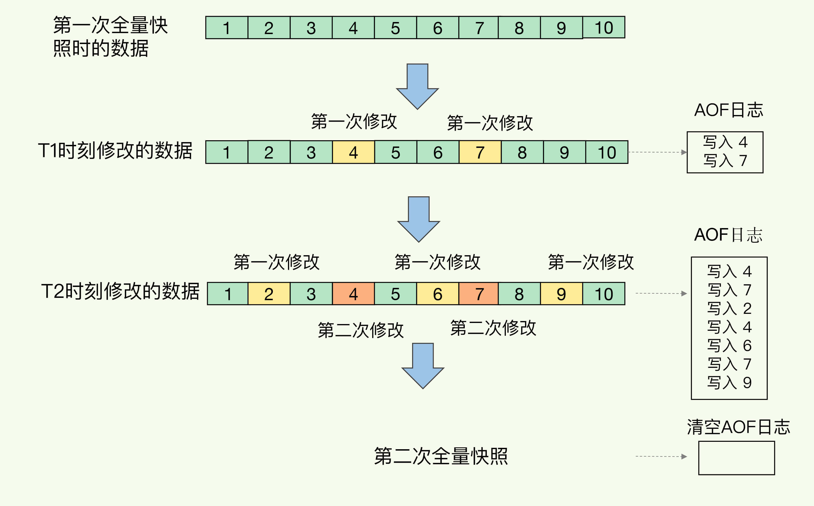
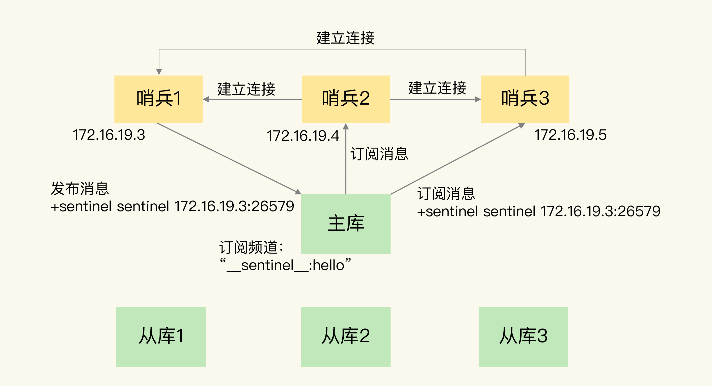
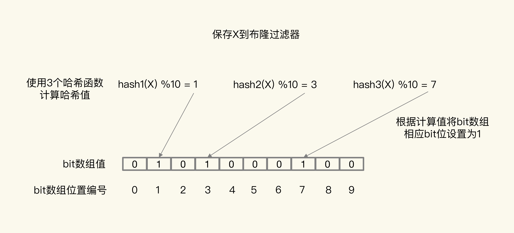
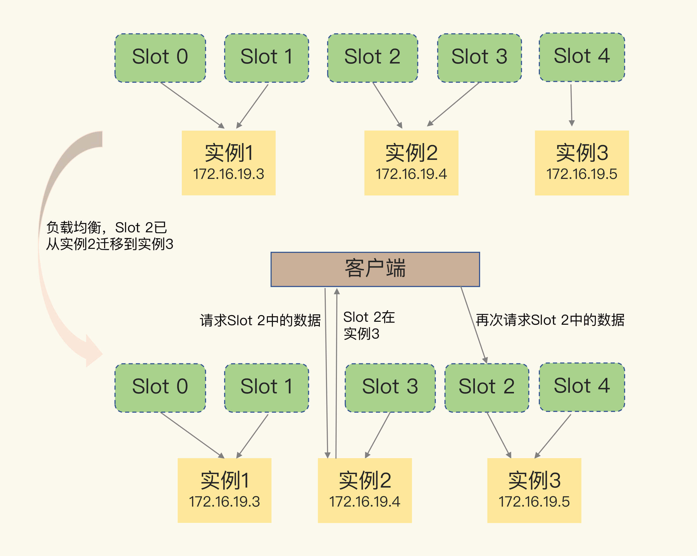
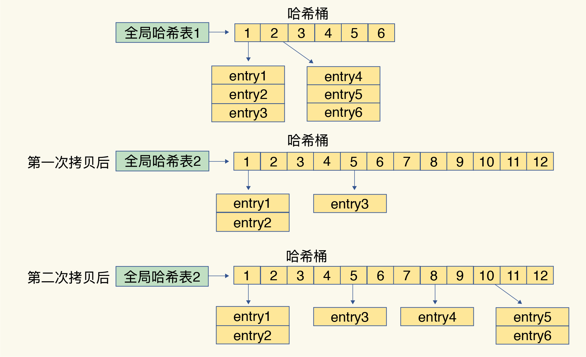

## 1. Redis

#### 1.1 Redis可以用来做什么？

**参考答案**

1.  Redis最常用来做缓存，是实现分布式缓存的首先中间件；
2.  Redis可以作为数据库，实现诸如点赞、关注、排行等对性能要求极高的互联网需求；
3.  Redis可以作为计算工具，能用很小的代价，统计诸如PV/UV、用户在线天数等数据；
4.  Redis还有很多其他的使用场景，例如：可以实现分布式锁，可以作为消息队列使用。

#### 1.2 Redis和传统的关系型数据库有什么不同？

**参考答案**

Redis是一种基于键值对的NoSQL数据库，而键值对的值是由多种数据结构和算法组成的。Redis的数据都存储于内存中，因此它的速度惊人，读写性能可达10万/秒，远超关系型数据库。

关系型数据库是基于二维数据表来存储数据的，它的数据格式更为严谨，并支持关系查询。关系型数据库的数据存储于磁盘上，可以存放海量的数据，但性能远不如Redis。

#### 1.3 redis 实现消息队列

消息保序：先入队列的先执行，后入队列的消息后执行

消息可靠性传输：消费者在处理消息的时候，还可能出现因为故障或宕机导致消息没有处理完成的情况。此时，消息队列需要能提供消息可靠性的保证，也就是说，当消费者重启后，可以重新读取消息再次进行处理，否则，就会出现消息漏处理的问题了。

消息重复处理：幂等性就是指，对于同一条消息，消费者收到一次的处理结果和收到多次的处理结果是一致的。


#### 1.4 Redis是单线程的，为什么还能这么快？

**参考答案**

1.  对服务端程序来说，线程切换和锁通常是性能杀手，而单线程避免了线程切换和竞争所产生的消耗；
2.  Redis的大部分操作是在内存上完成的，这是它实现高性能的一个重要原因；
3.  Redis采用了IO多路复用机制，使其在网络IO操作中能并发处理大量的客户端请求，实现高吞吐率。

关于Redis的单线程架构实现，如下图：


#### 1.5 Redis在持久化时fork出一个子进程，这时已经有两个进程了，怎么能说是单线程呢？

**参考答案**

Redis是单线程的，主要是指Redis的网络IO和键值对读写是由一个线程来完成的。而Redis的其他功能，如持久化、异步删除、集群数据同步等，则是依赖其他线程来执行的。所以，说Redis是单线程的只是一种习惯的说法，事实上它的底层不是单线程的。


#### 1.6 说一说Redis的持久化策略

**参考答案**

Redis支持RDB持久化、AOF持久化、RDB-AOF混合持久化这三种持久化方式。

RDB：

RDB(Redis Database)是Redis默认采用的持久化方式，它以快照的形式将进程数据持久化到硬盘中。RDB会创建一个经过压缩的二进制文件，文件以“.rdb”结尾，内部存储了各个数据库的键值对数据等信息。RDB持久化的触发方式有两种：

-   手动触发：通过SAVE或BGSAVE命令触发RDB持久化操作，创建“.rdb”文件；
-   自动触发：通过配置选项，让服务器在满足指定条件时自动执行BGSAVE命令。

其中，SAVE命令执行期间，Redis服务器将阻塞，直到“.rdb”文件创建完毕为止。而BGSAVE命令是异步版本的SAVE命令，它会使用Redis服务器进程的子进程，创建“.rdb”文件。BGSAVE命令在创建子进程时会存在短暂的阻塞，之后服务器便可以继续处理其他客户端的请求。总之，BGSAVE命令是针对SAVE阻塞问题做的优化，Redis内部所有涉及RDB的操作都采用BGSAVE的方式，而SAVE命令已经废弃！


RDB持久化的优缺点如下：

-   优点：RDB生成紧凑压缩的二进制文件，体积小，使用该文件恢复数据的速度非常快；

-   缺点：BGSAVE每次运行都要执行fork操作创建子进程，属于重量级操作，不宜频繁执行，

    所以RDB持久化没办法做到实时的持久化。

AOF：

AOF（Append Only File），解决了数据持久化的实时性，是目前Redis持久化的主流方式。AOF以独立日志的方式，记录了每次写入命令，重启时再重新执行AOF文件中的命令来恢复数据。AOF的工作流程包括：命令写入（append）、文件同步（sync）、文件重写（rewrite）、重启加载（load），如下图：


AOF默认不开启，需要修改配置项来启用它：

```
appendonly yes         # 启用AOF appendfilename "appendonly.aof"  # 设置文件名
```

AOF持久化的文件同步机制：

为了提高程序的写入性能，现代操作系统会把针对硬盘的多次写操作优化为一次写操作。

1.  当程序调用write对文件写入时，系统不会直接把书记写入硬盘，而是先将数据写入内存的缓冲区中；
2.  当达到特定的时间周期或缓冲区写满时，系统才会执行flush操作，将缓冲区中的数据冲洗至硬盘中；

这种优化机制虽然提高了性能，但也给程序的写入操作带来了不确定性。

1.  对于AOF这样的持久化功能来说，冲洗机制将直接影响AOF持久化的安全性；
2.  为了消除上述机制的不确定性，Redis向用户提供了appendfsync选项，来控制系统冲洗AOF的频率；
3.  Linux的glibc提供了fsync函数，可以将指定文件强制从缓冲区刷到硬盘，上述选项正是基于此函数。

appendfsync选项的取值和含义如下：


AOF持久化的优缺点如下：

-   优点：与RDB持久化可能丢失大量的数据相比，AOF持久化的安全性要高很多。通过使用everysec选项，用户可以将数据丢失的时间窗口限制在1秒之内。
-   缺点：AOF文件存储的是协议文本，它的体积要比二进制格式的”.rdb”文件大很多。AOF需要通过执行AOF文件中的命令来恢复数据库，其恢复速度比RDB慢很多。AOF在进行重写时也需要创建子进程，在数据库体积较大时将占用大量资源，会导致服务器的短暂阻塞。

AOF 重写：

我把重写的过程总结为“一个拷贝，两处日志”。

“一个拷贝”就是指，每次执行重写时，主线程 fork 出后台的 bgrewriteaof 子进程。此时，fork 会把主线程的内存拷贝一份给 bgrewriteaof 子进程，这里面就包含了数据库的最新数据。然后，bgrewriteaof 子进程就可以在不影响主线程的情况下，逐一把拷贝的数据写成操作，记入重写日志。

“两处日志”又是什么呢？因为主线程未阻塞，仍然可以处理新来的操作。此时，如果有写操作，第一处日志就是指正在使用的 AOF 日志，Redis 会把这个操作写到它的缓冲区。这样一来，即使宕机了，这个 AOF 日志的操作仍然是齐全的，可以用于恢复。而第二处日志，就是指新的 AOF 重写日志。这个操作也会被写到重写日志的缓冲区。这样，重写日志也不会丢失最新的操作。等到拷贝数据的所有操作记录重写完成后，重写日志记录的这些最新操作也会写入新的 AOF 文件，以保证数据库最新状态的记录。此时，我们就可以用新的 AOF 文件替代旧文件了。

总结来说，每次 AOF 重写时，Redis 会先执行一个内存拷贝，用于重写；然后，使用两个日志保证在重写过程中，新写入的数据不会丢失。而且，因为 Redis 采用额外的线程进行数据重写，所以，这个过程并不会阻塞主线程。


RDB-AOF混合持久化：

Redis从4.0开始引入RDB-AOF混合持久化模式，这种模式是基于AOF持久化构建而来的。用户可以通过配置文件中的“aof-use-rdb-preamble yes”配置项开启AOF混合持久化。Redis服务器在执行AOF重写操作时，会按照如下原则处理数据：

-   像执行BGSAVE命令一样，根据数据库当前的状态生成相应的RDB数据，并将其写入AOF文件中；
-   对于重写之后执行的Redis命令，则以协议文本的方式追加到AOF文件的末尾，即RDB数据之后。

通过使用RDB-AOF混合持久化，用户可以同时获得RDB持久化和AOF持久化的优点，服务器既可以通过AOF文件包含的RDB数据来实现快速的数据恢复操作，又可以通过AOF文件包含的AOF数据来将丢失数据的时间窗口限制在1s之内。



#### 1.7 Redis 哨兵机制？

**参考答案**

Redis Sentinel（哨兵）是一个分布式架构，它包含若干个哨兵节点和数据节点。每个哨兵节点会对数据节点和其余的哨兵节点进行监控，当发现节点不可达时，会对节点做下线标识。如果被标识的是主节点，它就会与其他的哨兵节点进行协商，当多数哨兵节点都认为主节点不可达时，它们便会选举出一个哨兵节点来完成自动故障转移的工作，同时还会将这个变化实时地通知给应用方。整个过程是自动的，不需要人工介入，有效地解决了Redis的高可用问题！


一组哨兵可以监控一个主节点，也可以同时监控多个主节点，两种情况的拓扑结构如下图：


**监控：**

哨兵之间如何交换信息？哨兵如何知道从库信息？



我们先看监控。监控是指哨兵进程在运行时，周期性地给所有的主从库发送 PING 命令，检测它们是否仍然在线运行。如果从库没有在规定时间内响应哨兵的 PING 命令，哨兵就会把它标记为“下线状态”；同样，如果主库也没有在规定时间内响应哨兵的 PING 命令，哨兵就会判定主库下线，然后开始自动切换主库的流程。

通知：

然后，哨兵会执行最后一个任务：通知。在执行通知任务时，哨兵会把新主库的连接信息发给其他从库，让它们执行 replicaof 命令，和新主库建立连接，并进行数据复制。同时，哨兵会把新主库的连接信息通知给客户端，让它们把请求操作发到新主库上。

哨兵就是一个运行在特定模式下的 Redis 实例，只不过它并不服务请求操作，只是完成监控、选主和通知的任务。所以，每个哨兵实例也提供 pub/sub 机制，客户端可以从哨兵订阅消息。哨兵提供的消息订阅频道有很多，不同频道包含了主从库切换过程中的不同关键事件。

让客户端从哨兵这里订阅消息了。具体的操作步骤是，客户端读取哨兵的配置文件后，可以获得哨兵的地址和端口，和哨兵建立网络连接。然后，我们可以在客户端执行订阅命令，来获取不同的事件消息。


选主：

- 如何判断主库客观下线？

哨兵进程会使用 PING 命令检测它自己和主、从库的网络连接情况，用来判断实例的状态。如果哨兵发现主库或从库对 PING 命令的响应超时了，那么，哨兵就会先把它标记为“主观下线”。

一个哨兵获得了仲裁所需的赞成票数后，就可以标记主库为“客观下线”。这个所需的赞成票数是通过哨兵配置文件中的 quorum 配置项设定的。例如，现在有 5 个哨兵，quorum 配置的是 3，那么，一个哨兵需要 3 张赞成票，就可以标记主库为“客观下线”了。这 3 张赞成票包括哨兵自己的一张赞成票和另外两个哨兵的赞成票。

- 如何选新主库？

如果从库总是和主库断连，而且断连次数超出了一定的阈值，我们就有理由相信，这个从库的网络状况并不是太好，就可以把这个从库筛掉了。

第一轮：优先级最高的从库得分高。用户可以通过 slave-priority 配置项，给不同的从库设置不同优先级。比如，你有两个从库，它们的内存大小不一样，你可以手动给内存大的实例设置一个高优先级。在选主时，哨兵会给优先级高的从库打高分，如果有一个从库优先级最高，那么它就是新主库了。如果从库的优先级都一样，那么哨兵开始第二轮打分。

第二轮：和旧主库同步程度最接近的从库得分高。这个规则的依据是，如果选择和旧主库同步最接近的那个从库作为主库，那么，这个新主库上就有最新的数据。

第三轮：ID 号小的从库得分高。每个实例都会有一个 ID，这个 ID 就类似于这里的从库的编号。目前，Redis 在选主库时，有一个默认的规定：在优先级和复制进度都相同的情况下，ID 号最小的从库得分最高，会被选为新主库。

- 哪个哨兵来执行选主？

表明希望由自己来执行主从切换，并让所有其他哨兵进行投票。这个投票过程称为“Leader 选举”。因为最终执行主从切换的哨兵称为 Leader，投票过程就是确定 Leader。

在投票过程中，任何一个想成为 Leader 的哨兵，要满足两个条件：第一，拿到半数以上的赞成票；第二，拿到的票数同时还需要大于等于哨兵配置文件中的 quorum 值。以 3 个哨兵为例，假设此时的 quorum 设置为 2，那么，任何一个想成为 Leader 的哨兵只要拿到 2 张赞成票，就可以了。

如果 S3 没有拿到 2 票 Y，那么这轮投票就不会产生 Leader。哨兵集群会等待一段时间（也就是哨兵故障转移超时时间的 2 倍），再重新选举。

#### 1.8 Redis的主从集群是如何实现的？如何实现数据一致性？

**参考答案**


从2.8版本开始，Redis使用psync命令完成主从数据同步，同步过程分为全量复制和部分复制。全量复制一般用于初次复制的场景，部分复制则用于处理因网络中断等原因造成数据丢失的场景。psync命令需要以下参数的支持：

1.  复制偏移量：主节点处理写命令后，会把命令长度做累加记录，从节点在接收到写命令后，也会做累加记录；从节点会每秒钟上报一次自身的复制偏移量给主节点，而主节点则会保存从节点的复制偏移量。
2.  积压缓冲区：保存在主节点上的一个固定长度的队列，默认大小为1M，当主节点有连接的从节点时被创建；主节点处理写命令时，不但会把命令发送给从节点，还会写入积压缓冲区；缓冲区是先进先出的队列，可以保存最近已复制的数据，用于部分复制和命令丢失的数据补救。
3.  主节点运行ID：每个Redis节点启动后，都会动态分配一个40位的十六进制字符串作为运行ID；如果使用IP和端口的方式标识主节点，那么主节点重启变更了数据集（RDB/AOF），从节点再基于复制偏移量复制数据将是不安全的，因此当主节点的运行ID变化后，从节点将做全量复制。

全量复制的过程，如下图：


一旦主从库完成了全量复制，它们之间就会一直维护一个网络连接，主库会通过这个连接将后续陆续收到的命令操作再同步给从库，这个过程也称为基于长连接的命令传播，可以避免频繁建立连接的开销。


部分复制的过程，如下图：


#### 1.9 说一说Redis的缓存淘汰策略

**参考答案**

当写入数据将导致超出maxmemory限制时，Redis会采用maxmemory-policy所指定的策略进行数据淘汰，该策略一共包含如下8种选项：

| **策略**        | **描述**                                                 | **版本** |
| :-------------- | :------------------------------------------------------- | :------- |
| noeviction      | 直接返回错误；                                           |          |
| volatile-ttl    | 从设置了过期时间的键中，选择过期时间最小的键，进行淘汰； |          |
| volatile-random | 从设置了过期时间的键中，随机选择键，进行淘汰；           |          |
| volatile-lru    | 从设置了过期时间的键中，使用LRU算法选择键，进行淘汰；    |          |
| volatile-lfu    | 从设置了过期时间的键中，使用LFU算法选择键，进行淘汰；    | 4.0      |
| allleys-random  | 从所有的键中，随机选择键，进行淘汰；                     |          |
| allkeys-lru     | 从所有的键中，使用LRU算法选择键，进行淘汰；              |          |
| allkeys-lfu     | 从所有的键中，使用LFU算法选择键，进行淘汰；              | 4.0      |

其中，volatile前缀代表从设置了过期时间的键中淘汰数据，allkeys前缀代表从所有的键中淘汰数据。关于后缀，ttl代表选择过期时间最小的键，random代表随机选择键，需要我们额外关注的是lru和lfu后缀，它们分别代表采用lru算法和lfu算法来淘汰数据。

LRU（Least Recently Used）是按照最近最少使用原则来筛选数据，即最不常用的数据会被筛选出来！

-   标准LRU：把所有的数据组成一个链表，表头和表尾分别表示MRU和LRU端，即最常使用端和最少使用端。刚被访问的数据会被移动到MRU端，而新增的数据也是刚被访问的数据，也会被移动到MRU端。当链表的空间被占满时，它会删除LRU端的数据。
-   近似LRU：Redis会记录每个数据的最近一次访问的时间戳（LRU）。Redis执行写入操作时，若发现内存超出maxmemory，就会执行一次近似LRU淘汰算法。近似LRU会随机采样N个key，然后淘汰掉最旧的key，若淘汰后内存依然超出限制，则继续采样淘汰。可以通过maxmemory_samples配置项，设置近似LRU每次采样的数据个数，该配置项的默认值为5。

LRU算法的不足之处在于，只看数据的访问时间，使用 LRU 策略在处理扫描式单次查询操作时，无法解决缓存污染。所谓的扫描式单次查询操作，就是指应用对大量的数据进行一次全体读取，每个数据都会被读取，而且只会被读取一次。此时，因为这些被查询的数据刚刚被访问过，所以 lru 字段值都很大。（缓存污染）

LFU算法正式用于解决缓存污染，LFU 缓存策略是在 LRU 策略基础上，为每个数据增加了一个计数器，来统计这个数据的访问次数（访问频率）。当使用 LFU 策略筛选淘汰数据时，首先会根据数据的访问次数进行筛选，把访问次数最低的数据淘汰出缓存。如果两个数据的访问次数相同，LFU 策略再比较这两个数据的访问时效性，把距离上一次访问时间更久的数据淘汰出缓存

#### 1.10 请介绍一下Redis key 的过期策略

**参考答案**

Redis支持如下两种过期策略：

惰性删除：客户端访问一个key的时候，Redis会先检查它的过期时间，如果发现过期就立刻删除这个key。

定期删除：Redis会将设置了过期时间的key放到一个独立的字典中，并对该字典进行每秒10次的过期扫描，

过期扫描不会遍历字典中所有的key，而是采用了一种简单的贪心策略。该策略的删除逻辑如下：

1.  从字典中随机选择20个key；
2.  删除这20个key中已过期的key；
3.  如果超过 25% 的 key 过期了，则重复删除的过程，直到过期 key 的比例降至 25% 以下。

#### 1.11 缓存穿透、缓存击穿、缓存雪崩有什么区别，该如何解决？

**参考答案**

缓存穿透：

问题描述：

客户端查询根本不存在的数据，使得请求直达存储层，导致其负载过大，甚至宕机。出现这种情况的原因，可能是业务层误将缓存和库中的数据删除了，也可能是有人恶意攻击，专门访问库中不存在的数据。

解决方案：

1.  缓存空对象：存储层未命中后，仍然将空值存入缓存层，客户端再次访问数据时，缓存层会直接返回空值。
2.  布隆过滤器：将数据存入布隆过滤器，访问缓存之前以过滤器拦截，若请求的数据不存在则直接返回空值。
2.  前端检验请求合法性

缓存击穿：

问题描述：

一份热点数据，它的访问量非常大。在其缓存失效的瞬间，大量请求直达存储层，导致服务崩溃。

解决方案：

永不过期：热点数据不设置过期时间，所以不会出现上述问题，这是“物理”上的永不过期。或者为每个数据设置逻辑过期时间，当发现该数据逻辑过期时，使用单独的线程重建缓存。

缓存雪崩：

问题描述：

在某一时刻，缓存层无法继续提供服务，导致所有的请求直达存储层，造成数据库宕机。可能是缓存中有大量数据同时过期，也可能是Redis节点发生故障，导致大量请求无法得到处理。

解决方案：

1. 避免数据同时过期：设置过期时间时，附加一个随机数，避免大量的key同时过期。

2. 启用降级、限流和熔断措施：

   降级：当业务应用访问的是非核心数据（例如电商商品属性）时，暂时停止从缓存中查询这些数据，而是直接返回预定义信息、空值或是错误信息；当业务应用访问的是核心数据（例如电商商品库存）时，仍然允许查询缓存，如果缓存缺失，也可以继续通过数据库读取。

   熔断：所谓的服务熔断，是指在发生缓存雪崩时，为了防止引发连锁的数据库雪崩，甚至是整个系统的崩溃，我们暂停业务应用对缓存系统的接口访问。再具体点说，就是业务应用调用缓存接口时，缓存客户端并不把请求发给 Redis 缓存实例，而是直接返回，等到 Redis 缓存实例重新恢复服务后，再允许应用请求发送到缓存系统

   限流：们就可以启动请求限流机制，在请求入口前端只允许每秒进入系统的请求数为 1000 个，再多的请求就会在入口前端被直接拒绝服务。所以，使用了请求限流，就可以避免大量并发请求压力传递到数据库层。

3. 构建高可用的Redis服务：采用哨兵或集群模式，部署多个Redis实例，个别节点宕机，依然可以保持服务的整体可用。

#### 1.12 说一说你对布隆过滤器的理解

**参考答案**

布隆过滤器可以用很低的代价，估算出数据是否真实存在。例如：给用户推荐新闻时，要去掉重复的新闻，就可以利用布隆过滤器，判断该新闻是否已经推荐过。

首先，使用 N 个哈希函数，分别计算这个数据的哈希值，得到 N 个哈希值。然后，我们把这 N 个哈希值对 bit 数组的长度取模，得到每个哈希值在数组中的对应位置。最后，我们把对应位置的 bit 位设置为 1，这就完成了在布隆过滤器中标记数据的操作



布隆过滤器的工作原理：

询问key时，每个哈希函数都利用这个key计算出一个哈希值，再根据哈希值计算一个位置。然后对比这些哈希函数在位数组中对应位置的数值：

-   如果这几个位置中，有一个位置的值是0，就说明这个布隆过滤器中，不存在这个key。

-   如果这几个位置中，所有位置的值都是1，就说明这个布隆过滤器中，极有可能存在这个key。之所以不是百分之百确定，是因为也可能是其他的key运算导致该位置为1。

    

#### 1.13 如何保证缓存与数据库的双写一致性？

**参考答案**

**穿透型缓存**

[](https://techlog.cn/article/list/images/1cde458c8ca9073bc83c7e5a121c99ea.png)

穿透型缓存的设计原则是将缓存与后端数据库的交互细节对应用层服务隐藏
应用层服务所有的读写请求均请求缓存，读请求 miss 后，缓存向后端数据服务器请求数据，先更新缓存后返回，而写请求也是同样的，先写入缓存服务器，后同步给后端服务器。

存在**数据一致性问题**和**实现复杂度问题**

1. 在读写并发的环境中，读请求发生 miss，此时缓存服务器向后端服务器请求数据并写入缓存，但在写入缓存前，如果发生了一个完整的写请求，那么就会出现这个写请求写入的新缓存被读请求获取的旧数据覆盖的问题
2. 另一个让这套缓存架构没能成为常用架构的原因是实现的复杂度。开发人员必须将代码分散于业务层与存储层，这给代码的开发和维护带来很高的复杂度，但如果使用原生支持穿透型缓存的缓存服务器，这无疑也是一种实现成本很低的架构

**旁路型缓存 -- Aside Cache**
[](https://techlog.cn/article/list/images/058f9b0470166326b3a6713afdb0752a.png)

大部分业务场景是“一写多读”的场景，在这样的场景下，旁路型缓存是非常适用的

**读请求**

上图展示了旁路型缓存的读 miss 情况的处理：
2.  应用服务器先请求缓存服务器，如果数据存在则直接返回
5.  如果缓存 miss，则应用服务器请求后端数据库
8.  应用服务器将后端数据库返回的数据更新到缓存服务器

**写请求**

对于写请求，这个模式要求所有的数据更新都需要删除缓存中对应的数据，官方建议旁路型缓存的设计原则是先操作后端数据库后操作缓存

 **为什么直接删除缓存数据？**

如果我们不是简单地删除数据而是试图去更新缓存中的数据，那么可能存在下面两个问题：

1.  一致性 -- 如果先 set 缓存后写数据库，由于二者不能保证事务性，可能存在 set 缓存成功，写数据库失败，造成二者数据不一致，或并发情况下新数据被旧数据覆盖的问题
2.  复杂度 -- 解决上述一致性问题以及在复杂的业务场景下，如何组织差异化数据进行更新操作是一项非常复杂的工作
    而简单暴力的淘汰被更新数据显然复杂度是最低的
    

四种同步策略：
想要保证缓存与数据库的双写一致，一共有4种方式，即4种同步策略：

1.  先更新缓存，再更新数据库；
2.  先更新数据库，再更新缓存；
3.  先删除缓存，再更新数据库；
4.  先更新数据库，再删除缓存。

从这4种同步策略中，我们需要作出比较的是：

1.  更新缓存与删除缓存哪种方式更合适？
2.  应该先操作数据库还是先操作缓存？

更新缓存还是删除缓存：

下面，我们来分析一下，应该采用更新缓存还是删除缓存的方式。

-   更新缓存

    优点：每次数据变化都及时更新缓存，所以查询时不容易出现未命中的情况。

    缺点：更新缓存的消耗比较大。如果数据需要经过复杂的计算再写入缓存，那么频繁的更新缓存，就会影响服务器的性能。如果是写入数据频繁的业务场景，那么可能频繁的更新缓存时，却没有业务读取该数据。

-   删除缓存

    优点：操作简单，无论更新操作是否复杂，都是将缓存中的数据直接删除。

    缺点：删除缓存后，下一次查询缓存会出现未命中，这时需要重新读取一次数据库。

从上面的比较来看，一般情况下，删除缓存是更优的方案。

先操作数据库还是缓存：

下面，我们再来分析一下，应该先操作数据库还是先操作缓存。

首先，我们将先删除缓存与先更新数据库，在出现失败时进行一个对比：


如上图，是先删除缓存再更新数据库，在出现失败时可能出现的问题：

1.  进程A删除缓存成功；
2.  进程A更新数据库失败；
3.  进程B从缓存中读取数据；
4.  由于缓存被删，进程B无法从缓存中得到数据，进而从数据库读取数据；
5.  进程B从数据库成功获取数据，然后将数据更新到了缓存。

最终，缓存和数据库的数据是一致的，但仍然是旧的数据。而我们的期望是二者数据一致，并且是新的数据。


如上图，是先更新数据库再删除缓存，在出现失败时可能出现的问题：

1.  进程A更新数据库成功；
2.  进程A删除缓存失败；
3.  进程B读取缓存成功，由于缓存删除失败，所以进程B读取到的是旧的数据。

最终，缓存和数据库的数据是不一致的。

经过上面的比较，我们发现在出现失败的时候，是无法明确分辨出先删缓存和先更新数据库哪个方式更好，以为它们都存在问题。后面我们会进一步对这两种方式进行比较，但是在这里我们先探讨一下，上述场景出现的问题，应该如何解决呢？

实际上，无论上面我们采用哪种方式去同步缓存与数据库，在第二步出现失败的时候，都建议采用重试机制解决，因为最终我们是要解决掉这个错误的。而为了避免重试机制影响主要业务的执行，一般建议重试机制采用异步的方式执行，如下图：


这里我们按照先更新数据库，再删除缓存的方式，来说明重试机制的主要步骤：

1.  更新数据库成功；
2.  删除缓存失败；
3.  将此数据加入消息队列；
4.  业务代码消费这条消息；
5.  业务代码根据这条消息的内容，发起重试机制，即从缓存中删除这条记录。

好了，下面我们再将先删缓存与先更新数据库，在没有出现失败时进行对比：


如上图，是先删除缓存再更新数据库，在没有出现失败时可能出现的问题：

1.  进程A删除缓存成功；
2.  进程B读取缓存失败；
3.  进程B读取数据库成功，得到旧的数据；
4.  进程B将旧的数据成功地更新到了缓存；
5.  进程A将新的数据成功地更新到数据库。

可见，进程A的两步操作均成功，但由于存在并发，在这两步之间，进程B访问了缓存。最终结果是，缓存中存储了旧的数据，而数据库中存储了新的数据，二者数据不一致。


如上图，是先更新数据库再删除缓存，再没有出现失败时可能出现的问题：

1.  进程A更新数据库成功；
2.  进程B读取缓存成功；
3.  进程A更新数据库成功。

可见，最终缓存与数据库的数据是一致的，并且都是最新的数据。但进程B在这个过程里读到了旧的数据，可能还有其他进程也像进程B一样，在这两步之间读到了缓存中旧的数据，但因为这两步的执行速度会比较快，所以影响不大。对于这两步之后，其他进程再读取缓存数据的时候，就不会出现类似于进程B的问题了。

最终结论：

经过对比你会发现，先更新数据库、再删除缓存是影响更小的方案。如果第二步出现失败的情况，则可以采用重试机制解决问题。

**扩展阅读**

延时双删

上面我们提到，如果是先删缓存、再更新数据库，在没有出现失败时可能会导致数据的不一致。如果在实际的应用中，出于某些考虑我们需要选择这种方式，那有办法解决这个问题吗？答案是有的，那就是采用延时双删的策略，延时双删的基本思路如下：

1.  删除缓存；
2.  更新数据库；
3.  sleep N毫秒；
4.  再次删除缓存。

阻塞一段时间之后，再次删除缓存，就可以把这个过程中缓存中不一致的数据删除掉。而具体的时间，要评估你这项业务的大致时间，按照这个时间来设定即可。

采用读写分离的架构怎么办？

如果数据库采用的是读写分离的架构，那么又会出现新的问题，如下图：


进程A先删除缓存，再更新主数据库，然后主库将数据同步到从库。而在主从数据库同步之前，可能会有进程B访问了缓存，发现数据不存在，进而它去访问从库获取到旧的数据，然后同步到缓存。这样，最终也会导致缓存与数据库的数据不一致。这个问题的解决方案，依然是采用延时双删的策略，但是在评估延长时间的时候，要考虑到主从数据库同步的时间。

第二次删除失败了怎么办？

如果第二次删除依然失败，则可以增加重试的次数，但是这个次数要有限制，当超出一定的次数时，要采取报错、记日志、发邮件提醒等措施。

#### 1.14 请介绍Redis切片集群的实现方案

**参考答案**

纵向扩展：升级单个 Redis 实例的资源配置，包括增加内存容量、增加磁盘容量、使用更高配置的 CPU。就像下图中，原来的实例内存是 8GB，硬盘是 50GB，纵向扩展后，内存增加到 24GB，磁盘增加到 150GB。

横向扩展：横向增加当前 Redis 实例的个数，就像下图中，原来使用 1 个 8GB 内存、50GB 磁盘的实例，现在使用三个相同配置的实例。


Redis集群的分区方案：

**数据切片与实例的分布关系**

Redis Cluster 方案采用哈希槽（Hash Slot，接下来我会直接称之为 Slot），来处理数据和实例之间的映射关系。
首先根据键值对的 key，按照CRC16 算法计算一个 16 bit 的值；然后，再用这个 16bit 值对 16384 取模，得到 0~16383 范围内的模数，每个模数代表一个相应编号的哈希槽。

我们在部署 Redis Cluster 方案时，可以使用 cluster create 命令创建集群，此时，Redis 会自动把这些槽平均分布在集群实例上。例如，如果集群中有 N 个实例，那么，每个实例上的槽个数为 16384/N 个。

当然， 我们也可以使用 cluster meet 命令手动建立实例间的连接，形成集群，再使用 cluster addslots 命令，指定每个实例上的哈希槽个数。

**客户端如何定位数据？**

MOVED

MOVED 重定向命令的使用方法。可以看到，由于负载均衡，Slot 2 中的数据已经从实例 2 迁移到了实例 3，但是，客户端缓存仍然记录着“Slot 2 在实例 2”的信息，所以会给实例 2 发送命令。实例 2 给客户端返回一条 MOVED 命令，把 Slot 2 的最新位置（也就是在实例 3 上），返回给客户端，客户端就会再次向实例 3 发送请求，同时还会更新本地缓存，把 Slot 2 与实例的对应关系更新过来。



ASK 命令表示两层含义：第一，表明 Slot 数据还在迁移中；第二，ASK 命令把客户端所请求数据的最新实例地址返回给客户端，此时，客户端需要给实例 3 发送 ASKING 命令，然后再发送操作命令。

和 MOVED 命令不同，ASK 命令并不会更新客户端缓存的哈希槽分配信息。


#### 1.15 Redis 数据倾斜

数据量倾斜：在某些情况下，实例上的数据分布不均衡，某个实例上的数据特别多。
数据访问倾斜：虽然每个集群实例上的数据量相差不大，但是某个实例上的数据是热点数据，被访问得非常频繁。


#### 1.16 切片集群之间如何通信？


Gossip 协议可以保证在一段时间后，集群中的每一个实例都能获得其它所有实例的状态信息。

一个 Gossip 消息的大小了，即 104 字节。每个实例在发送一个 Gossip 消息时，除了会传递自身的状态信息，默认还会传递集群十分之一实例的状态信息。

Redis Cluster 的实例会按照每 100ms 一次的频率，扫描本地的实例列表，如果发现有实例最近一次接收 PONG 消息的时间，已经大于配置项 cluster-node-timeout 的一半了（cluster-node-timeout/2），就会立刻给该实例发送 PING 消息，更新这个实例上的集群状态信息。

每个实例每 1 秒发送一条 PING 消息。这个频率不算高，如果再降低该频率的话，集群中各实例的状态可能就没办法及时传播了。

每个实例每 100 毫秒会做一次检测，给 PONG 消息接收超过 cluster-node-timeout/2 的节点发送 PING 消息。实例按照每 100 毫秒进行检测的频率，是 Redis 实例默认的周期性检查任务的统一频率，我们一般不需要修改它。

Redis 官方给出了 Redis Cluster 的规模上限，就是一个集群运行 1000 个实例。随着集群规模的增加，实例间的通信量也会增加。如果我们盲目地对 Redis Cluster 进行扩容，就可能会遇到集群性能变慢的情况。这是因为，集群中大规模的实例间心跳消息会挤占集群处理正常请求的带宽。

#### 1.17 Redis有哪些数据类型？

**参考答案**

1. Redis支持5种核心的数据类型，分别是字符串、哈希、列表、集合、有序集合；

2. Redis还提供了Bitmap、HyperLogLog、Geo类型，但这些类型都是基于上述核心数据类型实现的；

3. Redis在5.0新增加了Streams数据类型，它是一个功能强大的、支持多播的、可持久化的消息队列。

   

#### 1.18 数据类型使用场景


#### 1.19 说一说hash类型底层的数据结构

**参考答案**

哈希对象有两种编码方案，当同时满足以下条件时，哈希对象采用ziplist编码，否则采用hashtable编码：

-   哈希对象保存的键值对数量小于512个，可配置；
-   哈希对象保存的所有键值对中的键和值，其字符串长度都小于64字节，可配置。

其中，ziplist编码采用压缩列表作为底层实现，而hashtable编码采用字典作为底层实现。

**压缩列表：**

压缩列表（ziplist），是Redis为了节约内存而设计的一种线性数据结构，它是由一系列具有特殊编码的连续内存块构成的。一个压缩列表可以包含任意多个节点，每个节点可以保存一个字节数组或一个整数值。

压缩列表的结构如下图所示：


该结构当中的字段含义如下表所示：

| **属性** | **类型** | **长度** | **说明**                                                     |
| :------- | :------- | :------- | :----------------------------------------------------------- |
| zlbytes  | uint32_t | 4字节    | 压缩列表占用的内存字节数；                                   |
| zltail   | uint32_t | 4字节    | 压缩列表表尾节点距离列表起始地址的偏移量（单位字节）；       |
| zllen    | uint16_t | 2字节    | 压缩列表包含的节点数量，等于UINT16_MAX时，需遍历列表计算真实数量； |
| entryX   | 列表节点 | 不固定   | 压缩列表包含的节点，节点的长度由节点所保存的内容决定；       |
| zlend    | uint8_t  | 1字节    | 压缩列表的结尾标识，是一个固定值0xFF；                       |

其中，压缩列表的节点由以下字段构成：


prev_len，表示前一个 entry 的长度。prev_len 有两种取值情况：1 字节或 5 字节。取值 1 字节时，表示上一个 entry 的长度小于 254 字节。虽然 1 字节的值能表示的数值范围是 0 到 255，但是压缩列表中 zlend 的取值默认是 255，因此，就默认用 255 表示整个压缩列表的结束，其他表示长度的地方就不能再用 255 这个值了。所以，当上一个 entry 长度小于 254 字节时，prev_len 取值为 1 字节，否则，就取值为 5 字节。
len：表示自身长度，4 字节；
encoding：表示编码方式，1 字节；
content：保存实际数据。

#### 1.20 介绍一下zset类型底层的数据结构

**参考答案**

有序集合对象有2种编码方案，当同时满足以下条件时，集合对象采用ziplist编码，否则采用skiplist编码：

-   有序集合保存的元素数量不超过128个；
-   有序集合保存的所有元素的成员长度都小于64字节。

其中，ziplist编码的有序集合采用压缩列表作为底层实现，skiplist编码的有序集合采用zset结构作为底层实现。

其中，zset是一个复合结构，它的内部采用字典和跳跃表来实现，其源码如下。其中，dict保存了从成员到分支的映射关系，zsl则按分值由小到大保存了所有的集合元素。这样，当按照成员来访问有序集合时可以直接从dict中取值，当按照分值的范围访问有序集合时可以直接从zsl中取值，采用了空间换时间的策略以提高访问效率。

综上，zset对象的底层数据结构包括：压缩列表、字典、跳跃表。

**跳跃表：**

跳跃表的查找复杂度为平均O(logN)，最坏O(N)，效率堪比红黑树，却远比红黑树实现简单。跳跃表是在链表的基础上，通过增加索引来提高查找效率的。

有序链表插入、删除的复杂度为O(1)，而查找的复杂度为O(N)。例：若要查找值为60的元素，需要从第1个元素依次向后比较，共需比较6次才行，如下图：


跳跃表是从有序链表中选取部分节点，组成一个新链表，并以此作为原始链表的一级索引。再从一级索引中选取部分节点，组成一个新链表，并以此作为原始链表的二级索引。以此类推，可以有多级索引，如下图：


跳跃表在查找时，优先从高层开始查找，若next节点值大于目标值，或next指针指向NULL，则从当前节点下降一层继续向后查找，这样便可以提高查找的效率了。

跳跃表的实现主要涉及2个结构体：zskiplist、zskiplistNode，它们的关系如下图所示：


其中，蓝色的表格代表zskiplist，红色的表格代表zskiplistNode。zskiplist有指向头尾节点的指针，以及列表的长度，列表中最高的层级。zskiplistNode的头节点是空的，它不存储任何真实的数据，它拥有最高的层级，但这个层级不记录在zskiplist之内。


#### 1.21 SDS


char* 的不足：

- 操作效率低：获取长度需遍历，O(N)复杂度
- 二进制不安全：无法存储包含 \0 的数据

SDS 的优势：

- 操作效率高：获取长度无需遍历，O(1)复杂度
- 二进制安全：因单独记录长度字段，所以可存储包含 \0 的数据
- 兼容 C 字符串函数，可直接使用字符串 API

另外 Redis 在操作 SDS 时，为了避免频繁操作字符串时，每次「申请、释放」内存的开销，还做了这些优化：

- 内存预分配：SDS 扩容，会多申请一些内存（小于 1MB 翻倍扩容，大于 1MB 按 1MB 扩容）
- 多余内存不释放：SDS 缩容，不释放多余的内存，下次使用可直接复用这些内存

这种策略，是以多占一些内存的方式，换取「追加」操作的速度。

这个内存预分配策略，详细逻辑可以看 sds.c 的 sdsMakeRoomFor 函数。

课后题：SDS 字符串在 Redis 内部模块实现中也被广泛使用，你能在 Redis server 和客户端的实现中，找到使用 SDS 字符串的地方么？

1、Redis 中所有 key 的类型就是 SDS（详见 db.c 的 dbAdd 函数）

2、Redis Server 在读取 Client 发来的请求时，会先读到一个缓冲区中，这个缓冲区也是 SDS（详见 server.h 中 struct client 的 querybuf 字段）

3、写操作追加到 AOF 时，也会先写到 AOF 缓冲区，这个缓冲区也是 SDS （详见 server.h 中 struct client 的 aof_buf 字段）


#### 1.22 Hash 和渐进式 reHash

渐进式 rehash



hash 桶中的 dictEntry


type：表示值的类型，涵盖了我们前面学习的五大基本类型；
encoding：是值的编码方式，用来表示 Redis 中实现各个基本类型的底层数据结构，例如 SDS、压缩列表、哈希表、跳表等；
lru：记录了这个对象最后一次被访问的时间，用于淘汰过期的键值对；
refcount：记录了对象的引用计数；
*ptr：是指向数据的指针。


当满足以下任何一个条件时，程序会自动开始对哈希表执行扩展操作 rehash：

1.  服务器目前没有执行bgsave或bgrewriteof命令，并且哈希表的负载因子大于等于1；
2.  服务器目前正在执行bgsave或bgrewriteof命令，并且哈希表的负载因子大于等于5。

dict 在负载因子超过 1 时（used: bucket size >= 1），会触发 rehash。但如果 Redis 正在 RDB 或 AOF rewrite，为避免父进程大量写时复制，会暂时关闭触发 rehash。但这里有个例外，如果负载因子超过了 5（哈希冲突已非常严重），依旧会强制做 rehash（重点）


「全局哈希表」在触发渐进式 rehash 的情况有 2 个：

- 增删改查哈希表时：每次迁移 1 个哈希桶（文章提到的 dict.c 中的 _dictRehashStep 函数）
- 定时 rehash：如果 dict 一直没有操作，无法渐进式迁移数据，那主线程会默认每间隔 100ms 执行一次迁移操作。这里一次会以 100 个桶为基本单位迁移数据，并限制如果一次操作耗时超时 1ms 就结束本次任务，待下次再次触发迁移（文章没提到这个，详见 dict.c 的 dictRehashMilliseconds 函数）

（注意：定时 rehash 只会迁移全局哈希表中的数据，不会定时迁移 Hash/Set/Sorted Set 下的哈希表的数据，这些哈希表只会在操作数据时做实时的渐进式 rehash）


REHSH期间，字典同时持有两个哈希表，此时的访问将按照如下原则处理：

1.  新添加的键值对，一律被保存到ht[1]中；
2.  删除、修改、查找等其他操作，会在两个哈希表上进行，即程序先尝试去ht[0]中访问要操作的数据，若不存在则到ht[1]中访问，再对访问到的数据做相应的处理。


为了避免REHASH对服务器性能造成影响，REHASH操作不是一次性地完成的，而是分多次、渐进式地完成的。渐进式REHASH的详细过程如下：

1.  为ht[1]分配空间，为 ht[0] 已使用空间的 2 倍，让字典同时持有ht[0]和ht[1]两个哈希表；
2.  在字典中的索引计数器rehashidx设置为0，表示REHASH操作正式开始；
3.  在REHASH期间，每次对字典执行添加、删除、修改、查找操作时，程序除了执行指定的操作外，还会顺带将ht[0]中位于rehashidx上的所有键值对迁移到ht[1]中，再将rehashidx的值加1；
4.  随着字典不断被访问，最终在某个时刻，ht[0]上的所有键值对都被迁移到ht[1]上，此时程序将rehashidx属性值设置为-1，标识REHASH操作完成。

#### 1.23 如何利用Redis实现分布式Session？

**参考答案**

在web开发中，我们会把用户的登录信息存储在session里。而session是依赖于cookie的，即服务器创建session时会给它分配一个唯一的ID，并且在响应时创建一个cookie用于存储这个SESSIONID。当客户端收到这个cookie之后，就会自动保存这个SESSIONID，并且在下次访问时自动携带这个SESSIONID，届时服务器就可以通过这个SESSIONID得到与之对应的session，从而识别用户的身。如下图：


现在的互联网应用，基本都是采用分布式部署方式，即将应用程序部署在多台服务器上，并通过nginx做统一的请求分发。而服务器与服务器之间是隔离的，它们的session是不共享的，这就存在session同步的问题了，如下图：


如果客户端第一次访问服务器，请求被分发到了服务器A上，则服务器A会为该客户端创建session。如果客户端再次访问服务器，请求被分发到服务器B上，则由于服务器B中没有这个session，所以用户的身份无法得到验证，从而产生了不一致的问题。

解决这个问题的办法有很多，比如可以协调多个服务器，让他们的session保持同步。也可以在分发请求时做绑定处理，即将某一个IP固定分配给同一个服务器。但这些方式都比较麻烦，而且性能上也有一定的消耗。更合理的方式就是采用类似于Redis这样的高性能缓存服务器，来实现分布式session。

从上面的叙述可知，我们使用session保存用户的身份信息，本质上是要做两件事情。第一是保存用户的身份信息，第二是验证用户的身份信息。如果利用其它手段实现这两个目标，那么就可以不用session，或者说我们使用的是广义上的session了。

具体实现的思路如下图，我们在服务端增加两段程序：

第一是创建令牌的程序，就是在用户初次访问服务器时，给它创建一个唯一的身份标识，并且使用cookie封装这个标识再发送给客户端。那么当客户端下次再访问服务器时，就会自动携带这个身份标识了，这和SESSIONID的道理是一样的，只是改由我们自己来实现了。另外，在返回令牌之前，我们需要将它存储起来，以便于后续的验证。而这个令牌是不能保存在服务器本地的，因为其他服务器无法访问它。因此，我们可以将其存储在服务器之外的一个地方，那么Redis便是一个理想的场所。

第二是验证令牌的程序，就是在用户再次访问服务器时，我们获取到了它之前的身份标识，那么我们就要验证一下这个标识是否存在了。验证的过程很简单，我们从Redis中尝试获取一下就可以知道结果。


#### 1.24 如何利用Redis实现一个分布式锁？

**参考答案**

何时需要分布式锁？

在分布式的环境下，当多个server并发修改同一个资源时，为了避免竞争就需要使用分布式锁。那为什么不能使用Java自带的锁呢？因为Java中的锁是面向多线程设计的，它只局限于当前的JRE环境。而多个server实际上是多进程，是不同的JRE环境，所以Java自带的锁机制在这个场景下是无效的。

如何实现分布式锁？

采用Redis 单实例实现分布式锁，就是在Redis里存一份代表锁的数据，通常用字符串即可。实现分布式锁的过程如下：

```
// 加锁, unique_value作为客户端唯一性的标识
SET lock_key unique_value NX EX 10000
```

其中，unique_value 是客户端的唯一标识，可以用一个随机生成的字符串来表示，EX 10000 则表示 lock_key 会在 10s 后过期，以免客户端在这期间发生异常而无法释放锁。因为在加锁操作中，每个客户端都使用了一个唯一标识，所以在释放锁操作时，我们需要判断锁变量的值，是否等于执行释放锁操作的客户端的唯一标识。

解锁时要先判断、再释放，这两步需要保证原子性，否则第二步失败的话，就会出现死锁。而获取和删除命令不是原子的，这就需要采用Lua脚本，通过Lua脚本将两个命令编排在一起，而整个Lua脚本的执行是原子的。

基于RedLock算法的分布式锁：

上述分布式锁的实现方案，是建立在单个主节点之上的。它的潜在问题如下图所示，如果进程A在主节点上加锁成功，然后这个主节点宕机了，则从节点将会晋升为主节点。若此时进程B在新的主节点上加锁成果，之后原主节点重启，成为了从节点，系统中将同时出现两把锁，这是违背锁的唯一性原则的。


总之，就是在单个主节点的架构上实现分布式锁，是无法保证高可用的。若要保证分布式锁的高可用，则可以采用多个节点的实现方案。这种方案有很多，而Redis的官方给出的建议是采用RedLock算法的实现方案。该算法基于多个Redis节点，

优点：

1.   互斥访问：即永远只有⼀个 client 能拿到锁

2.   避免死锁：最终 client 都可能拿到锁，不会出现死锁的情况，即使锁定资源的服务崩溃或者分区，仍然能释放锁。

3.   容错性：只要⼤部分 Redis 节点存活（⼀半以上），就可以正常提供服务

它的基本原理如下：

1.   获取当前Unix时间，以毫秒为单位。

2.   依次尝试从N个实例，使⽤相同的key和随机值获取锁。在步骤2，当向Redis设置锁时,客户端应该设置⼀个⽹络连接和响应超时时间，这个超时时间应该⼩于锁的失效时间。例如你的锁⾃动失效时间为10秒，则超时时间应该在5-50毫秒之间。这样可以避免服务器端Redis已经挂掉的情况下，客户端还在死死地等待响应结果。如果服务器端没有在规定时间内响应，客户端应该尽快尝试另外⼀个Redis实例。

3.   客户端使⽤当前时间减去开始获取锁时间（步骤1记录的时间）就得到获取锁使⽤的时间。当且仅当从⼤多数（这⾥是3个节点）的Redis节点都取到锁，并且使⽤的时间⼩于锁失效时间时，锁才算获取成功。

4.   如果取到了锁，key的真正有效时间等于有效时间减去获取锁所使⽤的时间（步骤3计算的结果）。

5.   如果因为某些原因，获取锁失败（没有在⾄少N/2+1个Redis实例取到锁或者取锁时间已经超过了有效时间），客户端应该在所有的Redis实例上进⾏解锁（即便某些Redis实例根本就没有加锁成功）。

RedLock算法的示意图如下，我们可以自己实现该算法，也可以直接使用Redisson框架。


#### 1.25 select、poll、epoll

select：

首先，我们在调用 select 函数前，可以先创建好传递给 select 函数的描述符集合，然后再创建监听套接字。
而为了让创建的监听套接字能被 select 函数监控，我们需要把这个套接字的描述符加入到创建好的描述符集合中。然后，我们就可以调用 select 函数，并把创建好的描述符集合作为参数传递给 select 函数。程序在调用 select 函数后，会发生阻塞。
而当 select 函数检测到有描述符就绪后，就会结束阻塞，并返回就绪的文件描述符个数。那么此时，我们就可以在描述符集合中查找哪些描述符就绪了。然后，我们对已就绪描述符对应的套接字进行处理。比如，如果是 __readfds 集合中有描述符就绪，这就表明这些就绪描述符对应的套接字上，有读事件发生，此时，我们就在该套接字上读取数据。而因为 select 函数一次可以监听 1024 个文件描述符的状态，所以 select 函数在返回时，也可能会一次返回多个就绪的文件描述符。这样一来，我们就可以使用一个循环流程，依次对就绪描述符对应的套接字进行读写或异常处理操作。

select 函数存在两个设计上的不足：首先，select 函数对单个进程能监听的文件描述符数量是有限制的，它能监听的文件描述符个数由 __FD_SETSIZE 决定，默认值是 1024。其次，当 select 函数返回后，我们需要遍历描述符集合，才能找到具体是哪些描述符就绪了。这个遍历过程会产生一定开销，从而降低程序的性能。


poll：

poll 函数完成网络通信。这个流程主要可以分成三步：第一步，创建 pollfd 数组和监听套接字，并进行绑定；第二步，将监听套接字加入 pollfd 数组，并设置其监听读事件，也就是客户端的连接请求；第三步，循环调用 poll 函数，检测 pollfd 数组中是否有就绪的文件描述符。而在第三步的循环过程中，其处理逻辑又分成了两种情况：如果是连接套接字就绪，这表明是有客户端连接，我们可以调用 accept 接受连接，并创建已连接套接字，并将其加入 pollfd 数组，并监听读事件；如果是已连接套接字就绪，这表明客户端有读写请求，我们可以调用 recv/send 函数处理读写请求。

poll 函数的改进之处主要就在于，它允许一次监听超过 1024 个文件描述符。但是当调用了 poll 函数后，我们仍然需要遍历每个文件描述符，检测该描述符是否就绪，然后再进行处理。


epoll：

epoll 机制来说，我们则需要先调用 epoll_create 函数，创建一个 epoll 实例。这个 epoll 实例内部维护了两个结构，分别是记录要监听的文件描述符和已经就绪的文件描述符，而对于已经就绪的文件描述符来说，它们会被返回给用户程序进行处理。所以，我们在使用 epoll 机制时，就不用像使用 select 和 poll 一样，遍历查询哪些文件描述符已经就绪了。这样一来， epoll 的效率就比 select 和 poll 有了更高的提升。在创建了 epoll 实例后，我们需要再使用 epoll_ctl 函数，给被监听的文件描述符添加监听事件类型，以及使用 epoll_wait 函数获取就绪的文件描述符。


select
	fd_set 使用数组实现  
		1.fd_size 有限制 1024 bitmap
			fd【i】 = accept()
		2.fdset不可重用，新的fd进来，重新创建
		3.用户态和内核态拷贝产生开销
		4.O(n)时间复杂度的轮询
		成功调用返回结果大于 0，出错返回结果为 -1，超时返回结果为 0
		具有超时时间

poll
	基于结构体存储fd
	struct pollfd{
		int fd;
		short events;
		short revents; //可重用
	}
	解决了select的1,2两点缺点

epoll
	解决select的1，2，3，4
	不需要轮询，时间复杂度为O(1)
	epoll_create  创建一个白板 存放fd_events
	epoll_ctl 用于向内核注册新的描述符或者是改变某个文件描述符的状态。已注册的描述符在内核中会被维护在一棵红黑树上
	epoll_wait 通过回调函数内核会将 I/O 准备好的描述符加入到一个链表中管理，进程调用 epoll_wait() 便可以得到事件完成的描述符

​	两种触发模式：
​		LT:水平触发
​			当 epoll_wait() 检测到描述符事件到达时，将此事件通知进程，进程可以不立即处理该事件，下次调用 epoll_wait() 会再次通知进程。是默认的一种模式，并且同时支持 Blocking 和 No-Blocking。
​		ET:边缘触发
​			和 LT 模式不同的是，通知之后进程必须立即处理事件。
​			下次再调用 epoll_wait() 时不会再得到事件到达的通知。很大程度上减少了 epoll 事件被重复触发的次数，
​			因此效率要比 LT 模式高。只支持 No-Blocking，以避免由于一个文件句柄的阻塞读/阻塞写操作把处理多个文件描述符的任务饿死。

#### 1.26 reactor


当有连接请求时，reactor 将产生的连接事件交由 acceptor 处理；当有读写请求时，reactor 将读写事件交由 handler 处理。


1、为了高效处理网络 IO 的「连接事件」、「读事件」、「写事件」，演化出了 Reactor 模型

2、Reactor 模型主要有 reactor、acceptor、handler 三类角色：

- reactor：分配事件
- acceptor：接收连接请求
- handler：处理业务逻辑

3、Reactor 模型又分为 3 类：

- 单 Reactor 单线程：accept -> read -> 处理业务逻辑 -> write 都在一个线程
- 单 Reactor 多线程：accept/read/write 在一个线程，处理业务逻辑在另一个线程
- 多 Reactor 多线程 / 进程：accept 在一个线程/进程，read/处理业务逻辑/write 在另一个线程/进程

4、Redis 6.0 以下版本，属于单 Reactor 单线程模型，监听请求、读取数据、处理请求、写回数据都在一个线程中执行，这样会有 3 个问题：

- 单线程无法利用多核
- 处理请求发生耗时，会阻塞整个线程，影响整体性能
- 并发请求过高，读取/写回数据存在瓶颈

5、针对问题 3，Redis 6.0 进行了优化，引入了 IO 多线程，把读写请求数据的逻辑，用多线程处理，提升并发性能，但处理请求的逻辑依旧是单线程处理

课后题：除了 Redis，你还了解什么软件系统使用了 Reactor 模型吗？

Netty、Memcached 采用多 Reactor 多线程模型。

Nginx 采用多 Reactor 多进程模型，不过与标准的多 Reactor 多进程模型有些许差异。Nginx 的主进程只用来初始化 socket，不会 accept 连接，而是由子进程 accept 连接，之后这个连接的所有处理都在子进程中完成。

#### 1.27 redis 变慢原因？解决思路？

使用复杂度过高的命令或一次查询全量数据；
操作 bigkey；
大量 key 集中过期；
内存达到 maxmemory；
客户端使用短连接和 Redis 相连；
当 Redis 实例的数据量大时，无论是生成 RDB，还是 AOF 重写，都会导致 fork 耗时严重；AOF 的写回策略为 always，导致每个操作都要同步刷回磁盘；
Redis 实例运行机器的内存不足，导致 swap 发生，Redis 需要到 swap 分区读取数据；
进程绑定 CPU 不合理；
Redis 实例运行机器上开启了透明内存大页机制；
网卡压力过大。

获取 Redis 实例在当前环境下的基线性能。
是否用了慢查询命令？如果是的话，就使用其他命令替代慢查询命令，或者把聚合计算命令放在客户端做。
是否对过期 key 设置了相同的过期时间？对于批量删除的 key，可以在每个 key 的过期时间上加一个随机数，避免同时删除。
是否存在 bigkey？ 对于 bigkey 的删除操作，如果你的 Redis 是 4.0 及以上的版本，可以直接利用异步线程机制减少主线程阻塞；如果是 Redis 4.0 以前的版本，可以使用 SCAN 命令迭代删除；对于 bigkey 的集合查询和聚合操作，可以使用 SCAN 命令在客户端完成。
Redis AOF 配置级别是什么？业务层面是否的确需要这一可靠性级别？如果我们需要高性能，同时也允许数据丢失，可以将配置项 no-appendfsync-on-rewrite 设置为 yes，避免 AOF 重写和 fsync 竞争磁盘 IO 资源，导致 Redis 延迟增加。当然， 如果既需要高性能又需要高可靠性，最好使用高速固态盘作为 AOF 日志的写入盘。
Redis 实例的内存使用是否过大？发生 swap 了吗？如果是的话，就增加机器内存，或者是使用 Redis 集群，分摊单机 Redis 的键值对数量和内存压力。同时，要避免出现 Redis 和其他内存需求大的应用共享机器的情况。
在 Redis 实例的运行环境中，是否启用了透明大页机制？如果是的话，直接关闭内存大页机制就行了。
是否运行了 Redis 主从集群？如果是的话，把主库实例的数据量大小控制在 2~4GB，以免主从复制时，从库因加载大的 RDB 文件而阻塞。
是否使用了多核 CPU 或 NUMA 架构的机器运行 Redis 实例？使用多核 CPU 时，可以给 Redis 实例绑定物理核；使用 NUMA 架构时，注意把 Redis 实例和网络中断处理程序运行在同一个 CPU Socket 上。

#### 1.28 Redis 绑核

把 Redis 实例和网络中断处理程序绑在同一个 CPU Socket 下的不同核上，这样可以提升 Redis 的运行性能。

按一个 Redis 实例一个物理核方式进行绑定，Redis 的主线程、子进程和后台线程可以共享使用一个物理核上的两个逻辑核。

#### 1.29 内存碎片

info memory 命令是一个好工具，可以帮助你查看碎片率的情况；
碎片率阈值是一个好经验，可以帮忙你有效地判断是否要进行碎片清理了；

- mem_fragmentation_ratio 大于 1 但小于 1.5。这种情况是合理的。这是因为，刚才我介绍的那些因素是难以避免的。毕竟，内因的内存分配器是一定要使用的，分配策略都是通用的，不会轻易修改；而外因由 Redis 负载决定，也无法限制。所以，存在内存碎片也是正常的。
- mem_fragmentation_ratio 大于 1.5 。这表明内存碎片率已经超过了 50%。一般情况下，这个时候，我们就需要采取一些措施来降低内存碎片率了。
  内存碎片自动清理是一个好方法，可以避免因为碎片导致 Redis 的内存实际利用率降低，提升成本收益率。
- active-defrag-ignore-bytes 100mb：表示内存碎片的字节数达到 100MB 时，开始清理；
- active-defrag-threshold-lower 10：表示内存碎片空间占操作系统分配给 Redis 的总空间比例达到 10% 时，开始清理。
- active-defrag-cycle-min 25： 表示自动清理过程所用 CPU 时间的比例不低于 25%，保证清理能正常开展；
- active-defrag-cycle-max 75：表示自动清理过程所用 CPU 时间的比例不高于 75%，一旦超过，就停止清理，从而避免在清理时，大量的内存拷贝阻塞 Redis，导致响应延迟升高。

#### 1.30 redis 缓冲区溢出问题？


**输入缓冲区**就是用来暂存客户端发送的请求命令的，所以可能导致溢出的情况主要是下面两种：

写入了 bigkey，比如一下子写入了多个百万级别的集合类型数据；服务器端处理请求的速度过慢，例如，Redis 主线程出现了间歇性阻塞，无法及时处理正常发送的请求，导致客户端发送的请求在缓冲区越积越多。

**输出缓冲区**暂存的是 Redis 主线程要返回给客户端的数据，所以可能导致溢出的情况主要是下面三种：

服务器端返回 bigkey 的大量结果；
执行了 MONITOR 命令；
缓冲区大小设置得不合理。

复制缓冲区一旦发生溢出，主节点也会直接关闭和从节点进行复制操作的连接，导致全量复制失败。


复制积压缓冲区是一个大小有限的环形缓冲区。当主节点把复制积压缓冲区写满后，会覆盖缓冲区中的旧命令数据。如果从节点还没有同步这些旧命令数据，就会造成主从节点间重新开始执行全量复制。


#### 1.31 Redis 实现原子操作

Redis 的原子操作采用了两种方法：

把多个操作在 Redis 中实现成一个操作，也就是单命令操作；例如 INCR/DECR 命令只能在读取数据后做原子增减

把多个操作写到一个 Lua 脚本中，以原子性方式执行单个 Lua 脚本。

#### 1.32 说一下Redis中的watch命令

**参考答案**

很多时候，要确保事务中的数据没有被其他客户端修改才执行该事务。Redis提供了watch命令来解决这类问题，这是一种乐观锁的机制。客户端通过watch命令，要求服务器对一个或多个key进行监视，如果在客户端执行事务之前，这些key发生了变化，则服务器将拒绝执行客户端提交的事务，并向它返回一个空值。

#### 1.33 Redis 能实现事务 ACID 吗？

```
开启事务
127.0.0.1:6379> MULTI
OK
#将a:stock减1，
127.0.0.1:6379> DECR a:stockQUEUED
#将b:stock减1
127.0.0.1:6379> DECR b:stockQUEUED
#实际执行事务
127.0.0.1:6379> EXEC
1) (integer) 4
2) (integer) 9
```

原子性

命令入队时就报错（语法错误），会放弃事务执行，保证原子性；
命令入队时没报错（语义错误，例如 list 命令操作 String 类型），实际执行时报错，不保证原子性；
EXEC 命令执行时实例故障，如果开启了 AOF 日志，可以保证原子性。

在使用事务时，建议配合 Pipeline 使用。 

a) 如果不使用 Pipeline，客户端是先发一个 MULTI 命令到服务端，客户端收到 OK，然后客户端再发送一个个操作命令，客户端依次收到 QUEUED，最后客户端发送 EXEC 执行整个事务（文章例子就是这样演示的），这样消息每次都是一来一回，效率比较低，而且在这多次操作之间，别的客户端可能就把原本准备修改的值给修改了，所以无法保证隔离性。 

b) 而使用 Pipeline 是一次性把所有命令打包好全部发送到服务端，服务端全部处理完成后返回。这么做好的好处，一是减少了来回网络 IO 次数，提高操作性能。二是一次性发送所有命令到服务端，服务端在处理过程中，是不会被别的请求打断的（Redis单线程特性，此时别的请求进不来），这本身就保证了隔离性。我们平时使用的 Redis SDK 在使用开启事务时，一般都会默认开启 Pipeline 的，可以留意观察一下。

一致性

情况一：命令入队时就报错在这种情况下，事务本身就会被放弃执行，所以可以保证数据库的一致性。

情况二：命令入队时没报错，实际执行时报错在这种情况下，有错误的命令不会被执行，正确的命令可以正常执行，也不会改变数据库的一致性。

情况三：EXEC 命令执行时实例发生故障

如果我们使用了 RDB 快照，因为 RDB 快照不会在事务执行时执行，所以，事务命令操作的结果不会被保存到 RDB 快照中，使用 RDB 快照进行恢复时，数据库里的数据也是一致的。

如果我们使用了 AOF 日志，而事务操作还没有被记录到 AOF 日志时，实例就发生了故障，那么，使用 AOF 日志恢复的数据库数据是一致的。如果只有部分操作被记录到了 AOF 日志，我们可以使用 redis-check-aof 清除事务中已经完成的操作，数据库恢复后也是一致的。

隔离性

并发操作在 EXEC 命令前执行，此时，隔离性的保证要使用 WATCH 机制来实现，否则隔离性无法保证；
并发操作在 EXEC 命令后执行，此时，隔离性可以保证。

持久性

不管 Redis 采用什么持久化模式，事务的持久性属性是得不到保证的。

#### 1.34 Redis 脑裂问题？

所谓的脑裂，就是指在主从集群中，同时有两个主节点，它们都能接收写请求。而脑裂最直接的影响，就是客户端不知道应该往哪个主节点写入数据，结果就是不同的客户端会往不同的主节点上写入数据。而且，严重的话，脑裂会进一步导致数据丢失

Redis 已经提供了两个配置项来限制主库的请求处理，分别是 min-slaves-to-write 和 min-slaves-max-lag。min-slaves-to-write：这个配置项设置了主库能进行数据同步的最少从库数量；min-slaves-max-lag：这个配置项设置了主从库间进行数据复制时，从库给主库发送 ACK 消息的最大延迟（以秒为单位）。

我们可以把 min-slaves-to-write 和 min-slaves-max-lag 这两个配置项搭配起来使用，分别给它们设置一定的阈值，假设为 N 和 T。这两个配置项组合后的要求是，主库连接的从库中至少有 N 个从库，和主库进行数据复制时的 ACK 消息延迟不能超过 T 秒，否则，主库就不会再接收客户端的请求了。即使原主库是假故障，它在假故障期间也无法响应哨兵心跳，也不能和从库进行同步，自然也就无法和从库进行 ACK 确认了。这样一来，min-slaves-to-write 和 min-slaves-max-lag 的组合要求就无法得到满足，原主库就会被限制接收客户端请求，客户端也就不能在原主库中写入新数据了。

#### 1.35 Redis 6.0 新特性？

**多 IO 线程**

Redis 的多 IO 线程只是用来处理网络请求的，对于读写命令，Redis 仍然使用单线程来处理。


**客户端缓存**

Redis 6.0 新增了一个重要的特性，就是实现了服务端协助的客户端缓存功能，也称为跟踪（Tracking）功能。有了这个功能，业务应用中的 Redis 客户端就可以把读取的数据缓存在业务应用本地了，应用就可以直接在本地快速读取数据了。

普通模式下，实例会在服务端记录客户端读取过的 key，并监测 key 是否有修改。一旦 key 的值发生变化，服务端会给客户端发送 invalidate 消息，通知客户端缓存失效了。在使用普通模式时，有一点你需要注意一下，服务端对于记录的 key 只会报告一次 invalidate 消息，也就是说，服务端在给客户端发送过一次 invalidate 消息后，如果 key 再被修改，此时，服务端就不会再次给客户端发送 invalidate 消息。只有当客户端再次执行读命令时，服务端才会再次监测被读取的 key，并在 key 修改时发送 invalidate 消息

广播模式下，服务端会给客户端广播所有 key 的失效情况，不过，这样做了之后，如果 key 被频繁修改，服务端会发送大量的失效广播消息，这就会消耗大量的网络带宽资源。所以，在实际应用时，我们会让客户端注册希望跟踪的 key 的前缀，当带有注册前缀的 key 被修改时，服务端会把失效消息广播给所有注册的客户端。和普通模式不同，在广播模式下，即使客户端还没有读取过 key，但只要它注册了要跟踪的 key，服务端都会把 key 失效消息通知给这个客户端。

**访问控制**

6.0 版本支持创建不同用户来使用 Redis。在 6.0 版本前，所有客户端可以使用同一个密码进行登录使用，但是没有用户的概念，而在 6.0 中，我们可以使用 ACL SETUSER 命令创建用户

6.0 版本还支持以用户为粒度设置命令操作的访问权限。我把具体操作列在了下表中，你可以看下，其中，加号（+）和减号（-）就分别表示给用户赋予或撤销命令的调用权限。


6.0 版本还支持以 key 为粒度设置访问权限。

具体的做法是使用波浪号“~”和 key 的前缀来表示控制访问的 key。例如，我们执行下面命令，就可以设置用户 normaluser 只能对以“user:”为前缀的 key 进行命令操作：```ACL SETUSER normaluser ~user:* +@all```

**启用 RESP 3 协议**

Redis 6.0 实现了 RESP 3 通信协议，而之前都是使用的 RESP 2。在 RESP 2 中，客户端和服务器端的通信内容都是以字节数组形式进行编码的

而 RESP 3 直接支持多种数据类型的区分编码，包括空值、浮点数、布尔值、有序的字典集合、无序的集合等。所谓区分编码，就是指直接通过不同的开头字符，区分不同的数据类型，这样一来，客户端就可以直接通过判断传递消息的开头字符，来实现数据转换操作了，提升了客户端的效率。除此之外，RESP 3 协议还可以支持客户端以普通模式和广播模式实现客户端缓存。


#### 1.36 Redis 使用规范


#### 1.37 客户端和服务端如何通信？

在客户端请求中，客户端会给 Redis 发送命令，以及要写入的键和值；
而在服务器端响应中，Redis 实例会返回读取的值、OK 标识、成功写入的元素个数、错误信息，以及命令（例如 Redis Cluster 中的 MOVE 命令）。

7 种交互内容：

**命令**：这就是针对不同数据类型的操作命令。例如对 String 类型的 SET、GET 操作，对 Hash 类型的 HSET、HGET 等，这些命令就是代表操作语义的字符串。
**键**：键值对中的键，可以直接用字符串表示。
**单个值**：对应 String 类型的数据，数据本身可以是字符串、数值（整数或浮点数），布尔值（True 或是 False）等。
**集合值**：对应 List、Hash、Set、Sorted Set 类型的数据，不仅包含多个值，而且每个值也可以是字符串、数值或布尔值等。
**OK 回复**：对应命令操作成功的结果，就是一个字符串的“OK”。
**整数回复**：这里有两种情况。一种是，命令操作返回的结果是整数，例如 LLEN 命令返回列表的长度；另一种是，集合命令成功操作时，实际操作的元素个数，例如 SADD 命令返回成功添加的元素个数。
**错误信息**：命令操作出错时的返回结果，包括“error”标识，以及具体的错误信息。

RESP 2 协议是文本形式的协议，RESP 2 协议的一个不足就是支持的类型偏少，所以，Redis 6.0 版本使用了 RESP 3 协议。和 RESP 2 协议相比，RESP 3 协议增加了对浮点数、布尔类型、有序字典集合、无序集合等多种类型数据的支持。不过，这里，有个地方需要你注意，Redis 6.0 只支持 RESP 3，对 RESP 2 协议不兼容，所以，如果你使用 Redis 6.0 版本，需要确认客户端已经支持了 RESP 3 协议，否则，将无法使用 Redis 6.0。

#### 1.38 Redis 运维工具？

最基本的监控命令 INFO

