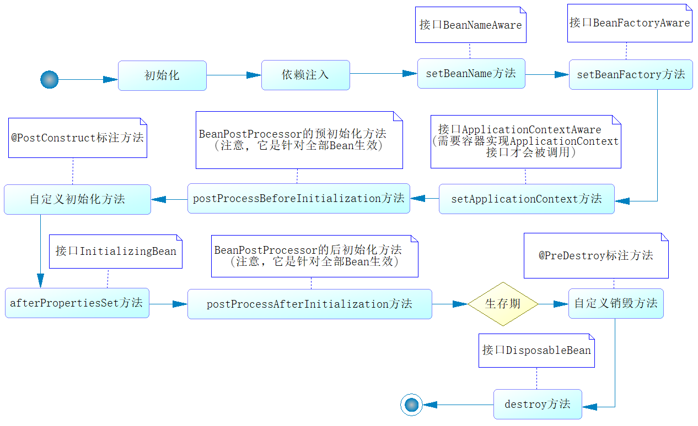

## 2. Spring

#### 2.1 请你说说Spring的核心是什么

**参考答案**

Spring框架包含众多模块，如Core、Testing、Data Access、Web Servlet等，其中Core是整个Spring框架的核心模块。Core模块提供了IoC容器、AOP功能、数据绑定、类型转换等一系列的基础功能，而这些功能以及其他模块的功能都是建立在IoC和AOP之上的，所以IoC和AOP是Spring框架的核心。

IoC（Inversion of Control）是控制反转的意思，这是一种面向对象编程的设计思想。在不采用这种思想的情况下，我们需要自己维护对象与对象之间的依赖关系，很容易造成对象之间的耦合度过高，在一个大型的项目中这十分的不利于代码的维护。IoC则可以解决这种问题，它可以帮我们维护对象与对象之间的依赖关系，降低对象之间的耦合度。

说到IoC就不得不说DI（Dependency Injection），DI是依赖注入的意思，它是IoC实现的实现方式，就是说IoC是通过DI来实现的。由于IoC这个词汇比较抽象而DI却更直观，所以很多时候我们就用DI来代替它，在很多时候我们简单地将IoC和DI划等号，这是一种习惯。而实现依赖注入的关键是IoC容器，它的本质就是一个工厂。

AOP（Aspect Oriented Programing）是面向切面编程思想，这种思想是对OOP的补充，它可以在OOP的基础上进一步提高编程的效率。简单来说，它可以统一解决一批组件的共性需求（如权限检查、记录日志、事务管理等）。在AOP思想下，我们可以将解决共性需求的代码独立出来，然后通过配置的方式，声明这些代码在什么地方、什么时机调用。当满足调用条件时，AOP会将该业务代码织入到我们指定的位置，从而统一解决了问题，又不需要修改这一批组件的代码。

#### 2.2 说一说你对Spring容器的了解

**参考答案**

Spring主要提供了两种类型的容器：BeanFactory和ApplicationContext。

- BeanFactory：是基础类型的IoC容器，提供完整的IoC服务支持。如果没有特殊指定，默认采用延 迟初始化策略。只有当客户端对象需要访问容器中的某个受管对象的时候，才对该受管对象进行初始化以及依赖注入操作。所以，相对来说，容器启动初期速度较快，所需要的资源有限。对于资源有限，并且功能要求不是很严格的场景，BeanFactory是比较合适的IoC容器选择。
- ApplicationContext：它是在BeanFactory的基础上构建的，是相对比较高级的容器实现，除了拥有BeanFactory的所有支持，ApplicationContext还提供了其他高级特性，比如事件发布、国际化信息支持等。ApplicationContext所管理的对象，在该类型容器启动之后，默认全部初始化并绑定完成。所以，相对于BeanFactory来说，ApplicationContext要求更多的系统资源，同时，因为在启动时就完成所有初始化，容 器启动时间较之BeanFactory也会长一些。在那些系统资源充足，并且要求更多功能的场景中，ApplicationContext类型的容器是比较合适的选择。

#### 2.3 说一说你对BeanFactory的了解

**参考答案**

BeanFactory是一个类工厂，与传统类工厂不同的是，BeanFactory是类的通用工厂，它可以创建并管理各种类的对象。这些可被创建和管理的对象本身没有什么特别之处，仅是一个POJO，Spring称这些被创建和管理的Java对象为Bean。并且，Spring中所说的Bean比JavaBean更为宽泛一些，所有可以被Spring容器实例化并管理的Java类都可以成为Bean。

BeanFactory是Spring容器的顶层接口，Spring为BeanFactory提供了多种实现，最常用的是XmlBeanFactory。但它在Spring 3.2中已被废弃，建议使用XmlBeanDefinitionReader、DefaultListableBeanFactory替代。BeanFactory最主要的方法就是 getBean(String beanName)，该方法从容器中返回特定名称的Bean。

#### 2.4 说一说你对Spring IOC的理解

**参考答案**

IoC（Inversion of Control）是控制反转的意思，这是一种面向对象编程的设计思想。在不采用这种思想的情况下，我们需要自己维护对象与对象之间的依赖关系，很容易造成对象之间的耦合度过高，在一个大型的项目中这十分的不利于代码的维护。IoC则可以解决这种问题，它可以帮我们维护对象与对象之间的依赖关系，降低对象之间的耦合度。

说到IoC就不得不说DI（Dependency Injection），DI是依赖注入的意思，它是IoC实现的实现方式，就是说IoC是通过DI来实现的。由于IoC这个词汇比较抽象而DI却更直观，所以很多时候我们就用DI来代替它，在很多时候我们简单地将IoC和DI划等号，这是一种习惯。而实现依赖注入的关键是IoC容器，它的本质就是一个工厂。

在具体的实现中，主要由三种注入方式：

1. 构造方法注入

   就是被注入对象可以在它的构造方法中声明依赖对象的参数列表，让外部知道它需要哪些依赖对象。然后，IoC Service Provider会检查被注入的对象的构造方法，取得它所需要的依赖对象列表，进而为其注入相应的对象。构造方法注入方式比较直观，对象被构造完成后，即进入就绪状态，可以马上使用。

2. setter方法注入

   通过setter方法，可以更改相应的对象属性。所以，当前对象只要为其依赖对象所对应的属性添加setter方法，就可以通过setter方法将相应的依赖对象设置到被注入对象中。setter方法注入虽不像构造方法注入那样，让对象构造完成后即可使用，但相对来说更宽松一些， 可以在对象构造完成后再注入。

3. 接口注入

   相对于前两种注入方式来说，接口注入没有那么简单明了。被注入对象如果想要IoC Service Provider为其注入依赖对象，就必须实现某个接口。这个接口提供一个方法，用来为其注入依赖对象。IoC Service Provider最终通过这些接口来了解应该为被注入对象注入什么依赖对象。相对于前两种依赖注入方式，接口注入比较死板和烦琐。

总体来说，构造方法注入和setter方法注入因为其侵入性较弱，且易于理解和使用，所以是现在使用最多的注入方式。而接口注入因为侵入性较强，近年来已经不流行了。

#### 2.5 Spring是如何管理Bean的？

**参考答案**

Spring通过IoC容器来管理Bean，我们可以通过XML配置或者注解配置，来指导IoC容器对Bean的管理。因为注解配置比XML配置方便很多，所以现在大多时候会使用注解配置的方式。

以下是管理Bean时常用的一些注解：

1. @ComponentScan用于声明扫描策略，通过它的声明，容器就知道要扫描哪些包下带有声明的类，也可以知道哪些特定的类是被排除在外的。
2. @Component、@Repository、@Service、@Controller用于声明Bean，它们的作用一样，但是语义不同。@Component用于声明通用的Bean，@Repository用于声明DAO层的Bean，@Service用于声明业务层的Bean，@Controller用于声明视图层的控制器Bean，被这些注解声明的类就可以被容器扫描并创建。
3. @Autowired、@Qualifier用于注入Bean，即告诉容器应该为当前属性注入哪个Bean。其中，@Autowired是按照Bean的类型进行匹配的，如果这个属性的类型具有多个Bean，就可以通过@Qualifier指定Bean的名称，以消除歧义。
4. @Scope用于声明Bean的作用域，默认情况下Bean是单例的，即在整个容器中这个类型只有一个实例。可以通过@Scope注解指定prototype值将其声明为多例的，也可以将Bean声明为session级作用域、request级作用域等等，但最常用的还是默认的单例模式。
5. @PostConstruct、@PreDestroy用于声明Bean的生命周期。其中，被@PostConstruct修饰的方法将在Bean实例化后被调用，@PreDestroy修饰的方法将在容器销毁前被调用。

#### 2.6 介绍Bean的作用域

**参考答案**

默认情况下，Bean在Spring容器中是单例的，我们可以通过@Scope注解修改Bean的作用域。该注解有如下5个取值，它们代表了Bean的5种不同类型的作用域：

| 类型          | 说明                                                         |
| :------------ | :----------------------------------------------------------- |
| singleton     | 在Spring容器中仅存在一个实例，即Bean以单例的形式存在。       |
| prototype     | 每次调用getBean()时，都会执行new操作，返回一个新的实例。     |
| request       | 每次HTTP请求都会创建一个新的Bean。                           |
| session       | 同一个HTTP Session共享一个Bean，不同的HTTP Session使用不同的Bean。 |
| globalSession | 同一个全局的Session共享一个Bean，一般用于Portlet环境。       |

#### 2.7 说一说Bean的生命周期

**参考答案**

Spring容器管理Bean，涉及对Bean的创建、初始化、调用、销毁等一系列的流程，这个流程就是Bean的生命周期。整个流程参考下图：



这个过程是由Spring容器自动管理的，其中有两个环节我们可以进行干预。

1. 我们可以自定义初始化方法，并在该方法前增加@PostConstruct注解，届时Spring容器将在调用SetBeanFactory方法之后调用该方法。
2. 我们可以自定义销毁方法，并在该方法前增加@PreDestroy注解，届时Spring容器将在自身销毁前，调用这个方法。

#### 2.8 Spring是怎么解决循环依赖的？

**参考答案**

首先，需要明确的是spring对循环依赖的处理有三种情况：

1. 构造器的循环依赖：这种依赖spring是处理不了的，直接抛出BeanCurrentlylnCreationException异常。
2. 单例模式下的setter循环依赖：通过“三级缓存”处理循环依赖。
3. 非单例循环依赖：无法处理。

接下来，我们具体看看spring是如何处理第二种循环依赖的。

一、什么是循环依赖

多个bean之间相互依赖，形成了一个闭环。 比如:A依赖于B、B依赖于c、c依赖于A

通常来说，如果问spring容器内部如何解决循环依赖， 一定是指默认的单例Bean中，属性互相引用的场景。也就是说，Spring的循环依赖，是Spring容器注入时候出现的问题。


二、Spring如何解决循环依赖

1，Spring中单例Bean的三级缓存

第一级缓存〈也叫单例池）singletonObjects:存放已经经历了完整生命周期的Bean对象
第二级缓存: earlySingletonObjects，存放早期暴露出来的Bean对象，Bean的生命周期未结束（属性还未填充完整）
第三级缓存: Map<String, ObiectFactory<?>> singletonFactories，存放可以生成Bean的工厂

3，Bean初始化主要方法

getSingleton：希望从容器里面获得单例的bean，没有的话
doCreateBean: 没有就创建bean
populateBean: 创建完了以后，要填充属性
addSingleton: 填充完了以后，再添加到容器进行使用
4，具体说明

A创建过程中需要B，于是A将自己放到三级缓存里面，去实例化B，B实例化的时候发现需要A，于是B先查一级缓存，没有，再查二级缓存，还是没有，再查三级缓存，找到了A然后把三级缓存里面的这个A放到二级缓存里面，并删除三级缓存里面的A，B顺利初始化完毕，将自己放到一级缓存里面（**此时B里面的A依然是创建中状态**）然后回来接着创建A，此时B已经创建结束，直接从一级缓存里面拿到B，然后完成创建，并将A放到一级缓存中。

#### 2.9 @Autowired和@Resource注解有什么区别？

**参考答案**

1. @Autowired是Spring提供的注解，@Resource是JDK提供的注解。
2. @Autowired是只能按类型注入，@Resource默认按名称注入，也支持按类型注入。
3. @Autowired按类型装配依赖对象，默认情况下它要求依赖对象必须存在，如果允许null值，可以设置它required属性为false，如果我们想使用按名称装配，可以结合@Qualifier注解一起使用。@Resource有两个中重要的属性：name和type。name属性指定byName，如果没有指定name属性，当注解标注在字段上，即默认取字段的名称作为bean名称寻找依赖对象，当注解标注在属性的setter方法上，即默认取属性名作为bean名称寻找依赖对象。需要注意的是，@Resource如果没有指定name属性，并且按照默认的名称仍然找不到依赖对象时， @Resource注解会回退到按类型装配。但一旦指定了name属性，就只能按名称装配了。

#### 2.10 Spring中默认提供的单例是线程安全的吗？

**参考答案**

不是。

Spring容器本身并没有提供Bean的线程安全策略。如果单例的Bean是一个无状态的Bean，即线程中的操作不会对Bean的成员执行查询以外的操作，那么这个单例的Bean是线程安全的。比如，Controller、Service、DAO这样的组件，通常都是单例且线程安全的。如果单例的Bean是一个有状态的Bean，则可以采用ThreadLocal对状态数据做线程隔离，来保证线程安全。

#### 2.11 说一说你对Spring AOP的理解

**参考答案**

AOP（Aspect Oriented Programming）是面向切面编程，它是一种编程思想，是面向对象编程（OOP）的一种补充。面向对象编程将程序抽象成各个层次的对象，而面向切面编程是将程序抽象成各个切面。所谓切面，相当于应用对象间的横切点，我们可以将其单独抽象为单独的模块。

AOP的术语：

- 连接点（join point）：对应的是具体被拦截的对象，因为Spring只能支持方法，所以被拦截的对象往往就是指特定的方法，AOP将通过动态代理技术把它织入对应的流程中。
- 切点（point cut）：有时候，我们的切面不单单应用于单个方法，也可能是多个类的不同方法，这时，可以通过正则式和指示器的规则去定义，从而适配连接点。切点就是提供这样一个功能的概念。
- 通知（advice）：就是按照约定的流程下的方法，分为前置通知、后置通知、环绕通知、事后返回通知和异常通知，它会根据约定织入流程中。
- 目标对象（target）：即被代理对象。
- 引入（introduction）：是指引入新的类和其方法，增强现有Bean的功能。
- 织入（weaving）：它是一个通过动态代理技术，为原有服务对象生成代理对象，然后将与切点定义匹配的连接点拦截，并按约定将各类通知织入约定流程的过程。
- 切面（aspect）：是一个可以定义切点、各类通知和引入的内容，SpringAOP将通过它的信息来增强Bean的功能或者将对应的方法织入流程。

Spring AOP：

AOP可以有多种实现方式，而Spring AOP支持如下两种实现方式。

- JDK动态代理：这是Java提供的动态代理技术，可以在运行时创建接口的代理实例。Spring AOP默认采用这种方式，在接口的代理实例中织入代码。
- CGLib动态代理：采用底层的字节码技术，在运行时创建子类代理的实例。当目标对象不存在接口时，Spring AOP就会采用这种方式，在子类实例中织入代码。

#### 2.12 请你说说AOP的应用场景

**参考答案**

Spring AOP为IoC的使用提供了更多的便利，一方面，应用可以直接使用AOP的功能，设计应用的横切关注点，把跨越应用程序多个模块的功能抽象出来，并通过简单的AOP的使用，灵活地编制到模块中，比如可以通过AOP实现应用程序中的日志功能。另一方面，在Spring内部，一些支持模块也是通过Spring AOP来实现的，比如事务处理。从这两个角度就已经可以看到Spring AOP的核心地位了。

#### 2.13 Spring AOP不能对哪些类进行增强？

**参考答案**

1. Spring AOP只能对IoC容器中的Bean进行增强，对于不受容器管理的对象不能增强。
2. 由于CGLib采用动态创建子类的方式生成代理对象，所以不能对final修饰的类进行代理。

#### 2.14 JDK动态代理和CGLIB有什么区别？

**参考答案**

JDK动态代理

这是Java提供的动态代理技术，可以在运行时创建接口的代理实例。Spring AOP默认采用这种方式，在接口的代理实例中织入代码。

CGLib动态代理

采用底层的字节码技术，在运行时创建子类代理的实例。当目标对象不存在接口时，Spring AOP就会采用这种方式，在子类实例中织入代码。

#### 2.15 既然有没有接口都可以用CGLIB，为什么Spring还要使用JDK动态代理？

**参考答案**

在性能方面，CGLib创建的代理对象比JDK动态代理创建的代理对象高很多。但是，CGLib在创建代理对象时所花费的时间比JDK动态代理多很多。所以，对于单例的对象因为无需频繁创建代理对象，采用CGLib动态代理比较合适。反之，对于多例的对象因为需要频繁的创建代理对象，则JDK动态代理更合适。

#### 2.16 Spring如何管理事务？

**参考答案**

Spring为事务管理提供了一致的编程模板，在高层次上建立了统一的事务抽象。也就是说，不管是选择MyBatis、Hibernate、JPA还是Spring JDBC，Spring都可以让用户以统一的编程模型进行事务管理。

Spring支持两种事务编程模型：

1. 编程式事务

   Spring提供了TransactionTemplate模板，利用该模板我们可以通过编程的方式实现事务管理，而无需关注资源获取、复用、释放、事务同步及异常处理等操作。相对于声明式事务来说，这种方式相对麻烦一些，但是好在更为灵活，我们可以将事务管理的范围控制的更为精确。

2. 声明式事务

   Spring事务管理的亮点在于声明式事务管理，它允许我们通过声明的方式，在IoC配置中指定事务的边界和事务属性，Spring会自动在指定的事务边界上应用事务属性。相对于编程式事务来说，这种方式十分的方便，只需要在需要做事务管理的方法上，增加@Transactional注解，以声明事务特征即可。

#### 2.17 Spring的事务传播方式有哪些？

**参考答案**

当我们调用一个业务方法时，它的内部可能会调用其他的业务方法，以完成一个完整的业务操作。这种业务方法嵌套调用的时候，如果这两个方法都是要保证事务的，那么就要通过Spring的事务传播机制控制当前事务如何传播到被嵌套调用的业务方法中。

Spring在TransactionDefinition接口中规定了7种类型的事务传播行为，它们规定了事务方法和事务方法发生嵌套调用时如何进行传播，如下表：

| 事务传播类型              | 说明                                                         |
| :------------------------ | :----------------------------------------------------------- |
| PROPAGATION_REQUIRED      | 如果当前没有事务，则新建一个事务；如果已存在一个事务，则加入到这个事务中。这是最常见的选择。 |
| PROPAGATION_SUPPORTS      | 支持当前事务，如果当前没有事务，则以非事务方式执行。         |
| PROPAGATION_MANDATORY     | 使用当前的事务，如果当前没有事务，则抛出异常。               |
| PROPAGATION_REQUIRES_NEW  | 新建事务，如果当前存在事务，则把当前事务挂起。               |
| PROPAGATION_NOT_SUPPORTED | 以非事务方式执行操作，如果当前存在事务，则把当前事务挂起。   |
| PROPAGATION_NEVER         | 以非事务方式执行操作，如果当前存在事务，则抛出异常。         |
| PROPAGATION_NESTED        | 如果当前存在事务，则在嵌套事务内执行；如果当前没有事务，则执行与PROPAGATION_REQUIRED类似的操作。 |

#### 2.18 Spring的事务如何配置，常用注解有哪些？

**参考答案**

事务的打开、回滚和提交是由事务管理器来完成的，我们使用不同的数据库访问框架，就要使用与之对应的事务管理器。在Spring Boot中，当你添加了数据库访问框架的起步依赖时，它就会进行自动配置，即自动实例化正确的事务管理器。

对于声明式事务，是使用@Transactional进行标注的。这个注解可以标注在类或者方法上。

- 当它标注在类上时，代表这个类所有公共（public）非静态的方法都将启用事务功能。
- 当它标注在方法上时，代表这个方法将启用事务功能。

另外，在@Transactional注解上，我们可以使用isolation属性声明事务的隔离级别，使用propagation属性声明事务的传播机制。

#### 2.19 说一说你对声明式事务的理解

**参考答案**

Spring事务管理的亮点在于声明式事务管理，它允许我们通过声明的方式，在IoC配置中指定事务的边界和事务属性，Spring会自动在指定的事务边界上应用事务属性。相对于编程式事务来说，这种方式十分的方便，只需要在需要做事务管理的方法上，增加@Transactional注解，以声明事务特征即可。

#### 2.20 SpringBoot 核心注解

SpringBoot是一个框架，一种全新的编程规范，它的产生简化了框架的使用，所谓简化是指简化了Spring众多框架中所需的大量且繁琐的配置，所以SpringBoot是一个服务于框架的框架，服务范围是简化配置文件以及简化我们编写代码的难度, 其中注解起到了非常关键的作用, 能够极地降低我们的代码量, 今天我们就来介绍一下Springboot的最核心的27的注解.

1.@SpringBootApplication
Spring Boot 最最最核心的注解，用在 Spring Boot 主类上，标识这是一个 Spring Boot 应用，用来开启 Spring Boot 的各项能力。实际上这个注解是@Configuration,@EnableAutoConfiguration        ,@ComponentScan三个注解的组合。由于这些注解一般都是一起使用，所以Spring Boot提供了一个统一的注解@SpringBootApplication。

2.@EnableAutoConfiguration
允许 Spring Boot 自动配置注解，开启这个注解之后，Spring Boot 就能根据当前类路径下的包或者类来配置 Spring Bean。

3.@SpringBootConfiguration
这个注解只是用来修饰是 Spring Boot 配置而已，或者可利于 Spring Boot 后续的扩展。

4.@ConditionalOnBean
@ConditionalOnBean(A.class)仅仅在当前上下文中存在A对象时，才会实例化一个Bean，也就是说只有当A.class 在spring的applicationContext中存在时，这个当前的bean才能够创建。

5.@ConditionalOnMissingBean
组合@Conditional注解，和@ConditionalOnBean注解相反，仅仅在当前上下文中不存在A对象时，才会实例化一个Bean。

6.@ConditionalOnClass
组合 @Conditional 注解，可以仅当某些类存在于classpath上时候才创建某个Bean。

7.@ConditionalOnMissingClass
组合@Conditional注解，和@ConditionalOnMissingClass注解相反，当classpath中没有指定的 Class才开启配置。

8.@ConditionalOnWebApplication
组合@Conditional 注解，当前项目类型是 WEB 项目才开启配置。当前项目有以下 3 种类型:ANY(任何Web项目都匹配)、SERVLET（仅但基础的Servelet项目才会匹配）、REACTIVE（只有基于响应的web应用程序才匹配）。

9.@ConditionalOnNotWebApplication
组合@Conditional注解，和@ConditionalOnWebApplication 注解相反，当前项目类型不是 WEB 项目才开启配置。

10.@ConditionalOnProperty
组合 @Conditional 注解，当指定的属性有指定的值时才开启配置。具体操作是通过其两个属性name以及havingValue来实现的，其中name用来从application.properties中读取某个属性值，如果该值为空，则返回false;如果值不为空，则将该值与havingValue指定的值进行比较，如果一样则返回true;否则返回false。如果返回值为false，则该configuration不生效；为true则生效。

10.@ConditionalOnExpression
组合 @Conditional 注解，当 SpEL 表达式为 true 时才开启配置。

12.@ConditionalOnJava
组合@Conditional 注解，当运行的 Java JVM 在指定的版本范围时才开启配置。

13.@ConditionalOnResource
组合 @Conditional 注解，当类路径下有指定的资源才开启配置

14.@ConditionalOnJndi
组合 @Conditional 注解，当指定的 JNDI 存在时才开启配置。

15.@ConditionalOnCloudPlatform
组合 @Conditional 注解，当指定的云平台激活时才开启配置。

16.@ConditionalOnSingleCandidate
组合 @Conditional 注解，当指定的 class 在容器中只有一个 Bean，或者同时有多个但为首选时才开启配置。

17.@ConfigurationProperties
Spring Boot可使用注解的方式将自定义的properties文件映射到实体bean中，比如config.properties文件。

18.@EnableConfigurationProperties
当@EnableConfigurationProperties注解应用到你的@Configuration时，任何被@ConfigurationProperties注解的beans将自动被Environment属性配置。 这种风格的配置特别适合与SpringApplication的外部YAML配置进行配合使用。

19.@AutoConfigureAfter
用在自动配置类上面，表示该自动配置类需要在另外指定的自动配置类配置完之后。

20.@AutoConfigureBefore
这个和@AutoConfigureAfter注解使用相反，表示该自动配置类需要在另外指定的自动配置类配置之前。

21.@AutoConfigureOrder
Spring Boot 1.3.0中有一个新的注解@AutoConfigureOrder，用于确定配置加载的优先级顺序。

22.@Configuration
从Spring3.0，@Configuration用于定义配置类，可替换xml配置文件，被注解的类内部包含有一个或多个被@Bean注解的方法，这些方法将会被AnnotationConfigApplicationContext或AnnotationConfigWebApplicationContext类进行扫描，并用于构建bean定义，初始化Spring容器。

23.@ComponentScan
做过web开发的同学一定都有用过@Controller，@Service，@Repository注解，查看其源码你会发现，他们中有一个共同的注解@Component，没错@ComponentScan注解默认就会装配标识了@Controller，@Service，@Repository，@Component注解的类到spring容器中。

24.@Conditional
@Conditional是Spring4新提供的注解，通过@Conditional注解可以根据代码中设置的条件装载不同的bean，在设置条件注解之前，先要把装载的bean类去实现Condition接口，然后对该实现接口的类设置是否装载的条件。Spring Boot注解中的@ConditionalOnProperty、@ConditionalOnBean等以@Conditional*开头的注解，都是通过集成了@Conditional来实现相应功能的。

25.@Import 
通过导入的方式实现把实例加入springIOC容器中。可以在需要时将没有被Spring容器管理的类导入至Spring容器中。

26.@ImportResource 
和@Import类似，区别就是@ImportResource导入的是配置文件。

27.@Component
@Component是一个元注解，意思是可以注解其他类注解，如@Controller @Service @Repository。带此注解的类被看作组件，当使用基于注解的配置和类路径扫描的时候，这些类就会被实例化。其他类级别的注解也可以被认定为是一种特殊类型的组件，比如@Controller 控制器（注入服务）、@Service服务（注入dao）、@Repository dao（实现dao访问）。@Component泛指组件，当组件不好归类的时候，我们可以使用这个注解进行标注，作用就相当于 XML配置，<bean id="" class=""/>。

### 2.21 SpringBoot 自动化配置原理
@SpringBootConfiguration 就是 @Configuration，代表当前类是一个配置类
@ComponentScan() 开启包扫描
@EnableAutoConfiguration 允许自动配置

- @AutoConfigurationPackage 给容器中导入 Registrar 组件，调用 Registrar 中的方法将主程序所在包下的所有组件导入进来。

    - ```
        @Import(AutoConfigurationPackages.Registrar.class)  
        public @interface AutoConfigurationPackage {}
        ```

- @Import({AutoConfigurationImportSelector.class}) 

    - 导入 AutoConfigurationImportSelector 类 -> getAutoConfigurationEntry() -> getCandidateConfigurations() -> SpringFactoriesLoader.loadSpringFactories() 。
        loadSpringFactories() 加载文件 META-INF/spring.factories。

spring-boot-autoconfigure-2.3.4.RELEASE.jar 包定义了 META-INF/spring.factories，该文件里定义了springboot 一启动就要给容器中加载的 127 个配置类。SpringBoot 默认会在底层配好所有的组件。但是如果用户自己配置了以用户的优先。


整个自动装配的过程是：SpringBoot 通过 @EnableAutoConfiguration 注解开启自动配置，加载spring.factories 中注册的各种 AutoConfiguration 类，当某个 AutoConfiguration 类满足其注解  @Conditional指定的生效条件时，默认都会与配置文件中指定的值绑定。实例化该 AutoConfiguration 类中定义的 Bean 并注入 Spring 容器。