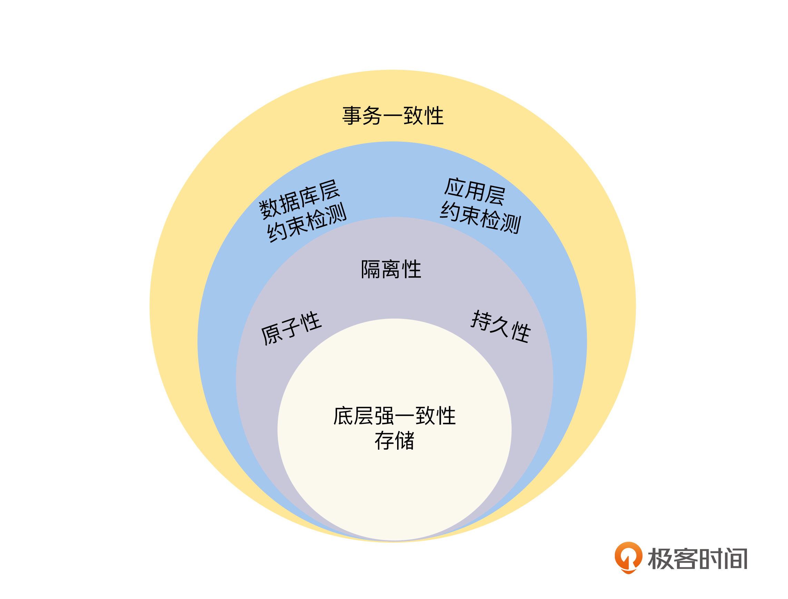
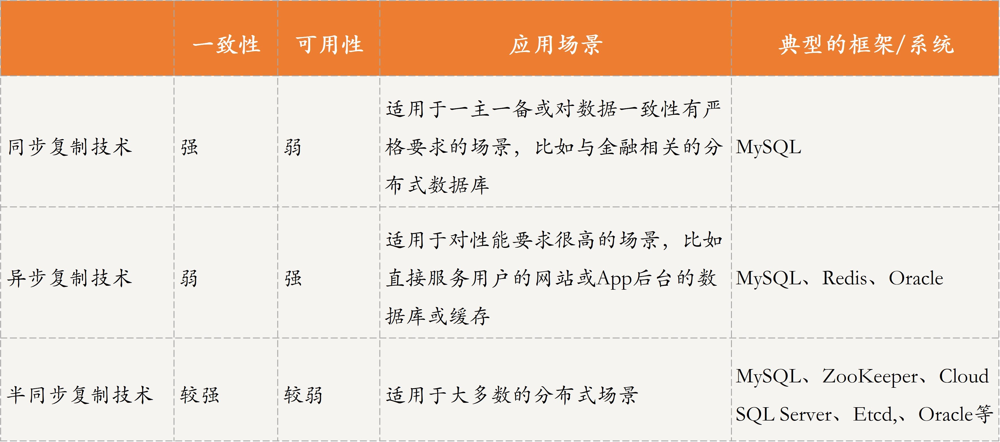
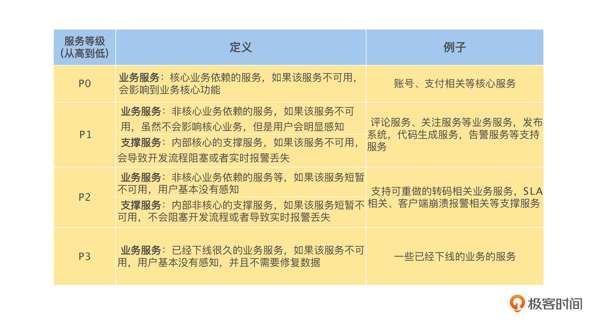
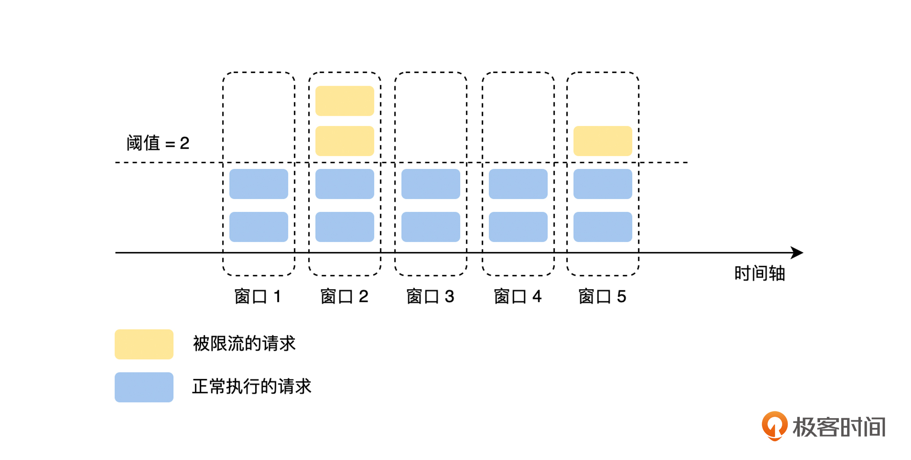
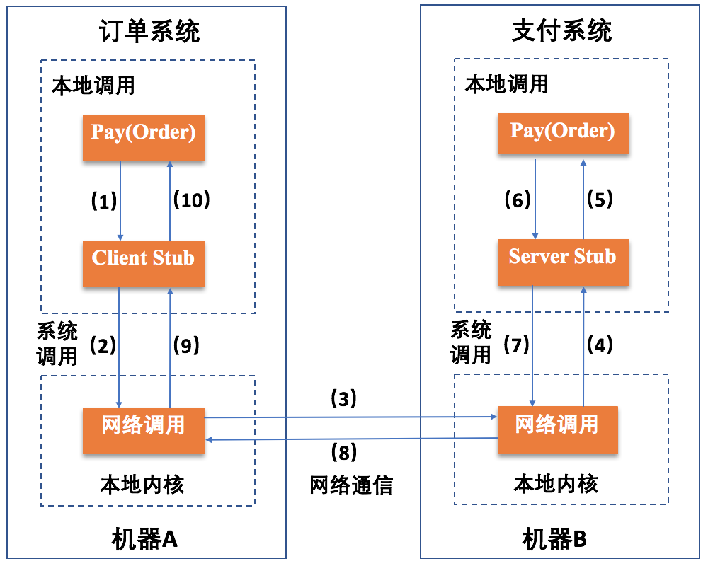
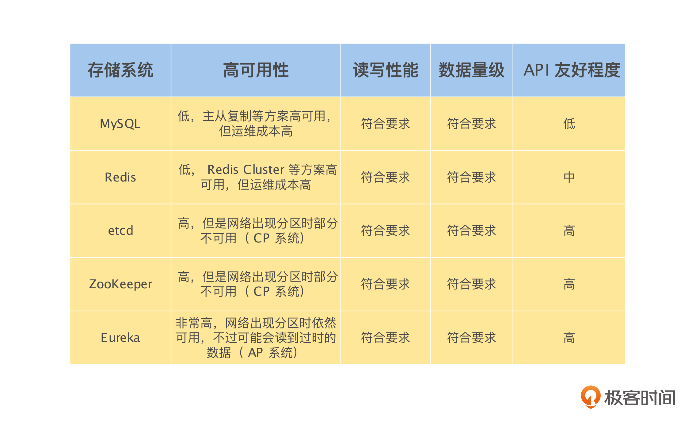
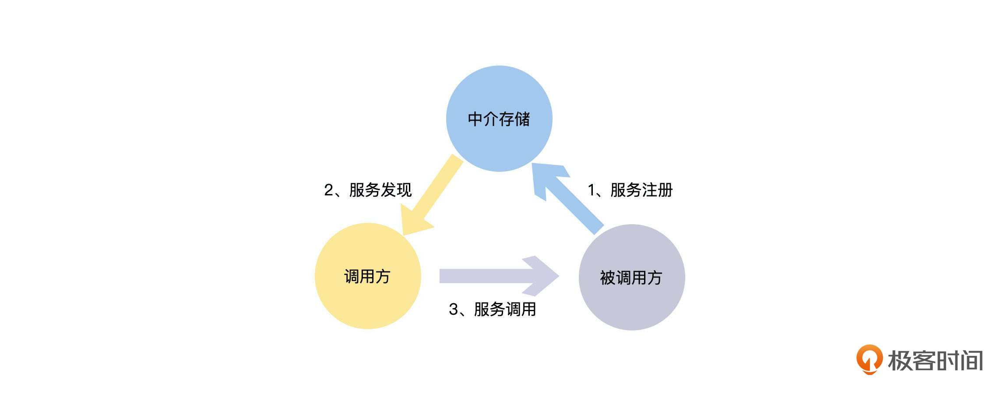

## 1. 分布式

#### 1.1 什么是CAP原则？

**参考答案**

CAP定理又称CAP原则，指的是在一个分布式系统中，Consistency（一致性）、 Availability（可用性）、Partition tolerance（分区容错性），最多只能同时满足三个特性中的两个，三者不可兼得。

但对于 CAP 理论，我们不会简单地三选二或者二选一。对于 AP 模型的系统，我们会努力去提升数据一致性的级别，而对于 CP 模型的系统，我们会努力去提升系统可用性的级别。

-   Consistency (一致性)：

    C 代表 Consistency，强一致性，是指所有节点在同一时刻的数据是相同的，即更新操作执行结束并响应用户完成后，所有节点存储的数据会保持相同。

- Availability (可用性)：

  要求系统提供的服务必须处于 100% 可用的状态，对于用户的每一个操作请求，系统总能够在有限的时间内返回结果。

  - 100% 可用，既不是 99% 可用，也不是 99.99% 可用，它说的是系统必须完全可用，不允许任何不可用的情况出现，这是一个非常理想的模型。
  - 有限时间内，它指的是对于客户端的一个请求，系统必须在指定的时间内返回对应的请求结果，如果超过了这个时间，系统就被认为是不可用的。
  - 返回结果，指系统在完成对客户端请求的处理后，必须返回一个正常的响应结果。客户端可以根据这个响应结果，来明确判断这个请求执行成功还是失败，而不是返回一个让用户无法判断的不正常的响应结果。

-   Partition Tolerance (分区容错性)：

    分区容错性，是指在分布式系统遇到网络分区的情况下，仍然可以响应用户的请求。网络分区是指因为网络故障（网络拥塞、网卡故障）导致网络不连通，不同节点分布在不同的子网络中，各个子网络内网络正常。
    
    分区容错性 P 是一个必须项。如果我们的设计放弃分区容错性，就相当于我们认为节点之间的网络通信永远是好的，那么我们对节点之间的远程调用的结果，就不需要处理超时、网络地址不可达等网络层错误了。

**对于分布式系统工程实践来说， CAP 理论更合适的描述是：在满足分区容错的前提下，没有算法能同时满足数据一致性和服务可用性。**

对于涉及钱的交易时，数据的一致性至关重要，因此保 CP 弃 A 应该是最佳选择。
而对于其他场景，大多数情况下的做法是选择 AP 而牺牲 C，因为很多情况下不需要太强的一致性（数据始终保持一致），只要满足最终一致性即可。

#### 1.2 ACID 和 BASE 理论

基本可用（Basically Available）和最终一致性（Eventually consistent）。软状态（Soft state，软状态描述的是实现服务可用性的时候系统数据的一种过渡状态

它的核心思想是，如果不是必须的话，不推荐实现事务或强一致性，鼓励可用性和性能优先，根据业务的场景特点，来实现非常弹性的基本可用，以及实现数据的最终一致性。

#### 1.3 谈一谈分布式中的一致性

为了便于理解，业界通常会把一致性笼统地分为如下三类：

- 弱一致性（Weak）：写入数据 A 成功后，在数据副本上可能读出来，也可能读不出来，不能保证多长时间之后每个副本的数据一定是一致的。
- 最终一致性（Eventually）：写入数据 A 成功后，在其他副本有可能读不到 A 的最新值，但在某个时间窗口之后保证最终能读到。
- 强一致性（Strong）：数据 A 一旦写入成功，在任意副本任意时刻都能读到 A 的最新值。

以数据为中心的一致性模型，

- 严格一致性，要求任何写操作都能立刻同步到其他所有进程，任何读操作都能读取到最新的修改。要实现这一点，要求存在一个全局时钟，也就是说每台服务器的时间都完全一致，但在分布式场景下很难做到。所以，严格一致性在实际生产环境中目前无法实现。既然全局时钟导致严格一致性很难实现，
- 顺序一致性放弃了全局时钟的约束，改为分布式逻辑时钟实现。分布式逻辑时钟可以理解为一个分布式 ID。顺序一致性是指，所有的进程以相同的顺序看到所有的修改。读操作未必能及时得到此前其他进程对同一数据的写更新，但是每个进程读到的该数据的不同值的顺序是一致的。
- 因果一致性是一种弱化的顺序一致性，所有进程必须以相同的顺序看到具有潜在因果关系的写操作，不同进程以不同的顺序看到并发的写操作。

以用户为中心的一致性模型

- 单调读一致性是指，不能读到新数据后，再读到比这个数据还旧的数据；如果没读到新数据，一直读的还是旧数据，单调读一致性并不关心这个问题。
- 单调写一致性是指，一个进程对数据项 a 执行的写操作，必须在该进程对 a 执行任何后续写操作前完成。这个很容易满足，注意这里是一个进程，所有的写操作都是顺序的。
- 写后读一致性是指，一个进程对数据项 a 执行一次写操作的结果，总是会被该进程对 a 执行的后续读操作看见。这个比较常见，比如数据库采用 Master-Slave 结构部署时，写完 Master 数据库，如果从 Slave 读取，有可能读不到，就不满足写后读一致性了。
- 读后写一致性是指，同一进程对数据项 a 执行的读操作之后的写操作，保证发生在与 a 读取值相同或比其更新的值上。这个问题经常出现的场景是，如果数据存储了多个副本，因为没有及时同步，在第一个副本上读了数据，去第二个副本上写，出现不一致的情况。

#### 1.4 如何实现分布式事务？

**原子性**

2PC

**一致性**

**Quorum 机制（NWR 模型）**

假设对于每一份数据，我们保存 n 个副本，客户端写入成功的副本数为 w ，读取成功的副本数为 r ，那么只需要满足仲裁条件 w + r > n 成立，读副本和写副本之间的交集就一定不为空，即一定能读取到最新的写入。我们将满足仲裁条件 w + r > n 的 w 和 r 称之为法定票数写和读，这就是 Quorum 机制

当 W + R > N 的时候，对于客户端来讲，整个系统能保证强一致性，一定能返回更新后的那份数据。

当 W + R <= N 的时候，对于客户端来讲，整个系统只能保证最终一致性，可能会返回旧数据。

**基于 XA 协议的二阶段提交（2PC）**

有 投票（Voting）和提交（Commit）

两阶段存在问题：

- 同步阻塞问题：二阶段提交算法在执行过程中，所有参与节点都是事务阻塞型的。也就是说，当本地资源管理器占有临界资源时，其他资源管理器如果要访问同一临界资源，会处于阻塞状态。因此，基于 XA 的二阶段提交协议不支持高并发场景。
- 单点故障问题：该算法类似于集中式算法，一旦事务管理器发生故障，整个系统都处于停滞状态。尤其是在提交阶段，一旦事务管理器发生故障，资源管理器会由于等待管理器的消息，而一直锁定事务资源，导致整个系统被阻塞。

和两阶段提交类似的 TCC

**TCC 能实现业务层的原子性操作。**

- Try 是指预留，它和二阶段提交协议中，提交请求阶段的操作类似，具体来说就是，系统会将需要确认的资源预留、锁定，确保确认操作一定能执行成功。

- Confirm 是指确认，它呢和二阶段提交协议中，提交执行阶段的操作类似，具体是指，系统将最终执行的操作。

- Cancel 是指撤销，比较像二阶段提交协议中的回滚操作，具体指系统将撤销之前预留的资源，也就是撤销已执行的预留操作对系统产生的影响。

**三阶段提交：**

三阶段提交引入了超时机制和准备阶段，有 CanCommit、PreCommit、DoCommit 三个阶段

- 如果协调者或参与者在规定的时间内没有接收到来自其他节点的响应，就会根据当前的状态选择提交或者终止整个事务，从而减少了整个集群的阻塞时间，在一定程度上减少或减弱了 2PC 中出现的同步阻塞问题。
- 在预提交阶段尽可能排除一些不一致的情况，保证在最后提交之前各参与节点的状态是一致的。

**隔离性**

脏写：即有两个事务 T1 和 T2 ， T1 更改了 x ，在 T1 提交之前， T2 随之也更改了 x 

丢失更新：T1 先读 x = 0 ，然后 T2 读 x = 0 ，接着 T1 将 x 加 3 后提交， T2 将 x 加 4 后提交，这时 x 的值最终为 4 ， T1 的更新丢失了

**持久性**

不论是 SATA 硬盘还是 SSD 硬盘，从硬盘自身的特点来说，顺序读写的性能都要远远高于随机读写。
在分布式事务中，通过数据冗余保障持久性

数据复制技术：

同步复制：主副本在接受外部客户端的写请求，将新数据写入本地存储后，是同步等待从副本也将新数据写入本地存储后，才回复客户端写入成功，即同步复制

异步复制：主副本在接受外部客户端的写请求，将新数据写入本地存储后，立即向客户端回复写入成功，即异步复制
半同步复制：当主数据库收到多个备数据库中的某一个回复数据同步成功后，便可给用户响应写操作完成；或主数据库等超过一半节点（包括主数据库）回复数据更新成功后，再给用户响应写操作成功。

#### 1.5 了解熔断、限流、降级、扩容吗？

熔断：

熔断则认为当前系统的这一个接口已经出现过载的情况，为了确保系统不会出现雪崩，而对当前接口的请求进行快速失败，直接返回失败，而不是真正地发起请求，以此来减少系统当前的过载情况。
熔断一般会内置到系统的框架中，并且默认开启，作为系统稳定性的最后一道保险丝，来确保系统不会因为过载而雪崩。

降级：

降级是通过**牺牲被降级的接口**或者服务，来保障其他的接口和服务正常运行的，所以我们可以通过降级直接停用非核心服务，然后对于核心接口和服务，在必要的时候，可以提供一个“ B 计划”。

扩容：

水平扩容：通过增加服务的实例数量对系统进行扩容
垂直扩容：通过升级服务部署节点的资源对系统进行扩容

#### 1.6 谈一谈分布式系统的流量控制

固定窗口

固定窗口就是定义一个“固定”的统计周期，比如 10 秒、30 秒或者 1 分钟，然后在每个周期里，统计当前周期中被接收到的请求数量，经过计数器累加后，如果超过设定的阈值就触发限流

滑动窗口

漏桶

其中流出速率是漏桶限流的防线，一般会设置得相对保守，可是这样就无法完全利用系统的性能，就增加了请求的排队时间。

令牌桶

有一个固定容量的存放令牌的桶，我们以固定速率向桶里放入令牌，桶满时会丢弃多出的令牌。每当请求到来时，必须先到桶里取一个令牌才可被服务器处理，也就是说只有拿到了令牌的请求才会被服务器处理

令牌桶以“恒定”的速率生产令牌，但是请求获取令牌的速率是“可变”的，桶里只要有令牌就直接发，令牌没了就触发限流；而漏桶只要桶非空，就以“恒定”的速率处理请求，但是请求流入桶的速率是“可变”的，只要桶还有容量，就可以流入，桶满了就触发限流。

#### 1.7 说一说分布式系统的负载均衡

负载均衡关注公平性和正确性

##### 无状态的负载均衡

无状态的负载均衡是我们日常工作中接触最多的负载均衡模型，它指的是参与负载均衡的后端实例是无状态的，所有的后端实例都是对等的，一个请求不论发向哪一个实例，都会得到相同的并且正确的处理结果，所以无状态的负载均衡策略不需要关心请求的状态。

**顺序轮询**

顺序轮询的负载均衡策略非常简单，只需要将请求按顺序分配给多个实例，不用再做其他的处理。例如，轮询策略会将第一个请求分配给第一个实例，然后将下一个请求分配给第二个实例，这样依次分配下去，分配完一轮之后，再回到开头分配给第一个实例，再依次分配。

**权重轮询**

权重轮询的负载均衡策略是将每一个后端实例分配一个权重，分配请求的数量和实例的权重成正比轮询。例如有两个实例 A，B，假设我们设置 A 的权重为 20，B 的权重为 80，那么负载均衡会将 20% 的请求数量分配给 A，80 % 的请求数量分配给 B。

**随机策略**

随机策略也比较容易理解，指的就是当用户请求到来时，会随机发到某个服务节点进行处理，可以采用随机函数实现。这里，随机函数的作用就是，让请求尽可能分散到不同节点，防止所有请求放到同一节点或少量几个节点上。

##### 半状态的负载均衡

虽然负载均衡策略利用请求的状态信息进行路由，但是仅仅进行简单的规则处理，比如 Hash 运算加求模来路由请求，它不保证路由的正确性，这个正确性由后端实例来保证。

**Hash**

Hash 负载均衡策略是指将请求的状态信息，按一定的 Hash 算法固定分配到一个实例上，例如，按请求的来源 IP 地址或者用户的 ID，将同一个来源 IP 地址或者用户 ID 的请求固定到一个实例上

Hash 的负载均衡策略中，最大的一个问题是基于机器数量求模，如果机器数量发生变化，请求和实例的分配关系机会将全部变化，这会影响它的正确性

**一致性 Hash**

一致性 Hash 和 Hash 策略最大的区别在于，一致性 Hash 是对固定值 2^32^ 求模，不会随着机器数量的变化而变化，所以对于同一个 Request ID ， iRequest 是始终稳定不变的，这样就解决了 Hash 的策略在实例数量发送变化后，几乎所有的分配关系都会发生变化的问题。

##### 全状态的负载均衡

全状态的负载均衡一般以路由服务的形式存在，在路由服务里面，都会存储后端实例 ID 和状态信息的索引，在进行请求路由的时候，路由服务从请求的状态信息中获得索引的标识，通过查询索引获得后端实例的 ID，然后再进行路由。

####  1.8 说一下分布式系统的数据分片技术

#### 1.9 远程调用

- 本地调用通常指的是，进程内函数之间的相互调用；
- 远程调用，是进程间函数的相互调用，是一种进程间通信模式。通过远程调用，一个进程可以看到其他进程的函数、方法等，
  - 本地过程调用（Local Procedure Call，LPC），是指同一台机器上运行的不同进程之间的互相通信，即在多进程操作系统中，运行的不同进程之间可以通过 LPC 进行函数调用。
  - 远程过程调用（Remote Procedure Call，RPC），是指不同机器上运行的进程之间的相互通信，某一机器上运行的进程在不知道底层通信细节的情况下，就像访问本地服务一样，去调用远程机器上的服务。

远程调用机制：

- 远程过程调用 RPC(Remote Procedure Call) 

- 远程方法调用 RMI(Remote Method Invocation)。

**RPC 具体过程** 

**RMI 具体过程**

RMI 是一个用于实现 RPC 的 Java API，能够让本地 Java 虚拟机上运行的对象调用远程方法如同调用本地方法，隐藏通信细节。RMI 是基于对象的，本质就是一种基于对象的 RPC 实现。

RMI 与 PRC 最大的不同在于调用方式和返回结果的形式，RMI 通过对象作为远程接口来进行远程方法的调用，返回的结果也是对象形式。

**如果服务 A 需要调用服务 B，那么服务 A 怎么获取被调用服务 B 的 IP 和 Port 呢？**

统一的中介存储：调用方在唯一的地方获得被调用服务的所有实例的信息。

状态更新和通知：服务实例的信息能够及时更新并且通知到服务调用方。

服务注册：服务状态的更新
服务发现：服务的状态通知

**在解决分布式系统的配置管理问题时，把这个中间层称之为配置中心**

统一的中介存储：一个带版本管理的存储系统，按服务的维度，存储和管理整个分布式系统的配置信息，这样可以很方便地对服务的配置信息，进行搜索、查询和修改。

配置信息的同步：所有的实例，本地都不存储配置信息，实例能够从配置中心获得服务的配置信息，在配置修改后，能够及时将最新的配置，同步给服务的每一个实例。

#### 1.10 如何实现分布式锁

- 基于数据库实现分布式锁，这里的数据库指的是关系型数据库；

基于数据库实现分布式锁比较简单，绝招在于创建一张锁表，为申请者在锁表里建立一条记录，记录建立成功则获得锁，消除记录则释放锁。

数据库对共享资源做了唯一性约束，如果有多个请求被同时提交到数据库的话，数据库会保证只有一个操作可以成功，操作成功的那个线程就获得了访问共享资源的锁，可以进行操作。

- 基于缓存实现分布式锁；

set nx ex 和 红锁

- 基于 ZooKeeper 实现分布式锁。

1. 在与该方法对应的持久节点 shared_lock 的目录下，为每个进程创建一个临时顺序节点。如下图所示，吹风机就是一个拥有 shared_lock 的目录，当有人买吹风机时，会为他创建一个临时顺序节点。
2. 每个进程获取 shared_lock 目录下的所有临时节点列表，注册 Watcher，用于监听子节点变更的信息。当监听到自己的临时节点是顺序最小的，则可以使用共享资源。
3. 每个节点确定自己的编号是否是 shared_lock 下所有子节点中最小的，若最小，则获得锁。例如，用户 A 的订单最先到服务器，因此创建了编号为 1 的临时顺序节点 LockNode1。该节点的编号是持久节点目录下最小的，因此获取到分布式锁，可以访问临界资源，从而可以购买吹风机。
4. 若本进程对应的临时节点编号不是最小的，则分为两种情况：

- 本进程为读请求，如果比自己序号小的节点中有写请求，则等待；

- 本进程为写请求，如果比自己序号小的节点中有请求，则等待

#### 1.11 说一说你对高并发的理解

**参考答案**

1. 如何理解高并发？

高并发意味着大流量，需要运用技术手段抵抗流量的冲击，这些手段好比操作流量，能让流量更平稳地被系统所处理，带给用户更好的体验。我们常见的高并发场景有：淘宝的双11、春运时的抢票、微博大V的热点新闻等。除了这些典型事情，每秒几十万请求的秒杀系统、每天千万级的订单系统、每天亿级日活的信息流系统等，都可以归为高并发。很显然，上面谈到的高并发场景，并发量各不相同，那到底多大并发才算高并发呢？

1.  不能只看数字，要看具体的业务场景。不能说10W QPS的秒杀是高并发，而1W QPS的信息流就不是高并发。信息流场景涉及复杂的推荐模型和各种人工策略，它的业务逻辑可能比秒杀场景复杂10倍不止。因此，不在同一个维度，没有任何比较意义。
2.  业务都是从0到1做起来的，并发量和QPS只是参考指标，最重要的是：在业务量逐渐变成原来的10倍、100倍的过程中，你是否用到了高并发的处理方法去演进你的系统，从架构设计、编码实现、甚至产品方案等维度去预防和解决高并发引起的问题？而不是一味的升级硬件、加机器做水平扩展。

此外，各个高并发场景的业务特点完全不同：有读多写少的信息流场景、有读多写多的交易场景，那是否有通用的技术方案解决不同场景的高并发问题呢？我觉得大的思路可以借鉴，别人的方案也可以参考，但是真正落地过程中，细节上还会有无数的坑。另外，由于软硬件环境、技术栈、以及产品逻辑都没法做到完全一致，这些都会导致同样的业务场景，就算用相同的技术方案也会面临不同的问题，这些坑还得一个个趟。

2. 高并发系统设计的目标是什么？

先搞清楚高并发系统设计的目标，在此基础上再讨论设计方案和实践经验才有意义和针对性。

2.1 宏观目标

高并发绝不意味着只追求高性能，这是很多人片面的理解。从宏观角度看，高并发系统设计的目标有三个：高性能、高可用，以及高可扩展。

1.  高性能：性能体现了系统的并行处理能力，在有限的硬件投入下，提高性能意味着节省成本。同时，性能也反映了用户体验，响应时间分别是100毫秒和1秒，给用户的感受是完全不同的。
2.  高可用：表示系统可以正常服务的时间。一个全年不停机、无故障；另一个隔三差五出线上事故、宕机，用户肯定选择前者。另外，如果系统只能做到90%可用，也会大大拖累业务。
3.  高扩展：表示系统的扩展能力，流量高峰时能否在短时间内完成扩容，更平稳地承接峰值流量，比如双11活动、明星离婚等热点事件。

这3个目标是需要通盘考虑的，因为它们互相关联、甚至也会相互影响。比如说：考虑系统的扩展能力，你会将服务设计成无状态的，这种集群设计保证了高扩展性，其实也间接提升了系统的性能和可用性。再比如说：为了保证可用性，通常会对服务接口进行超时设置，以防大量线程阻塞在慢请求上造成系统雪崩，那超时时间设置成多少合理呢？一般，我们会参考依赖服务的性能表现进行设置。

2.2 微观目标

再从微观角度来看，高性能、高可用和高扩展又有哪些具体的指标来衡量？为什么会选择这些指标呢？

2.2.1 性能指标

通过性能指标可以度量目前存在的性能问题，同时作为性能优化的评估依据。一般来说，会采用一段时间内的接口响应时间作为指标。

1.  平均响应时间：最常用，但是缺陷很明显，对于慢请求不敏感。比如1万次请求，其中9900次是1ms，100次是100ms，则平均响应时间为1.99ms，虽然平均耗时仅增加了0.99ms，但是1%请求的响应时间已经增加了100倍。

2.  TP90、TP99等分位值：将响应时间按照从小到大排序，TP90表示排在第90分位的响应时间， 分位值越大，对慢请求越敏感。

    

3.  吞吐量：和响应时间呈反比，比如响应时间是1ms，则吞吐量为每秒1000次。

通常，设定性能目标时会兼顾吞吐量和响应时间，比如这样表述：在每秒1万次请求下，AVG控制在50ms以下，TP99控制在100ms以下。对于高并发系统，AVG和TP分位值必须同时要考虑。另外，从用户体验角度来看，200毫秒被认为是第一个分界点，用户感觉不到延迟，1秒是第二个分界点，用户能感受到延迟，但是可以接受。因此，对于一个健康的高并发系统，TP99应该控制在200毫秒以内，TP999或者TP9999应该控制在1秒以内。

2.2.2 可用性指标

高可用性是指系统具有较高的无故障运行能力，可用性 = 平均故障时间 / 系统总运行时间，一般使用几个9来描述系统的可用性。

对于高并发系统来说，最基本的要求是：保证3个9或者4个9。原因很简单，如果你只能做到2个9，意味着有1%的故障时间，像一些大公司每年动辄千亿以上的GMV或者收入，1%就是10亿级别的业务影响。

2.2.3 可扩展性指标

面对突发流量，不可能临时改造架构，最快的方式就是增加机器来线性提高系统的处理能力。

对于业务集群或者基础组件来说，扩展性 = 性能提升比例 / 机器增加比例，理想的扩展能力是：资源增加几倍，性能提升几倍。通常来说，扩展能力要维持在70%以上。

但是从高并发系统的整体架构角度来看，扩展的目标不仅仅是把服务设计成无状态就行了，因为当流量增加10倍，业务服务可以快速扩容10倍，但是数据库可能就成为了新的瓶颈。

像MySQL这种有状态的存储服务通常是扩展的技术难点，如果架构上没提前做好规划（垂直和水平拆分），就会涉及到大量数据的迁移。

因此，高扩展性需要考虑：服务集群、数据库、缓存和消息队列等中间件、负载均衡、带宽、依赖的第三方等，当并发达到某一个量级后，上述每个因素都可能成为扩展的瓶颈点。

3. 高并发的实践方案有哪些？

了解了高并发设计的3大目标后，再系统性总结下高并发的设计方案，会从以下两部分展开：先总结下通用的设计方法，然后再围绕高性能、高可用、高扩展分别给出具体的实践方案。

3.1 通用的设计方法

通用的设计方法主要是从「纵向」和「横向」两个维度出发，俗称高并发处理的两板斧：纵向扩展和横向扩展。

3.1.1 纵向扩展（scale-up）

它的目标是提升单机的处理能力，方案又包括：

1.  提升单机的硬件性能：通过增加内存、CPU核数、存储容量、或者将磁盘升级成SSD等堆硬件的方式来提升。
2.  提升单机的软件性能：使用缓存减少IO次数，使用并发或者异步的方式增加吞吐量。

3.1.2 横向扩展（scale-out）

因为单机性能总会存在极限，所以最终还需要引入横向扩展，通过集群部署以进一步提高并发处理能力，又包括以下2个方向：

1.  做好分层架构：这是横向扩展的提前，因为高并发系统往往业务复杂，通过分层处理可以简化复杂问题，更容易做到横向扩展。

    

    上面这种图是互联网最常见的分层架构，当然真实的高并发系统架构会在此基础上进一步完善。比如会做动静分离并引入CDN，反向代理层可以是LVS+Nginx，Web层可以是统一的API网关，业务服务层可进一步按垂直业务做微服务化，存储层可以是各种异构数据库。

2.  各层进行水平扩展：无状态水平扩容，有状态做分片路由。业务集群通常能设计成无状态的，而数据库和缓存往往是有状态的，因此需要设计分区键做好存储分片，当然也可以通过主从同步、读写分离的方案提升读性能。

3.2 具体的实践方案

下面再结合我的个人经验，针对高性能、高可用、高扩展3个方面，总结下可落地的实践方案。

3.2.1 高性能的实践方案

1.  集群部署，通过负载均衡减轻单机压力。
2.  多级缓存，包括静态数据使用CDN、本地缓存、分布式缓存等，以及对缓存场景中的热点key、缓存穿透、缓存并发、数据一致性等问题的处理。
3.  分库分表和索引优化，以及借助搜索引擎解决复杂查询问题。
4.  考虑NoSQL数据库的使用，比如HBase、TiDB等，但是团队必须熟悉这些组件，且有较强的运维能力。
5.  异步化，将次要流程通过多线程、MQ、甚至延时任务进行异步处理。
6.  限流，需要先考虑业务是否允许限流（比如秒杀场景是允许的），包括前端限流、Nginx接入层的限流、服务端的限流。
7.  对流量进行削峰填谷，通过MQ承接流量。
8.  并发处理，通过多线程将串行逻辑并行化。
9.  预计算，比如抢红包场景，可以提前计算好红包金额缓存起来，发红包时直接使用即可。
10.  缓存预热，通过异步任务提前预热数据到本地缓存或者分布式缓存中。
11.  减少IO次数，比如数据库和缓存的批量读写、RPC的批量接口支持、或者通过冗余数据的方式干掉RPC调用。
12.  减少IO时的数据包大小，包括采用轻量级的通信协议、合适的数据结构、去掉接口中的多余字段、减少缓存key的大小、压缩缓存value等。
13.  程序逻辑优化，比如将大概率阻断执行流程的判断逻辑前置、For循环的计算逻辑优化，或者采用更高效的算法。
14.  各种池化技术的使用和池大小的设置，包括HTTP请求池、线程池（考虑CPU密集型还是IO密集型设置核心参数）、数据库和Redis连接池等。
15.  JVM优化，包括新生代和老年代的大小、GC算法的选择等，尽可能减少GC频率和耗时。
16.  锁选择，读多写少的场景用乐观锁，或者考虑通过分段锁的方式减少锁冲突。

上述方案无外乎从计算和 IO 两个维度考虑所有可能的优化点，需要有配套的监控系统实时了解当前的性能表现，并支撑你进行性能瓶颈分析，然后再遵循二八原则，抓主要矛盾进行优化。

3.2.2 高可用的实践方案

1.  对等节点的故障转移，Nginx和服务治理框架均支持一个节点失败后访问另一个节点。
2.  非对等节点的故障转移，通过心跳检测并实施主备切换（比如redis的哨兵模式或者集群模式、MySQL的主从切换等）。
3.  接口层面的超时设置、重试策略和幂等设计。
4.  降级处理：保证核心服务，牺牲非核心服务，必要时进行熔断；或者核心链路出问题时，有备选链路。
5.  限流处理：对超过系统处理能力的请求直接拒绝或者返回错误码。
6.  MQ场景的消息可靠性保证，包括producer端的重试机制、broker侧的持久化、consumer端的ack机制等。
7.  灰度发布，能支持按机器维度进行小流量部署，观察系统日志和业务指标，等运行平稳后再推全量。
8.  监控报警：全方位的监控体系，包括最基础的CPU、内存、磁盘、网络的监控，以及Web服务器、JVM、数据库、各类中间件的监控和业务指标的监控。
9.  灾备演练：类似当前的“混沌工程”，对系统进行一些破坏性手段，观察局部故障是否会引起可用性问题。

高可用的方案主要从冗余、取舍、系统运维3个方向考虑，同时需要有配套的值班机制和故障处理流程，当出现线上问题时，可及时跟进处理。

3.2.3 高扩展的实践方案

1.  合理的分层架构：比如上面谈到的互联网最常见的分层架构，另外还能进一步按照数据访问层、业务逻辑层对微服务做更细粒度的分层（但是需要评估性能，会存在网络多一跳的情况）。
2.  存储层的拆分：按照业务维度做垂直拆分、按照数据特征维度进一步做水平拆分（分库分表）。
3.  业务层的拆分：最常见的是按照业务维度拆（比如电商场景的商品服务、订单服务等），也可以按照核心接口和非核心接口拆，还可以按照请求源拆（比如To C和To B，APP和H5）。

#### 1.12 如何实现分布式存储？

**参考答案**

分布式存储是一个大的概念，其包含的种类繁多，除了传统意义上的分布式文件系统、分布式块存储和分布式对象存储外，还包括分布式数据库和分布式缓存等。下面我们探讨一下分布式文件系统等传统意义上的存储架构，实现这种存储架构主要有三种通用的形式，其它存储架构也基本上基于上述架构，并没有太大的变化。

中间控制节点架构（HDFS）

分布式存储最早是由谷歌提出的，其目的是通过廉价的服务器来提供使用与大规模，高并发场景下的Web访问问题。下图是谷歌分布式存储（HDFS）的简化的模型。在该系统的整个架构中将服务器分为两种类型，一种名为namenode，这种类型的节点负责管理管理数据（元数据），另外一种名为datanode，这种类型的服务器负责实际数据的管理。

上图分布式存储中，如果客户端需要从某个文件读取数据，首先从namenode获取该文件的位置（具体在哪个datanode），然后从该位置获取具体的数据。在该架构中namenode通常是主备部署，而datanode则是由大量节点构成一个集群。由于元数据的访问频度和访问量相对数据都要小很多，因此namenode通常不会成为性能瓶颈，而datanode集群可以分散客户端的请求。因此，通过这种分布式存储架构可以通过横向扩展datanode的数量来增加承载能力，也即实现了动态横向扩展的能力。

完全无中心架构---计算模式（Ceph）

下图是Ceph存储系统的架构，在该架构中与HDFS不同的地方在于该架构中没有中心节点。客户端是通过一个设备映射关系计算出来其写入数据的位置，这样客户端可以直接与存储节点通信，从而避免中心节点的性能瓶颈。

在Ceph存储系统架构中核心组件有Mon服务、OSD服务和MDS服务等。对于块存储类型只需要Mon服务、OSD服务和客户端的软件即可。其中Mon服务用于维护存储系统的硬件逻辑关系，主要是服务器和硬盘等在线信息。Mon服务通过集群的方式保证其服务的可用性。OSD服务用于实现对磁盘的管理，实现真正的数据读写，通常一个磁盘对应一个OSD服务。 客户端访问存储的大致流程是，客户端在启动后会首先从Mon服务拉取存储资源布局信息，然后根据该布局信息和写入数据的名称等信息计算出期望数据的位置（包含具体的物理服务器信息和磁盘信息），然后该位置信息直接通信，读取或者写入数据。

完全无中心架构---一致性哈希（Swift）

与Ceph的通过计算方式获得数据位置的方式不同，另外一种方式是通过一致性哈希的方式获得数据位置。一致性哈希的方式就是将设备做成一个哈希环，然后根据数据名称计算出的哈希值映射到哈希环的某个位置，从而实现数据的定位。

上图是一致性哈希的基本原理，为了绘制简单，本文以一个服务器上的一个磁盘为例进行介绍。为了保证数据分配的均匀性及出现设备故障时数据迁移的均匀性，一致性哈希将磁盘划分为比较多的虚拟分区，每个虚拟分区是哈希环上的一个节点。整个环是一个从0到32位最大值的一个区间，并且首尾相接。当计算出数据（或者数据名称）的哈希值后，必然落到哈希环的某个区间，然后以顺时针，必然能够找到一个节点。那么，这个节点就是存储数据的位置。 Swift存储的整个数据定位算法就是基于上述一致性哈希实现的。在Swift对象存储中，通过账户名/容器名/对象名三个名称组成一个位置的标识，通过该唯一标识可以计算出一个整型数来。而在存储设备方面，Swift构建一个虚拟分区表，表的大小在创建集群是确定（通常为几十万），这个表其实就是一个数组。这样，根据上面计算的整数值，以及这个数组，通过一致性哈希算法就可以确定该整数在数组的位置。而数组中的每项内容是数据3个副本（也可以是其它副本数量）的设备信息（包含服务器和磁盘等信息）。也就是经过上述计算，可以确定一个数据存储的具体位置。这样，Swift就可以将请求重新定向到该设备进行处理。

上述计算过程是在一个名为Proxy的服务中进行的，该服务可以集群化部署。因此可以分摊请求的负载，不会成为性能瓶颈。

#### 1.13 说一说你对分布式事务的了解

**参考答案**

分布式事务就是指事务的参与者、支持事务的服务器、资源服务器以及事务管理器分别位于不同的分布式系统的不同节点之上。简单的说，就是一次大的操作由不同的小操作组成，这些小的操作分布在不同的服务器上，且属于不同的应用，分布式事务需要保证这些小操作要么全部成功，要么全部失败。本质上来说，分布式事务就是为了保证不同数据库的数据一致性。

要实现分布式事务，有如下几种常见的解决方案：

2PC

说到2PC就不得不聊数据库分布式事务中的 XA Transactions。

如上图，在XA协议中分为两阶段：

第一阶段：事务管理器要求每个涉及到事务的数据库预提交(precommit)此操作，并反映是否可以提交。

第二阶段：事务协调器要求每个数据库提交数据，或者回滚数据。

优点：

-   尽量保证了数据的强一致，实现成本较低，在各大主流数据库都有自己实现，对于MySQL是从5.5开始支持。

缺点：

-   单点问题:事务管理器在整个流程中扮演的角色很关键，如果其宕机，比如在第一阶段已经完成，在第二阶段正准备提交的时候事务管理器宕机，资源管理器就会一直阻塞，导致数据库无法使用。
-   同步阻塞:在准备就绪之后，资源管理器中的资源一直处于阻塞，直到提交完成，释放资源。
-   数据不一致:两阶段提交协议虽然为分布式数据强一致性所设计，但仍然存在数据不一致性的可能，比如在第二阶段中，假设协调者发出了事务commit的通知，但是因为网络问题该通知仅被一部分参与者所收到并执行了commit操作，其余的参与者则因为没有收到通知一直处于阻塞状态，这时候就产生了数据的不一致性。

总的来说，XA协议比较简单，成本较低，但是其单点问题，以及不能支持高并发依然是其最大的弱点。

TCC

关于TCC（Try-Confirm-Cancel）的概念，最早是由Pat Helland于2007年发表的一篇名为《Life beyond Distributed Transactions:an Apostate’s Opinion》的论文提出。 TCC事务机制相比于上面介绍的XA，解决了其几个缺点：

1.  解决了协调者单点，由主业务方发起并完成这个业务活动。业务活动管理器也变成多点，引入集群。
2.  同步阻塞：引入超时，超时后进行补偿，并且不会锁定整个资源，将资源转换为业务逻辑形式，粒度变小。
3.  数据一致性，有了补偿机制之后，由业务活动管理器控制一致性。

对于TCC做出如下的解释：

-   Try阶段：尝试执行,完成所有业务检查（一致性），预留必须业务资源（准隔离性）。
-   Confirm阶段：确认执行真正执行业务，不作任何业务检查，只使用Try阶段预留的业务资源，Confirm操作满足幂等性。要求具备幂等设计，Confirm失败后需要进行重试。
-   Cancel阶段：取消执行，释放Try阶段预留的业务资源 Cancel操作满足幂等性Cancel阶段的异常和Confirm阶段异常处理方案基本上一致。

举个简单的例子如果你用100元买了一瓶水，在Try阶段你需要向你的钱包检查是否够100元并锁住这100元，水也是一样的。如果有一个失败，则进行cancel(释放这100元和这一瓶水)，如果cancel失败不论什么失败都进行重试cancel，所以需要保持幂等。如果都成功，则进行confirm,确认这100元扣，和这一瓶水被卖，如果confirm失败无论什么失败则重试(会依靠活动日志进行重试)。

对于TCC来说适合以下场景：

-   强隔离性，严格一致性要求的活动业务。
-   执行时间较短的业务。

本地消息表

本地消息表这个方案最初是ebay提出的，此方案的核心是将需要分布式处理的任务通过消息日志的方式来异步执行。消息日志可以存储到本地文本、数据库或消息队列，再通过业务规则自动或人工发起重试。人工重试更多的是应用于支付场景，通过对账系统对事后问题的处理。

对于本地消息队列来说核心是把大事务转变为小事务，还是举上面用100元去买一瓶水的例子：

1.  当你扣钱的时候，你需要在你扣钱的服务器上新增加一个本地消息表，你需要把你扣钱和写入减去水的库存到本地消息表放入同一个事务(依靠数据库本地事务保证一致性。
2.  这个时候有个定时任务去轮询这个本地事务表，把没有发送的消息，扔给商品库存服务器，叫他减去水的库存，到达商品服务器之后这个时候得先写入这个服务器的事务表，然后进行扣减，扣减成功后，更新事务表中的状态。
3.  商品服务器通过定时任务扫描消息表或者直接通知扣钱服务器，扣钱服务器本地消息表进行状态更新。
4.  针对一些异常情况，定时扫描未成功处理的消息，进行重新发送，在商品服务器接到消息之后，首先判断是否是重复的，如果已经接收，在判断是否执行，如果执行在马上又进行通知事务，如果未执行，需要重新执行需要由业务保证幂等，也就是不会多扣一瓶水。

本地消息队列是BASE理论，是最终一致模型，适用于对一致性要求不高的场景，实现这个模型时需要注意重试的幂等。

MQ事务

在RocketMQ中实现了分布式事务，实际上其实是对本地消息表的一个封装，将本地消息表移动到了MQ内部，下面简单介绍一下MQ事务。

基本流程如下：

第一阶段Prepared消息，会拿到消息的地址。

第二阶段执行本地事务。

第三阶段通过第一阶段拿到的地址去访问消息，并修改状态。消息接受者就能使用这个消息。

如果确认消息失败，在RocketMq Broker中提供了定时扫描没有更新状态的消息，如果有消息没有得到确认，会向消息发送者发送消息，来判断是否提交，在rocketmq中是以listener的形式给发送者，用来处理。

如果消费超时，则需要一直重试，消息接收端需要保证幂等。如果消息消费失败，这个就需要人工进行处理，因为这个概率较低，如果为了这种小概率时间而设计这个复杂的流程反而得不偿失。

Saga事务

Saga是30年前一篇数据库伦理提到的一个概念。其核心思想是将长事务拆分为多个本地短事务，由Saga事务协调器协调，如果正常结束那就正常完成，如果某个步骤失败，则根据相反顺序一次调用补偿操作。 Saga的组成：

每个Saga由一系列sub-transaction Ti 组成 每个Ti 都有对应的补偿动作Ci，补偿动作用于撤销Ti造成的结果,这里的每个T，都是一个本地事务。 可以看到，和TCC相比，Saga没有“预留 try”动作，它的Ti就是直接提交到库。

Saga的执行顺序有两种：

-   T1, T2, T3, ..., Tn
-   T1, T2, ..., Tj, Cj,..., C2, C1，其中0 < j < n

Saga定义了两种恢复策略：

向后恢复，即上面提到的第二种执行顺序，其中j是发生错误的sub-transaction，这种做法的效果是撤销掉之前所有成功的sub-transation，使得整个Saga的执行结果撤销。 向前恢复，适用于必须要成功的场景，执行顺序是类似于这样的：T1, T2, ..., Tj(失败), Tj(重试),..., Tn，其中j是发生错误的sub-transaction。该情况下不需要Ci。这里要注意的是，在saga模式中不能保证隔离性，因为没有锁住资源，其他事务依然可以覆盖或者影响当前事务。

还是拿100元买一瓶水的例子来说，这里定义：

-   T1=扣100元，T2=给用户加一瓶水，T3=减库存一瓶水；
-   C1=加100元，C2=给用户减一瓶水，C3=给库存加一瓶水；

我们一次进行T1，T2，T3如果发生问题，就执行发生问题的C操作的反向。 上面说到的隔离性的问题会出现在，如果执行到T3这个时候需要执行回滚，但是这个用户已经把水喝了(另外一个事务)，回滚的时候就会发现，无法给用户减一瓶水了。这就是事务之间没有隔离性的问题。

可以看见saga模式没有隔离性的影响还是较大，可以参照华为的解决方案:从业务层面入手加入一 Session 以及锁的机制来保证能够串行化操作资源。也可以在业务层面通过预先冻结资金的方式隔离这部分资源， 最后在业务操作的过程中可以通过及时读取当前状态的方式获取到最新的更新。

#### 1.14 分布式系统如何保证最终一致性？

**参考答案**

国际开放标准组织Open Group定义了DTS（分布式事务处理模型），模型中包含4种角色：应用程序、事务管理器、资源管理器和通信资源管理器。事务管理器是统管全局的管理者，资源管理器和通信资源管理器是事务的参与者。

JEE（Java企业版）规范也包含此分布式事务处理模型的规范，并在所有AppServer中进行实现。在JEE规范中定义了TX协议和XA协议，TX协议定义应用程序与事务管理器之间的接口，XA协议则定义事务管理器与资源管理器之间的接口。在过去使用 AppServer如WebSphere、 WebLogic、JBoss等配置数据源时会看见类似XADatasource的数据源，这就是实现了分布式事务处理模型的关系型数据库的数据源。在企业级开发JEE中，关系型数据库、JMS服务扮演资源管理器的角色，而EJB容器扮演事务管理器的角色。

下面我们介绍两阶段提交协议、三阶段提交协议及阿里巴巴提出的 TCC，它们都是根据DTS这一思想演变而来的。

两阶段提交协议

两阶段提交协议把分布式事务分为两个阶段，一个是准备阶段，另一个是提交阶段。准备阶段和提交阶段都是由事务管理器发起的，为了接下来讲解方便，我们将事务管理器称为协调者，将资源管理器称为参与者。

两阶段提交协议的流程如下所述。

-   准备阶段：协调者向参与者发起指令，参与者评估自己的状态，如果参与者评估指令可以完成，则会写redo或者undo日志（Write-Ahead Log的一种），然后锁定资源，执行操作，但是并不提交。

-   提交阶段：如果每个参与者明确返回准备成功，也就是预留资源和执行操作成功，则协调者向参与者发起提交指令，参与者提交资源变更的事务，释放锁定的资源；如果任何一个参与者明确返回准备失败，也就是预留资源或者执行操作失败，则协调者向参与者发起中止指令，参与者取消已经变更的事务，执行undo日志，释放锁定的资源。两阶段提交协议的成功场景如下图所示。

    

    我们看到两阶段提交协议在准备阶段锁定资源，这是一个重量级的操作，能保证强一致性，但是实现起来复杂、成本较高、不够灵活，更重要的是它有如下致命的问题。

-   阻塞：从上面的描述来看，对于任何一次指令都必须收到明确的响应，才会继续进行下一步，否则处于阻塞状态，占用的资源被一直锁定，不会被释放。

-   单点故障：如果协调者宕机，参与者没有协调者指挥，则会一直阻塞，尽管可以通过选举新的协调者替代原有协调者，但是如果协调者在发送一个提交指令后宕机，而提交指令仅仅被一个参与者接收，并且参与者接收后也宕机，则新上任的协调者无法处理这种情况。

-   脑裂：协调者发送提交指令，有的参与者接收到并执行了事务，有的参与者没有接收到事务就没有执行事务，多个参与者之间是不一致的。

上面的所有问题虽然很少发生，但都需要人工干预处理，没有自动化的解决方案，因此两阶段提交协议在正常情况下能保证系统的强一致性，但是在出现异常的情况下，当前处理的操作处于错误状态，需要管理员人工干预解决，因此可用性不够好，这也符合CAP协议的一致性和可用性不能兼得的原理。

三阶段提交协议

三阶段提交协议是两阶段提交协议的改进版本。它通过超时机制解决了阻塞的问题，并且把两个阶段增加为以下三个阶段。

-   询问阶段：协调者询问参与者是否可以完成指令，协调者只需要回答是或不是，而不需要做真正的操作，这个阶段超时会导致中止。
-   准备阶段：如果在询问阶段所有参与者都返回可以执行操作，则协调者向参与者发送预执行请求，然后参与者写redo和undo日志，执行操作但是不提交操作；如果在询问阶段任意参与者返回不能执行操作的结果，则协调者向参与者发送中止请求，这里的逻辑与两阶段提交协议的准备阶段是相似的。
-   提交阶段：如果每个参与者在准备阶段返回准备成功，也就是说预留资源和执行操作成功，则协调者向参与者发起提交指令，参与者提交资源变更的事务，释放锁定的资源；如果任何参与者返回准备失败，也就是说预留资源或者执行操作失败，则协调者向参与者发起中止指令，参与者取消已经变更的事务，执行 undo 日志，释放锁定的资源，这里的逻辑与两阶段提交协议的提交阶段一致。

三阶段提交协议的成功场景示意图如下图所示：

三阶段提交协议与两阶段提交协议主要有以下两个不同点：

-   增加了一个询问阶段，询问阶段可以确保尽可能早地发现无法执行操作而需要中止的行为，但是它并不能发现所有这种行为，只会减少这种情况的发生。
-   在准备阶段以后，协调者和参与者执行的任务中都增加了超时，一旦超时，则协调者和参与者都会继续提交事务，默认为成功，这也是根据概率统计超时后默认为成功的正确性最大。

三阶段提交协议与两阶段提交协议相比，具有如上优点，但是一旦发生超时，系统仍然会发生不一致，只不过这种情况很少见，好处是至少不会阻塞和永远锁定资源。

TCC

签名讲解了两阶段提交协议和三阶段提交协议，实际上它们能解决常见的分布式事务的问题，但是遇到极端情况时，系统会产生阻塞或者不一致的问题，需要运营或者技术人员解决。两阶段及三阶段方案中都包含多个参与者、多个阶段实现一个事务，实现复杂，性能也是一个很大的问题，因此，在互联网的高并发系统中，鲜有使用两阶段提交和三阶段提交协议的场景。

后来有人提出了TCC协议，TCC协议将一个任务拆分成Try、Confirm、Cancel三个步骤，正常的流程会先执行Try，如果执行没有问题，则再执行Confirm，如果执行过程中出了问题，则执行操作的逆操作Cancel。从正常的流程上讲，这仍然是一个两阶段提交协议，但是在执行出现问题时有一定的自我修复能力，如果任何参与者出现了问题，则协调者通过执行操作的逆操作来Cancel之前的操作，达到最终的一致状态。

可以看出，从时序上来说，如果遇到极端情况，则TCC会有很多问题，例如，如果在取消时一些参与者收到指令，而另一些参与者没有收到指令，则整个系统仍然是不一致的。对于这种复杂的情况，系统首先会通过补偿的方式尝试自动修复，如果系统无法修复，则必须由人工参与解决。

从TCC的逻辑上看，可以说TCC是简化版的三阶段提交协议，解决了两阶段提交协议的阻塞问题，但是没有解决极端情况下会出现不一致和脑裂的问题。然而，TCC通过自动化补偿手段，将需要人工处理的不一致情况降到最少，也是一种非常有用的解决方案。某著名的互联网公司在内部的一些中间件上实现了TCC模式。

我们给出一个使用TCC的实际案例，在秒杀的场景中，用户发起下订单请求，应用层先查询库存，确认商品库存还有余量，则锁定库存，此时订单状态为待支付，然后指引用户去支付，由于某种原因用户支付失败或者支付超时，则系统会自动将锁定的库存解锁以供其他用户秒杀。

TCC协议的使用场景如下图所示：

在大规模、高并发服务化系统中，一个功能被拆分成多个具有单一功能的子功能，一个流程会有多个系统的多个单一功能的服务组合实现，如果使用两阶段提交协议和三阶段提交协议，则确实能解决系统间的一致性问题。除了这两个协议的自身问题，其实现也比较复杂、成本比较高，最重要的是性能不好，相比来看，TCC协议更简单且更容易实现，但是TCC协议由于每个事务都需要执行Try，再执行Confirm，略显臃肿，因此，现实系统的底线是仅仅需要达到最终一致性，而不需要实现专业的、复杂的一致性协议。实现最终一致性有一些非常有效、简单的模式，下面就介绍这些模式及其应用场景。

查询模式

任何服务操作都需要提供一个查询接口，用来向外部输出操作执行的状态。服务操作的使用方可以通过查询接口得知服务操作执行的状态，然后根据不同的状态来做不同的处理操作。

为了能够实现查询，每个服务操作都需要有唯一的流水号标识，也可使用此次服务操作对应的资源ID来标识，例如：请求流水号、订单号等。首先，单笔查询操作是必须提供的，也鼓励使用单笔订单查询，这是因为每次调用需要占用的负载是可控的。批量查询则根据需要来提供，如果使用了批量查询，则需要有合理的分页机制，并且必须限制分页的大小，以及对批量查询的吞吐量有容量评估、熔断、隔离和限流等措施。

补偿模式

有了上面的查询模式，在任何情况下，我们都能得知具体的操作所处的状态，如果整个操作都处于不正常的状态，则我们需要修正操作中有问题的子操作，这可能需要重新执行未完成的子操作，后者取消已经完成的子操作，通过修复使整个分布式系统达到一致。为了让系统最终达到一致状态而做的努力都叫作补偿。

对于服务化系统中同步调用的操作，若业务操作发起方还没有收到业务操作执行方的明确返回或者调用超时，业务发起方需要及时地调用业务执行方来获得操作执行的状态，这里使用在前面学习的查询模式。在获得业务操作执行方的状态后，如果业务执行方已经完成预设工作，则业务发起方向业务的使用方返回成功；如果业务操作执行方的状态为失败或者未知，则会立即告诉业务使用方失败，也叫作快速失败策略，然后调用业务操作的逆向操作，保证操作不被执行或者回滚已经执行的操作，让业务使用方、业务操作发起方和业务操作执行方最终达到一致状态。

异步确保模式

异步确保模式是补偿模式的一个典型案例，经常应用到使用方对响应时间要求不太高的场景中，通常把这类操作从主流程中摘除，通过异步的方式进行处理，处理后把结果通过通知系统通知给使用方。这个方案的最大好处是能够对高并发流量进行消峰，例如：电商系统中的物流、配送，以及支付系统中的计费、入账等。

在实践中将要执行的异步操作封装后持久入库，然后通过定时捞取未完成的任务进行补偿操作来实现异步确保模式，只要定时系统足够健壮，则任何任务最终都会被成功执行。

异步确保模式如下图所示：

定期校对模式

系统在没有达到一致之前，系统间的状态是不一致的，甚至是混乱的，需要通过补偿操作来达到最终一致性的目的，但是如何来发现需要补偿的操作呢？

在操作主流程中的系统间执行校对操作，可以在事后异步地批量校对操作的状态，如果发现不一致的操作，则进行补偿，补偿操作与补偿模式中的补偿操作是一致的。

另外，实现定期校对的一个关键就是分布式系统中需要有一个自始至终唯一的ID，生成全局唯一ID有以下两种方法：

-   持久型：使用数据库表自增字段或者Sequence生成，为了提高效率，每个应用节点可以缓存一个批次的ID，如果机器重启则可能会损失一部分ID，但是这并不会产生任何问题。
-   时间型：一般由机器号、业务号、时间、单节点内自增ID组成，由于时间一般精确到秒或者毫秒，因此不需要持久就能保证在分布式系统中全局唯一、粗略递增等。

可靠消息模式

在分布式系统中，对于主流程中优先级比较低的操作，大多采用异步的方式执行，也就是前面提到的异步确保模型，为了让异步操作的调用方和被调用方充分解耦，也由于专业的消息队列本身具有可伸缩、可分片、可持久等功能，我们通常通过消息队列实现异步化。对于消息队列，我们需要建立特殊的设施来保证可靠的消息发送及处理机的幂等性。

缓存一致性模式

在大规模、高并发系统中的一个常见的核心需求就是亿级的读需求，显然，关系型数据库并不是解决高并发读需求的最佳方案，互联网的经典做法就是使用缓存来抗住读流量。

-   如果性能要求不是非常高，则尽量使用分布式缓存，而不要使用本地缓存。
-   写缓存时数据一定要完整，如果缓存数据的一部分有效，另一部分无效，则宁可在需要时回源数据库，也不要把部分数据放入缓存中。
-   使用缓存牺牲了一致性，为了提高性能，数据库与缓存只需要保持弱一致性，而不需要保持强一致性，否则违背了使用缓存的初衷。
-   读的顺序是先读缓存，后读数据库，写的顺序要先写数据库，后写缓存。

#### 1.15 谈谈你对分布式的单点问题的了解

**参考答案**

在分布式系统中，单点问题是一个比较常见的问题，对于单点问题可以分为有状态服务的单点问题和无状态服务的单点问题。

无状态服务的单点问题

对于无状态的服务，单点问题的解决比较简单，因为服务是无状态的，所以服务节点很容易进行平行扩展。比如，在分布式系统中，为了降低各进程通信的网络结构的复杂度，我们会增加一个代理节点，专门做消息的转发，其他的业务进行直接和代理节点进行通信，类似一个星型的网络结构。

参考上面两个图，图中proxy是一个消息转发代理，业务进程中的消息都会经过该代理，这也是比较场景的一个架构。在上图中，只有一个proxy，如果该节点挂了，那么所有的业务进程之间都无法进行通信。由于proxy是无状态的服务，所以很容易想到第二个图中的解决方案，增加一个proxy节点，两个proxy节点是对等的。增加新节点后，业务进程需要与两个Proxy之间增加一个心跳的机制，业务进程在发送消息的时候根据proxy的状态，选择一个可用的proxy进行消息的传递。从负载均衡的角度来看，如果两个proxy都是存活状态的话，业务进程应当随机选择一个proxy。

那么该解决方案中会存在什么问题呢？主要存在的问题是消息的顺序性问题。一般来说，业务的消息都是发送、应答，再发送、再应答这样的顺序进行的，在业务中可以保证消息的顺序性。但是，在实际的应用中，会出现这样一个情况：在业务进程1中，有个业务需要给业务进程3发送消息A和消息B，根据业务的特性，消息A必须要在消息B之前到达。如果业务进程1在发送消息A的时候选择了proxy1，在发送消息B的时候选择了proxy2，那么在分布式环境中，我们并不能确保先发送的消息A一定就能比后发送的消息B先到达业务进程3。那么怎么解决这个问题？其实方案也比较简单，对于这类对消息顺序有要求的业务，我们可以指定对应的proxy进行发送，比如消息A和消息B都是使用proxy1进行发送，这样就可以保证消息A比消息B先到达业务进程3。

整体来说，对于无状态的服务的单点问题的解决方案还是比较简单的，只要增加对应的服务节点即可。

有状态服务的单点问题

相对无状态服务的单点问题，有状态服务的单点问题就复杂多了。如果在架构中，有个节点是单点的，并且该节点是有状态的服务，那么首先要考虑的是该节点是否可以去状态，如果可以，则优先选择去除状态的方案（比如说把状态存储到后端的可靠DB中，可能存在性能的损耗），然后就退化成了一个无状态服务的单点问题了，这就可以参考上一方案了。 但是，并不是所有的服务都是可以去状态的，比如说对于一些业务它只能在一个节点中进行处理，如果在不同的节点中处理的话可能会造成状态的不一致，这类型的业务是无法去除状态的。对于这种无法去除状态的单点的问题的解决方案也是有多种，但是越完善的方案实现起来就越复杂，不过整体的思路都是采用主备的方式。

第一个方案就是就是增加一个备用节点，备用节点和业务进程也可以进行通信，但是所有的业务消息都发往Master节点进行处理。Master节点和Slave节点之间采用ping的方式进行通信。Slave节点会定时发送ping包给Master节点，Master节点收到后会响应一个Ack包。当Slave节点发现Master节点没有响应的时候，就会认为Master节点挂了，然后把自己升级为Master节点，并且通知业务进程把消息转发给自己。该方案看起来也是挺完美的，好像不存在什么问题，Slave升级为Master后所有的业务消息都会发给它。但是，如果在Master内部有一些自己的业务逻辑，比如说随机生成一些业务数据，并且定时存档。那么当Master和Slave之间的网络出现问题的时候，Slave会认为Master挂了，就会升级为Master，同样会执行Master的相应的业务逻辑，同样也会生成一些业务数据回写到DB。但是，其实Master是没有挂的，它同样也在运行对应的业务逻辑（即使业务进程的消息没有发给旧的Master了），这样就会出现两个Master进行写同一份数据了，造成数据的混乱。所以说，该方案并不是一个很好的方案。

那怎么解决可能会出现多个Master的问题？换个角度看，该问题其实就是怎么去裁决哪个节点是Master的问题。

方案一：引入第三方的服务进行裁决。

我们可以引入ZooKeeper，由ZooKeeper进行裁决。同样，我们启动两个主节点，“节点A”和节点B。它们启动之后向ZooKeeper去注册一个节点，假设节点A注册的节点为master001，节点B注册的节点为master002，注册完成后进行选举，编号小的节点为真正的主节点。那么，通过这种方式就完成了对两个Master进程的调度。

方案二： 通过选举算法和租约的方式实现Master的选举。

对于方案一的缺点主要要多维护一套ZooKeeper的服务，如果原本业务上并没有部署该服务的话，要增加该服务的维护也是比较麻烦的事情。这个时候我们可以在业务进程中加入Master的选举方案。目前有比较成熟的选举算法，比如Paxos和Raft。然后再配合租约机制，就可以实现Master的选举，并且确保当前只有一个Master的方案。但是，这些选举算法理解起来并不是那么地容易，要实现一套完善的方案也是挺难的。所以不建议重复造轮子，业内有很多成熟的框架或者组件可以使用，比如微信的PhxPaxos。

比如上图的方案中，三个节点其实都是对等的，通过选举算法确定一个Master。为了确保任何时候都只能存在一个Matster，需要加入租约的机制。一个节点成为Master后，Master和非Master节点都会进行计时，在超过租约时间后，三个节点后可以发起“我要成为Master”的请求，进行重新选举。由于三个节点都是对等的，任意一个都可以成为Master，也就是说租期过后，有可能会出现Master切换的情况，所以为了避免Master的频繁切换，Master节点需要比另外两个节点先发起自己要成为Master的请求（续租），告诉其他两个节点我要继续成为Master，然后另外两个节点收到请求后会进行应答，正常情况下另外两个节点会同意该请求。关键点就是，在租约过期之前，非Master节点不能发起“我要成为Master”的请求，这样就可以解决Master频繁切换的问题。

#### 1.16 单体服务面临的问题？

#### 1.17 分布式选举算法？

选举的作用就是选出一个主节点，由它来协调和管理其他节点，以保证集群有序运行和节点间数据的一致性。

**Bully 算法**

在 Bully 算法中，节点的角色有两种：普通节点和主节点。初始化时，所有节点都是平等的，都是普通节点，并且都有成为主的权利。但是，当选主成功后，有且仅有一个节点成为主节点，其他所有节点都是普通节点。当且仅当主节点故障或与其他节点失去联系后，才会重新选主。

Bully 算法在选举过程中，需要用到以下 3 种消息：

- Election 消息，用于发起选举；
- Alive 消息，对 Election 消息的应答；
- Victory 消息，竞选成功的主节点向其他节点发送的宣誓主权的消息。

**假设条件是，集群中每个节点均知道其他节点的 ID。**

在此前提下，其具体的选举过程是：

1. 集群中每个节点判断自己的 ID 是否为当前活着的节点中 ID 最大的，如果是，则直接向其他节点发送 Victory 消息，宣誓自己的主权；
2. 如果自己不是当前活着的节点中 ID 最大的，则向比自己 ID 大的所有节点发送 Election 消息，并等待其他节点的回复；
3. 若在给定的时间范围内，本节点没有收到其他节点回复的 Alive 消息，则认为自己成为主节点，并向其他节点发送 Victory 消息，宣誓自己成为主节点；若接收到来自比自己 ID 大的节点的 Alive 消息，则等待其他节点发送 Victory 消息；
4. 若本节点收到比自己 ID 小的节点发送的 Election 消息，则回复一个 Alive 消息，告知其他节点，我比你大，重新选举。

**Basic Paxos 算法**

多节点之间如何就某个值（提案 Value）达成共识；

提议者代表的是接入和协调功能，收到客户端请求后，发起二阶段提交，进行共识协商；
接受者代表投票协商和存储数据，对提议的值进行投票，并接受达成共识的值，存储保存；
学习者代表存储数据，不参与共识协商，只接受达成共识的值，存储保存。

*准备（Prepare）阶段*

首先客户端 1、2 作为提议者，分别向所有接受者发送包含提案编号的准备请求：在准备请求中是不需要指定提议的值的，只需要携带提案编号就可以了。若 [n, v]表示一个提案，其中 n 为提案编号，v 为提议值。

接着，当节点 A、B 收到提案编号为 1 的准备请求，节点 C 收到提案编号为 5 的准备请求后，将进行这样的处理：

- 由于之前没有通过任何提案，所以节点 A、B 将返回一个 “尚无提案”的响应。也就是说节点 A 和 B 在告诉提议者，我之前没有通过任何提案呢，并承诺以后不再响应提案编号小于等于 1 的准备请求，不会通过编号小于 1 的提案。

- 节点 C 也是如此，它将返回一个 “尚无提案”的响应，并承诺以后不再响应提案编号小于等于 5 的准备请求，不会通过编号小于 5 的提案。

- 当节点 A、B 收到提案编号为 5 的准备请求的时候，因为提案编号 5 大于它们之前响应的准备请求的提案编号 1，而且两个节点都没有通过任何提案，所以它将返回一个 “尚无提案”的响应，并承诺以后不再响应提案编号小于等于 5 的准备请求，不会通过编号小于 5 的提案。

- 当节点 C 收到提案编号为 1 的准备请求的时候，由于提案编号 1 小于它之前响应的准备请求的提案编号 5，所以丢弃该准备请求，不做响应。

*接受（Accept）阶段*

第二个阶段也就是接受阶段，首先客户端 1、2 在收到大多数节点的准备响应之后（当少于一半的节点出现故障的时候，共识协商仍然在正常工作。），会分别发送接受请求：

- 当客户端 1 收到大多数的接受者（节点 A、B）的准备响应后，根据响应中提案编号最大的提案的值，设置接受请求中的值。因为该值在来自节点 A、B 的准备响应中都为空（也就是图 5 中的“尚无提案”），所以就把自己的提议值 3 作为提案的值，发送接受请求[1, 3]。
- 当客户端 2 收到大多数的接受者的准备响应后（节点 A、B 和节点 C），根据响应中提案编号最大的提案的值，来设置接受请求中的值。因为该值在来自节点 A、B、C 的准备响应中都为空（也就是图 5 和图 6 中的“尚无提案”），所以就把自己的提议值 7 作为提案的值，发送接受请求[5, 7]。

当三个节点收到 2 个客户端的接受请求时，会进行这样的处理：

- 当节点 A、B、C 收到接受请求[1, 3]的时候，由于提案的提案编号 1 小于三个节点承诺能通过的提案的最小提案编号 5，所以提案[1, 3]将被拒绝。

- 当节点 A、B、C 收到接受请求[5, 7]的时候，由于提案的提案编号 5 不小于三个节点承诺能通过的提案的最小提案编号 5，所以就通过提案[5, 7]，也就是接受了值 7，三个节点就 X 值为 7 达成了共识。

如果集群中有学习者，当接受者通过了一个提案时，就通知给所有的学习者。当学习者发现大多数的接受者都通过了某个提案，那么它也通过该提案，接受该提案的值。

**Raft 算法**

Raft 算法是现在分布式系统开发首选的共识算法。

采用 Raft 算法选举，集群节点的角色有 3 种：

- Leader，即主节点，同一时刻只有一个 Leader，平常的主要工作内容就是 3 部分，处理写请求、管理日志复制和不断地发送心跳信息
- Candidate，即候选者，每一个节点都可以成为 Candidate，节点在该角色下才可以被选为新的 Leader；候选人将向其他节点发送请求投票（RequestVote）RPC 消息，通知其他节点来投票，如果赢得了大多数选票，就晋升当领导者。
- Follower，Leader 的跟随者，不可以发起选举。默默地接收和处理来自领导者的消息，当等待领导者心跳信息超时的时候，就主动站出来，推荐自己当候选人。

Raft 选举的流程，可以分为以下几步：

1. 初始化时，所有节点均为 Follower 状态。

跟随者等待领导者心跳信息超时的时间间隔，是随机的；

1. 开始选主时，所有节点的状态由 Follower 转化为 Candidate，并向其他节点发送选举请求。
2. 其他节点根据接收到的选举请求的先后顺序，回复是否同意成为主。这里需要注意的是，在每一轮选举中，一个节点只能投出一张票。
3. 若发起选举请求的节点获得超过一半的投票，则成为主节点，其状态转化为 Leader，其他节点的状态则由 Candidate 降为 Follower。Leader 节点与 Follower 节点之间会定期发送心跳包，以检测主节点是否活着。
4. 当 Leader 节点的任期到了，即发现其他服务器开始下一轮选主周期时，Leader 节点的状态由 Leader 降级为 Follower，进入新一轮选主。

