#### 1.1 安全是什么？知道 cia 三原则吗？

机密性（Confidentiality）、完整性（Integrity）、可用性（Availability），我们可以简称为 CIA 三元组，是安全的基本原则。

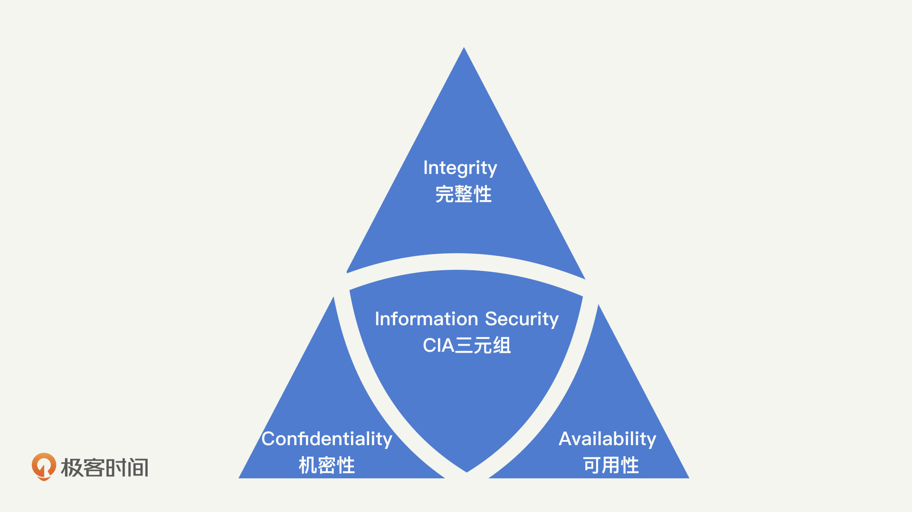

机密性用一句话来说就是，确保数据只被授权的主体访问，不被任何未授权的主体访问。 简单用一个词总结就是“不可见”。

完整性就是确保数据只被授权的主体进行授权的修改，简单来说，就是“不可改”。

可用性就是确保数据能够被授权的主体访问到 ，简单来说，就是“可读”。

在互联网企业发展初期，可用性的优先级较高。如果涉及金钱相关的业务，则完整性的优先级更高；而涉及个人隐私相关的业务，则保密性的优先级更高。

#### 1.2 该怎么取解决安全问题？知道黄金法则吗？

黄金法则主要包含三部分：认证（Authentication）、授权（Authorization）、审计（Audit）。

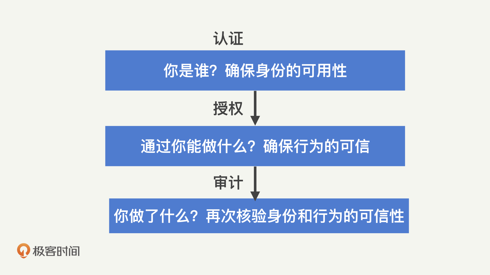

**身份识别和认证**

认证其实包括两个部分：身份识别和认证。身份识别其实就是在问“你是谁”，你会回答“你是你”。身份认证则会问“你是你吗”，那你要证明“你是你”这个回答是合法的。

认证强度由弱到强：

你知道什么（密码、密保问题等）；
你拥有什么（门禁卡、安全令牌等）；
你是什么（生物特征，指纹、人脸、虹膜等）。

**授权**

下一个需要明确的问题就是“你能做什么”。除了对“你能做什么”进行限制，授权机制还会对“你能做多少”进行限制。

**审计和问责**

“你做了什么”，这个检查的过程就是审计。当发现你做了某些异常操作时，安全还会提供你做了这些操作的“证据”，让你无法抵赖，这个过程就是问责。都需要共同的基础：日志

事前防御属于认证，事中防御属于授权，事后防御属于审计。

#### 1.3 说一说加密算法

**对称加密算法**

对称加密，代表加密和解密使用的是同一个密钥

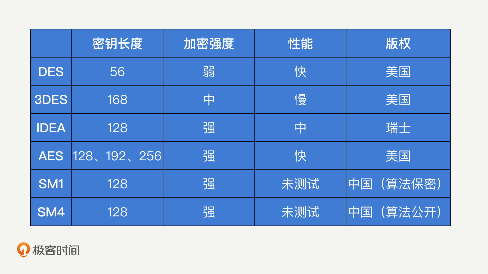

DES 实际上是一个过时的密码学算法，目前已经不推荐使用了
IDEA 的优势在于没有专利的限制
AES 是国际上最认可的密码学算法。在算力没有突破性进展的前提下，AES 在可预期的未来都是安全的。
国密算法的优点显而易见：受到国家的支持和认可。

对于大部分公司来说，选取 AES128 进行加解密运算，就能获得较高的安全性和性能。如果是金融或政府行业，在涉及国家层面的对抗上，有一定的合规需求，则需要应用国密算法。

**非对称加密算法**

非对称加密代表加密和解密使用不同的密钥。发送方公钥对信息进行加密，接收方收到密文后，使用私钥进行解密。非对称密钥其实主要解决了密钥分发的难题

非对称加密可以用于加密，发送方用接收方的公钥加密，只有拥有私钥的接收方才能解密。

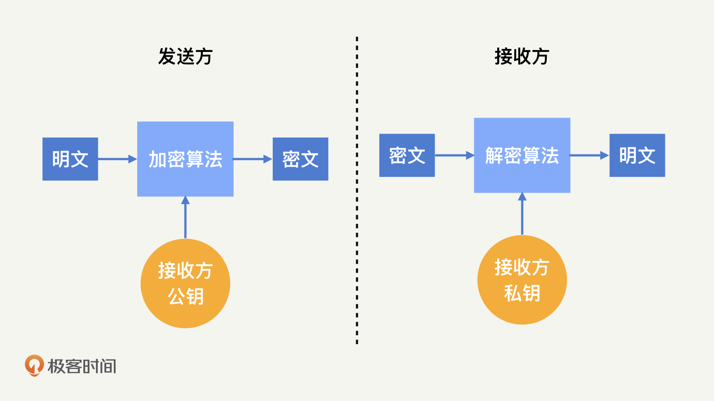

非对称加密还可以用于签名，发送方用发送方的私钥加密，接收方用发送方的公钥解密，只有拥有私钥的发送方才能发送。

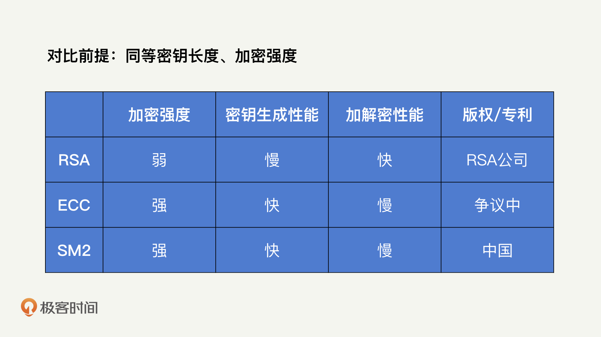

RSA 是比较经典的非对称加密算法，它的主要优势就是性能比较快，
ECC 是目前国际上加密强度最高的非对称加密算法。

**散列算法**

散列算法除了提供唯一的 id，其更大的利用价值还在于它的不可逆性。

使用散列算法的时候，一定要注意加“盐”。所谓“盐”，就是一串随机的字符，是可以公开的。即使两个用户设置了相同的密码，也会拥有不同的散列值。

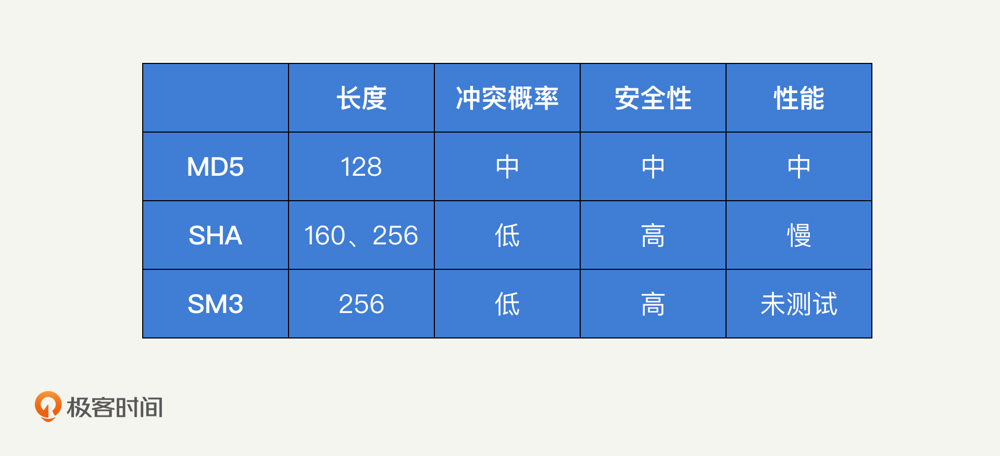

MD5 可以用来生成一个 128 位的消息摘要，它是目前应用比较普遍的散列算法，因为算法的缺陷，它的唯一性已经被破解了
SHA-256 普遍被认为是相对安全的散列算法

**适用场景：**

对称加密具备较高的安全性和性能，要优先考虑。在一对多的场景中（如多人登录服务器），存在密钥分发难题的时候，我们要使用非对称加密；不需要可逆计算的时候（如存储密码），我们就使用散列算法。

#### 1.4 怎么样做好身份识别和认证？

对外认证，其实就是应用的登录注册模块，它面向用户进行认证。
服务器的登录、数据库的登录、Git 的登录、各种内部管理后台的登录等等即对内认证。

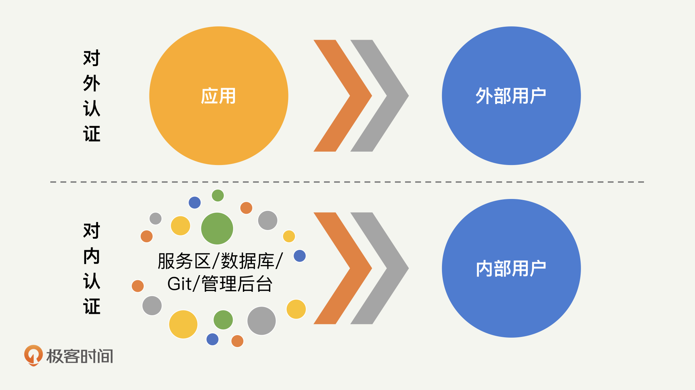

当账号体系变得越来越复杂时，如何对这些账号进行统一的管理，是解决身份认证问题的关键。而单点登录就是一个非常有效的解决方案。

单点登录（SSO）：用户只需要进行一次认证，就可以访问所有的网页、应用和其他产品了。

**CAS**（Central Authentication Service，集中式认证服务）流程

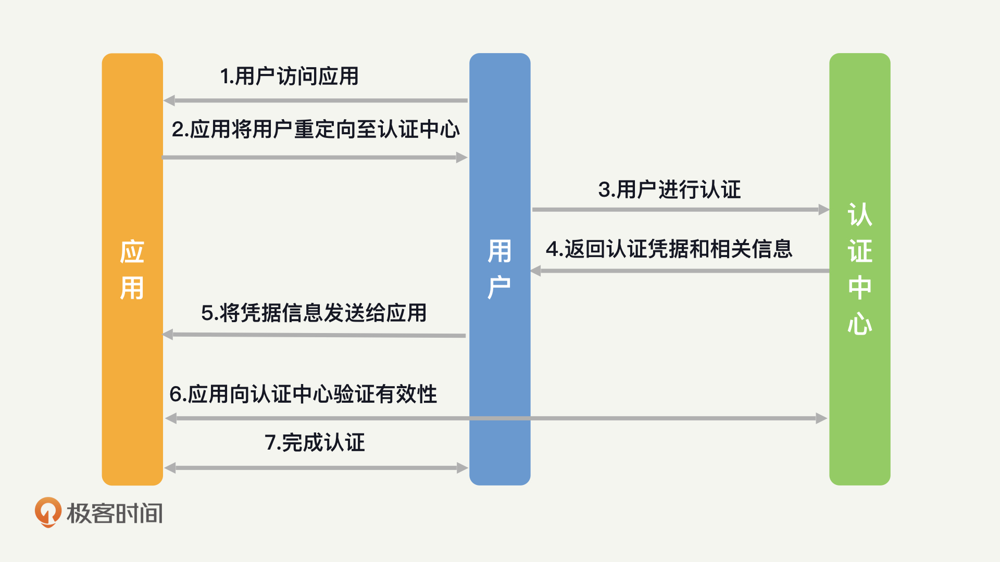

**JWT**（JSON Web Token）是一种非常轻量级的单点登录流程。它会在客户端保存一个凭证信息，之后在你每一次登录的请求中都带上这个凭证，将其作为登录状态的依据。JWT 的好处在于，不需要应用服务端去额外维护 Cookie 或者 Session 了。

**OAuth**（Open Authorization）的主要特点是授权，也是我们通常用 QQ、微信登录其他应用时所采用的协议

通过 OAuth，用户在完成了认证中心的登录之后，应用只能够验证用户确实在第三方登录了。但是，想要维持应用内的登录状态，应用还是得颁发自己的登录凭证。

**OpenID**（Open Identity Document）和 OAuth 的功能基本一致。但是，OpenID 不提供授权的功能。最常见的，当我们需要在应用中使用微信支付的时候，应用只需要收集支付相关的信息即可，并不需要获取用户的微信头像。

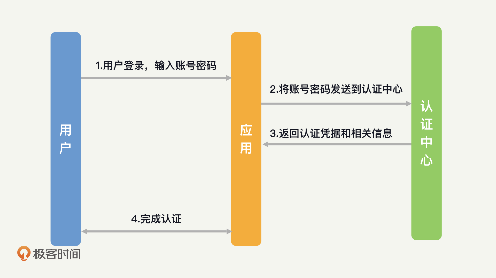

#### 1.5 如何做好授权？

访问控制模型

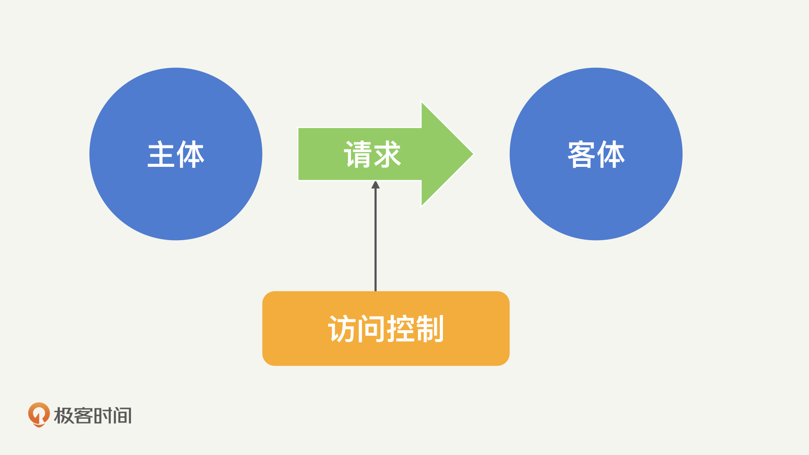

主体：请求的发起者。主体可以是用户，也可以是进程、应用、设备等任何发起访问请求的来源。
客体：请求的接收方，一般是某种资源。比如某个文件、数据库，也可以是进程、设备等接受指令的实体。
请求：主体对客体进行的操作。常规的是读、写和执行，也可以进一步细分为删除、追加等粒度更细的操作

常见的访问控制机制有 4 种：DAC、role-BAC、rule-BAC、MAC

DAC（Discretionary Access Control，自主访问控制） 就是让客体的所有者来定义访问控制规则

role-BAC（role Based Access Control，基于角色的访问控制）就是将主体划分为不同的角色，然后对每个角色的权限进行定义。管理员只需要定义好每一个角色所具备的功能权限，然后将用户划分到不同的角色中去，就完成了访问控制配置的过程。

rule-BAC（rule Based Access Control，基于规则的访问控制）就是制定某种规则，将主体、请求和客体的信息结合起来进行判定。一个典型的例子就是防火墙。防火墙通过将请求的源 IP 和端口、目标 IP 和端口、协议等特征获取到后，根据定义好的规则，来判定是否允许主体访问。

MAC（Mandatory Access Control，强制访问控制）是一种基于安全级别标签的访问控制策略，MAC 要求对所有的主体和客体都打上对应的标签，然后根据标签来制定访问控制规则。

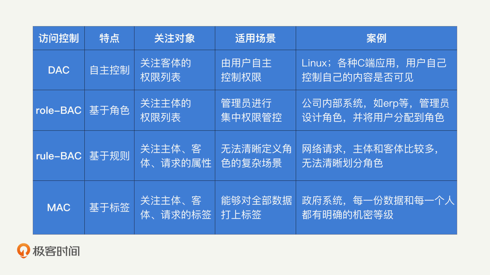

#### 1.6 什么是 XSS 攻击？

XSS 就是利用 Web 漏洞，在用户的浏览器中执行黑客定义的 JavaScript 脚本，从而窃取你的隐私信息或者仿冒你进行操作。

**持久型：**此类型的XSS漏洞经常出现在用户评论的页面，将攻击者精心构造的恶意代码保存在数据库中。如果其他的用户访问到该页面时就会触发恶意的XSS代码执行，从而窃取用户的信息。数据流向：浏览器---后端---数据库---后端---浏览器

**反射型：**当客户端进行访问某一条链接的时候，攻击者就可以将恶意的代码植入到URL中，如果服务器端未对URL的参数做判断或者是过滤，直接就返回相应页面，那么XSS攻击代码就会一起被传输到用户的浏览器，从而出发反射型XSS。

**基于 DOM：**客户端上的JS脚本可以访问浏览器的DOM并修改页面的内容，不依赖服务器的数据，直接从浏览器端获得数据并执行。

**XSS 能做什么？**

黑客可以在 JavaScript 中通过 document.cookie 获得 Cookie 信息
直接代替用户在 HTML 进行各类操作
JavaScript 还能够记录用户在浏览器中的大部分操作。比如：鼠标的轨迹、键盘输入的信息等。
通过修改 DOM，伪造一个登录框，来诱导用户在本不需要登录的页面，去输入自己的用户名和密码

**防护手段**

验证输入 OR 验证输出
编码
检测和过滤
CSP，就是在服务端返回的 HTTP header 里面添加一个 Content-Security-Policy 选项，然后定义资源的白名单域名。浏览器就会识别这个字段，并限制对非白名单资源的访问。

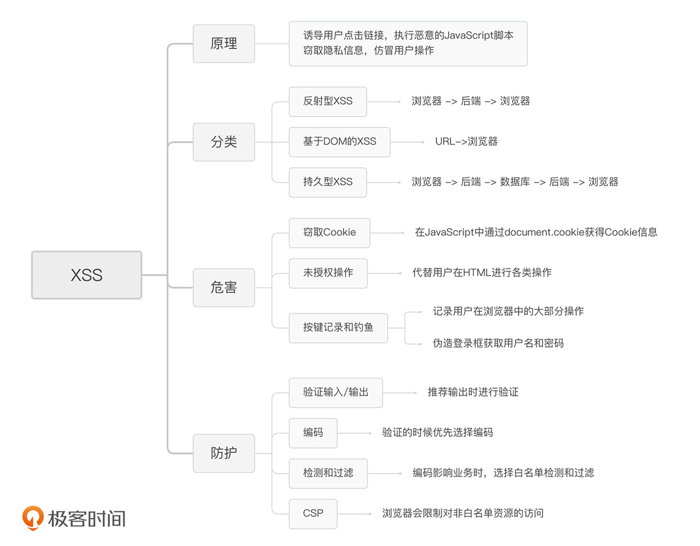

#### 1.7 什么是 SQL 注入？

注入”了一段 SQL 代码到应用中，去篡改正常的 SQL 语意

SQL 注入是在解析的过程中生效的，用户的输入会影响 SQL 解析的结果。将 SQL 语句的解析和实际执行过程分开，只在执行的过程中代入用户的操作。

**防护手段**

1. 使用 PreparedStatement
2. 使用存储过程
3. 验证输入

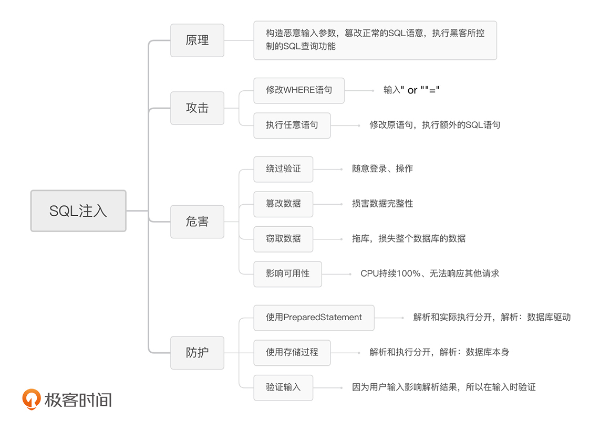

#### 1.8 什么是 CSRF\SSRF 攻击？

黑客会通过恶意 JavaScript 脚本窃取你保存在网页中的身份信息，通过仿冒你，让你的浏览器发起伪造的请求，最终执行黑客定义的操作，就是 CSRF（Cross-Site Request Forgery，跨站请求伪造）攻击。

**防护手段**

1. 我们只需要在这个接口中，加入一个黑客无法猜到的参数，就可以有效防止 CSRF 了。这就是 CSRF Token 的工作原理。

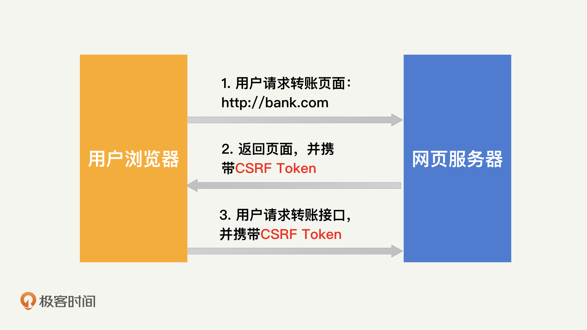

2. 二次验证，例如支付密码

只要黑客在输入中提交一个内网 URL，就能让服务端发起一个黑客定义的内网请求，从而获取到内网数据（内网探测）。这就是 SSRF（Server Side Request Forgery，服务端请求伪造）

**防护手段**

1. 白名单的限制永远是最简单、最高效的防护措施。
2. 为其他业务提供的服务接口，最好每次都进行验证

#### 1.9 什么是反序列化漏洞？

最终调用Runtime.getRuntime().exec("open -a calculator")实现命令执行的功能。

#### 1.10 开发过程中使用的插件存在漏洞吗？

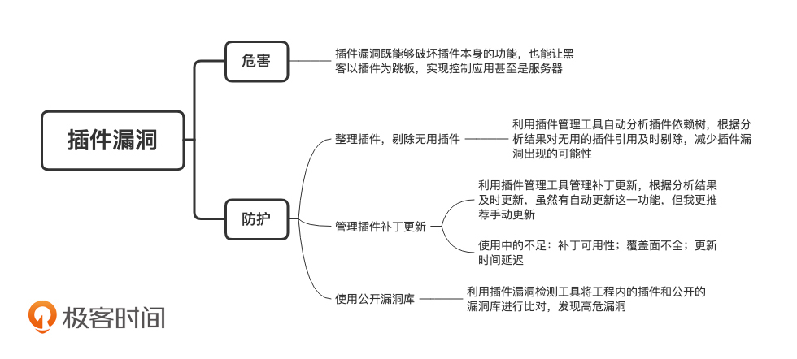

#### 1.11 什么情况下会导致信息泄露？

黑盒（Black Box Testing，功能测试）”，就是在不获取代码的情况下，直接运行应用，然后对应用的请求和响应进行扫描。

“白盒（White Box Testing，结构测试）”，即直接获取到线上的源代码，然后对它进行扫描

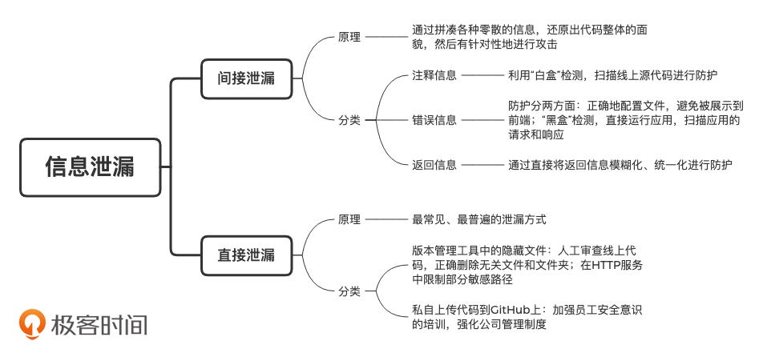

#### 1.12 权限提升和持久化？

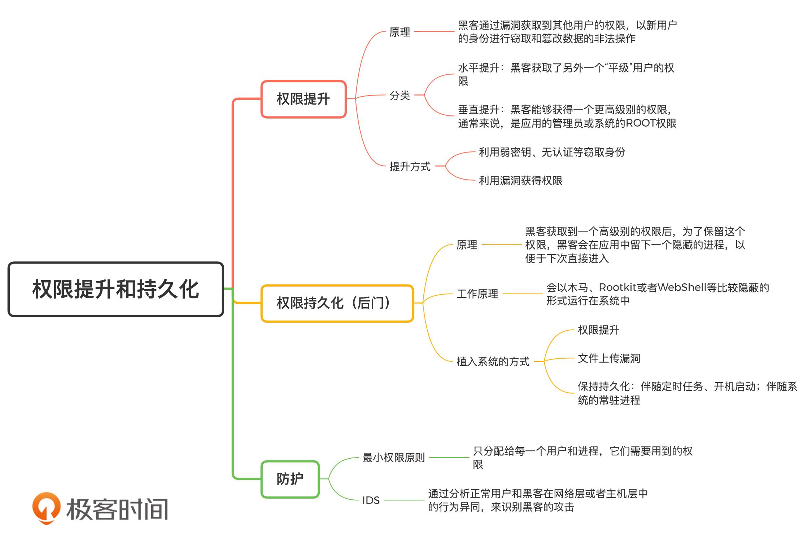

#### 1.13 了解防火墙吗？

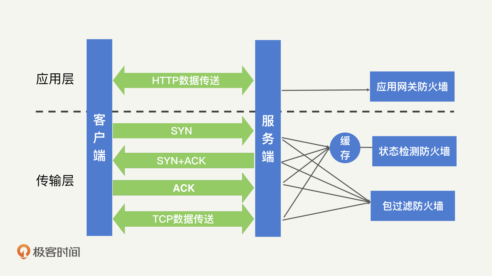

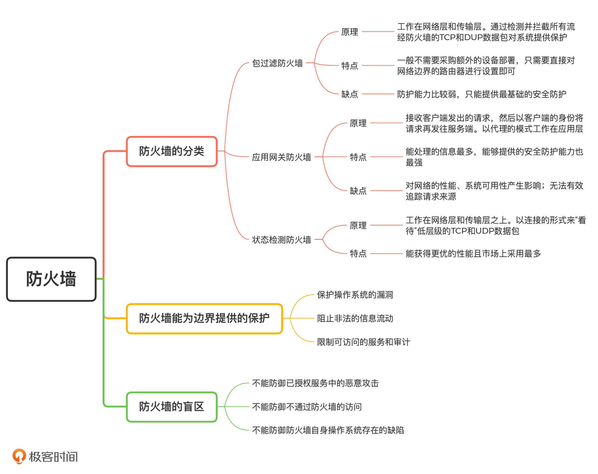

1. 保护操作系统的漏洞：拒绝对高危端口的访问

2. 阻止非法的信息流动：在网络边界之间流动的数据，往往都会受到一定的规则约束

3. 限制可访问的服务和审计：带宽使用限制和请求拦截

#### 1.14 了解 WAF 吗？

WAF（Web Application Firewall，Web 应用防护系统）的概念也就被提了出来。WAF 说白了就是应用网关防火墙的一种，它只专注于 Web 安全的防御。

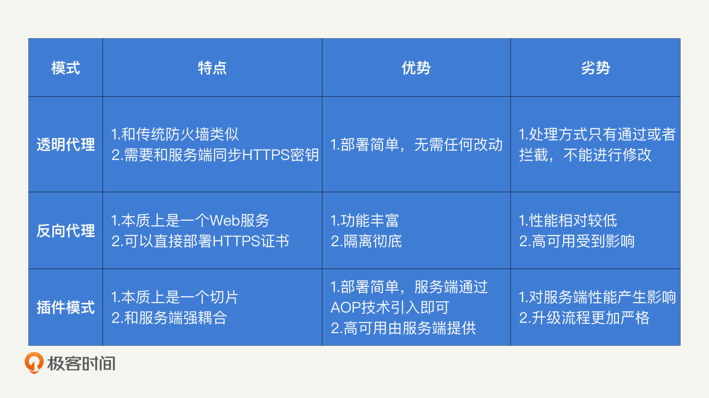

透明代理和大部分防火墙的工作模式相同：在客户端和服务端通信不需要作出任何改变的情况下，对 HTTP 流量进行请求和转发。在这个过程中，为了解密 HTTPS 流量，WAF 必须和服务端同步 HTTPS 密钥。

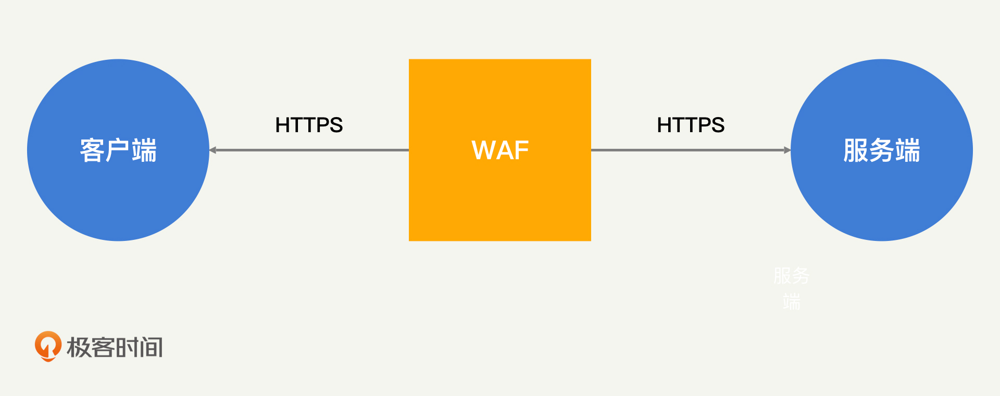

反向代理要求客户端将请求的目标地址指向 WAF，而不是服务端。在反向代理工作模式中，服务端接收的请求，实际上也是由 WAF 发起的。在这个过程中，WAF 本身就相当于一个 Web 服务，只不过对所有的 HTTP 请求都进行了转发。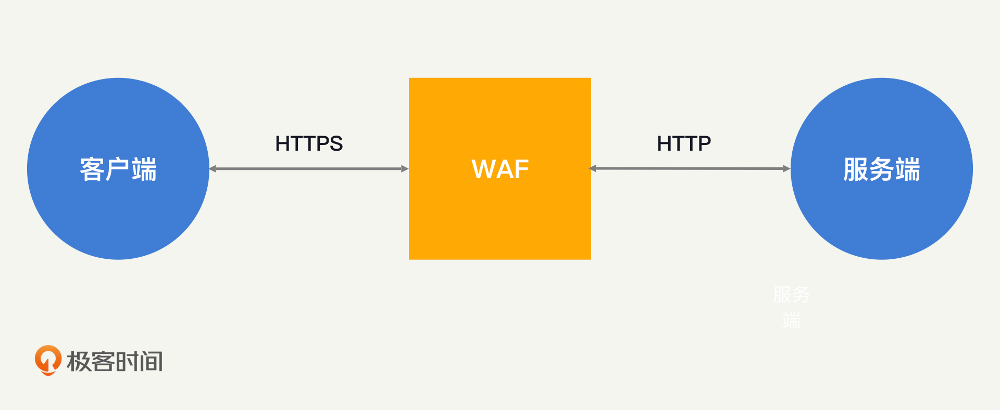

在插件模式中，WAF 不再是网络中一个独立的安全产品了，而是以插件的形式依附于 Web 服务端本身，为 Web 安全提供防护。

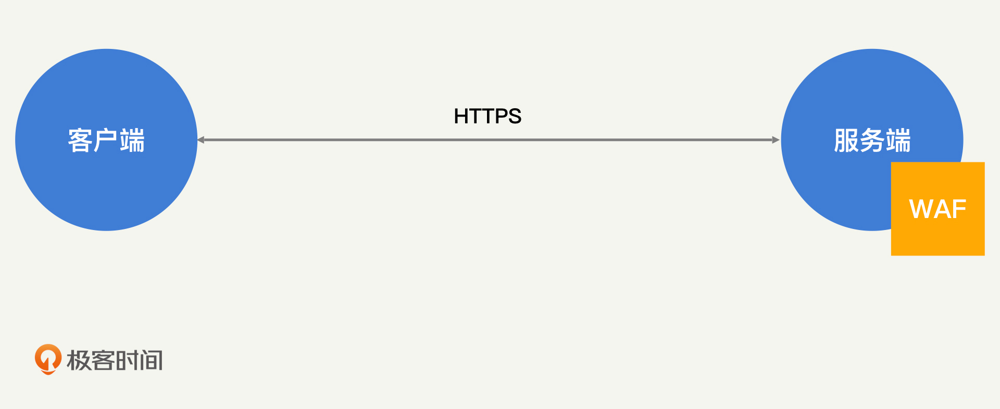

#### 1.15 了解 IDS 吗？

IDS（Intrusion Detection System，入侵检测系统）

NIDS 主要检测网络流量中的攻击行为。NIDS 一般部署在内网的网络节点（路由器或交换机）中，所有的网络请求都会流经这些网络节点，所以，NIDS 基本可以获取到对应网络节点下全部的网络行为。

HIDS 主要检测服务器系统中的攻击行为。HIDS 运行于每一个服务器中，也就相当于对系统行为进行分布式检测。

当发现了黑客的攻击行为后，IDS 会产生报警，IPS 同样会产生报警，同时会尝试对黑客的行为进行拦截。

所谓“蜜罐”，就是一台部署在内网的服务器。蜜罐内的一切行为，都是黑客产生的。

低交互蜜罐，就是蜜罐内的所有服务都是模拟的，不能提供真实的服务功能。
高交互蜜罐会提供一个真实的服务，而且不施加任何限制，只是用来做详细的记录而已

优点：

蜜罐几乎不会产生误报|
蜜罐内的所有行为都是真实的黑客攻击行为，因此数据量小、价值高
不需要已知的攻击样本，根据黑客的行为我们甚至能够发现新的攻击方式

缺点：

靠运气

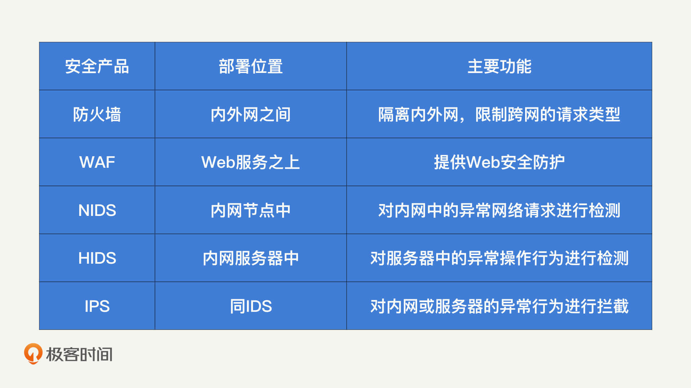

入侵检测系统架构图

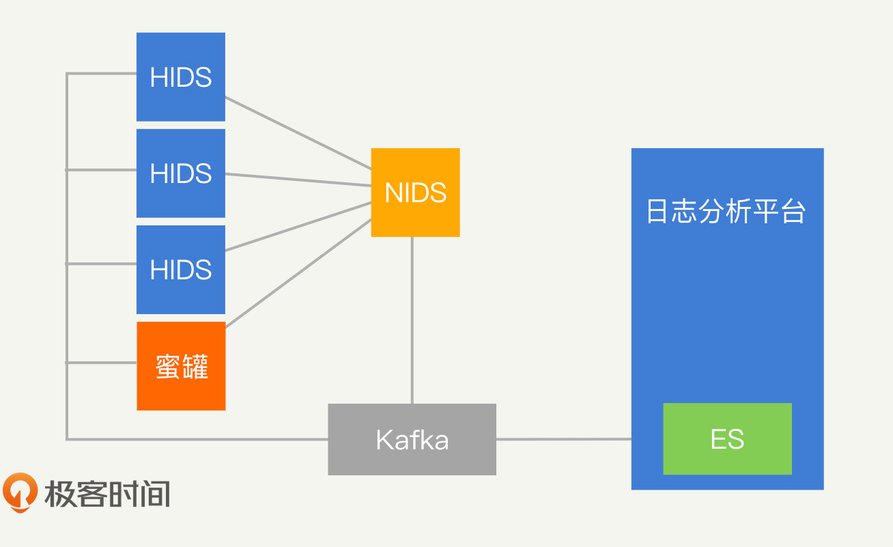

#### 1.16 了解 SDL 吗？

SDL 可以从根源上解决安全问题：通过加入安全的角色和职责，SDL 让安全贯穿软件开发的整个生命周期；通过事前的培训和事后的应急响应，SDL 为软件提供了额外的安全防护保障。

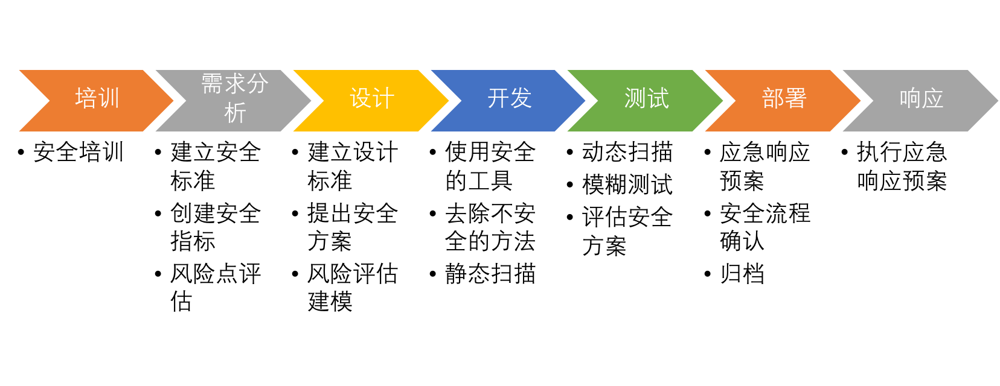

#### 1.17 了解前端安全吗？如何保证前端代码安全？

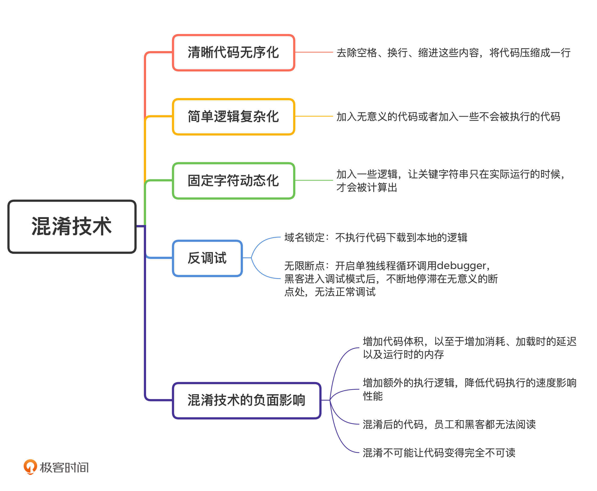

#### 1.18 什么是业务安全？如何防护？

黑产是基于正常的业务产品逻辑，采取非正常或者批量的操作，来获取利益的行为。
业务安全就是通过各类产品策略，来对黑产进行识别和拦截，从而保障业务的正常运行。

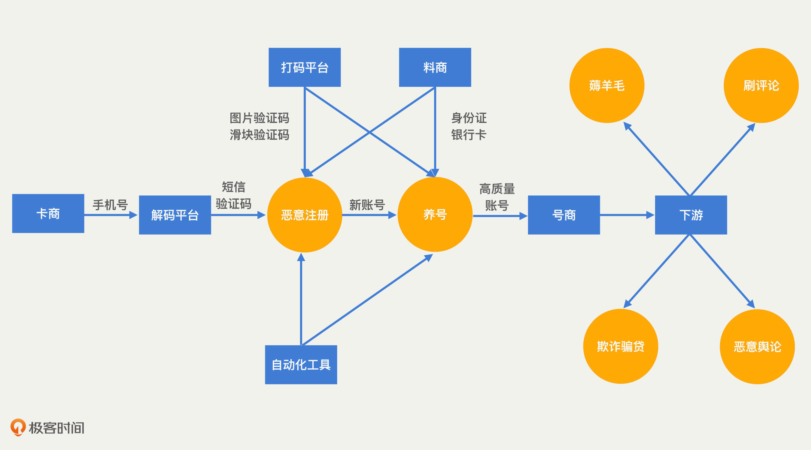

**防护手段**

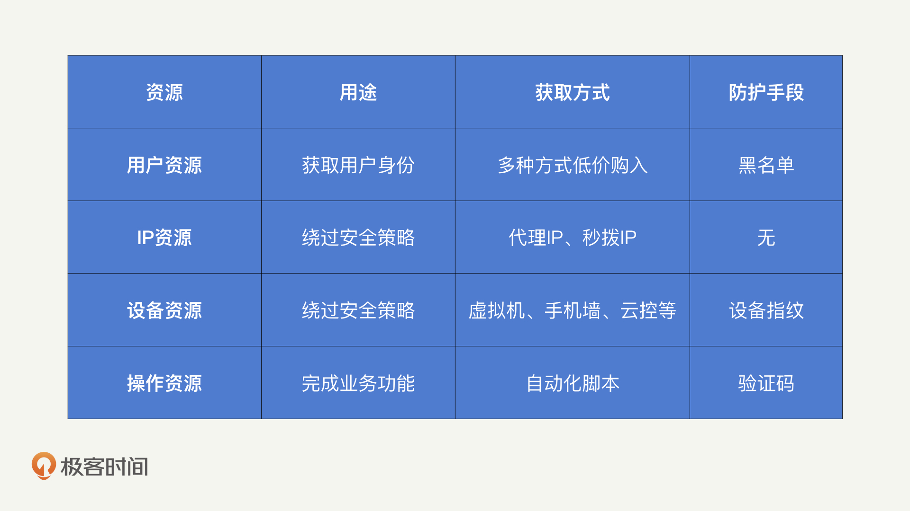