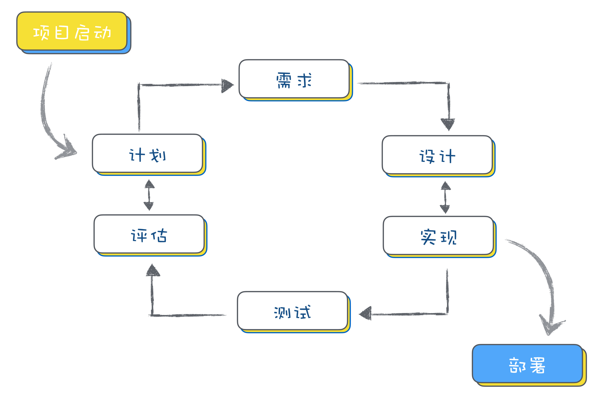
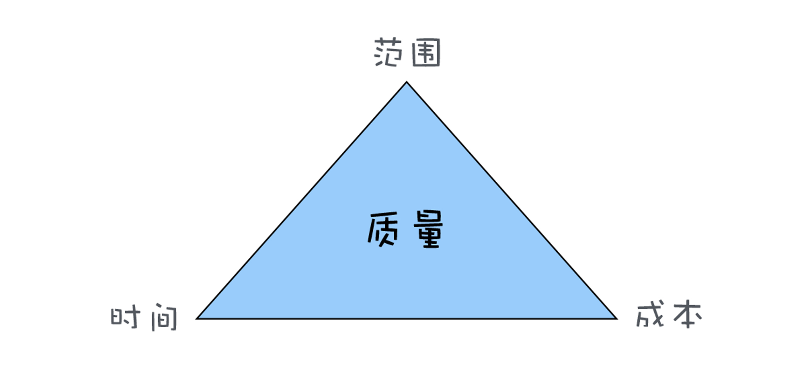

#### 1.1 什么是瀑布模型？

软件项目生命周期：需求定义与分析、设计、实现、测试、交付和维护
软件项目里的各种角色：项目经理、产品经理、架构师、程序员、测试工程师、运维工程师

瀑布模型把整个项目过程分成了六个主要阶段：
一、问题的定义及规划

这个阶段是需求方和开发方共同确定软件开发目标，同时还要做可行性研究，以确定项目可行。这个阶段会产生需求文档和可行性研究报告。

二、需求分析

对需求方提出的所有需求，进行详细的分析。这个阶段一般需要和客户反复确认，以保证能充分理解客户需求。最终会形成需求分析文档。

三、软件设计

根据需求分析的结果，对整个软件系统进行抽象和设计，如系统框架设计，数据库设计等等。最后会形成架构设计文档。

四、程序编码

将架构设计和界面设计的结果转换成计算机能运行的程序代码。

五、软件测试

在编码完成后，对可运行的结果对照需求分析文档进行严密的测试。如果测试发现问题，需要修复。最终测试完成后，形成测试报告。

六、运行维护

软件开发完成，正式运行投入使用。后续需要继续维护，修复错误和增加功能。交付时需要提供使用说明文档。

#### 1.2 除了瀑布模型，还有其他模型吗？

**快速原型模式**：就是为了要解决客户的需求不明确和需求多变的问题。

先迅速建造一个可以运行的软件原型，然后收集用户反馈，再反复修改确认，使开发出的软件能真正反映用户需求，这种开发模型就叫快速原型模型。

**增量模型**是按照功能模块来拆分

**迭代模型**则是按照时间来拆分，看单位时间内能完成多少功能

**MVP 模型**一开始只推出最核心的功能，满足用户最核心的需求，然后在用户的使用过程中收集反馈，进一步升级迭代

#### 什么是敏捷开发？

这些年敏捷开发，已经逐步发展出一套 “Scrum + 极限编程 + 看板” 的最佳实践，Scrum 主要用来管理项目过程，极限编程重点在工程实践，而看板将工作流可视化。

**一切工作任务围绕 Ticket 开展**

所谓的看板，就是把白板分成几个栏，每一栏为一类，分别写着“To Do（待选取）”、“In Progress（进行中）”、“Done（完成）”等

**基于 Git 和 CI 的开发流程**

代码审查（Code Review）和自动化测试

创建一个干净的运行环境，把你提交的代码下载下来，再下载安装所有依赖项，然后运行你的所有测试代码，运行完后，把测试结果报告给你。测试结果直观的反馈在 PR 上，绿色表示通过，红色表示不通过。

#### 1.3 什么是软件管理金三角？

软件质量（产品的质量，客户的满意度）与范围（需要实现多少功能）、时间（多久可以完成）、成本（花多少钱）四个要素之间的平衡。

#### 1.4 如何进行可行性分析？

经济可行性。从成本和收益角度分析，看投入产出比。不仅要分析短期利益，还要分析长期利益，看是不是值得做。

技术可行性。软件项目最终是需要人通过技术来实现的，所以要分析技术上是不是可行，如果有技术上解决不了的问题又能否规避。

社会可行性。社会可行性涉及法律、道德、社会影响等社会因素。比如，触犯国家法律的事情肯定不能做；产品如若不符合道德标准，可能带来较大的社会负面影响，那么也要慎重考虑。

#### 1.5 如何进行软件项目管理？

#### 1.6 如何制定项目计划？

第一步：任务分解；

把要做的事情，按照一个树形结构去组织，逐级分解，分割成小而具体的可交付结果，直到不能再拆分为止

第二步：估算时间；

任务分解完之后，你就需要对每一个任务估算时间

第三步：排任务路径。

项目中有些任务是可以并行做的，而有些任务之间则是有依赖关系的

#### 1.7 如何制定流程规范？

第一步：明确要解决的问题
第二步：提出解决方案

敏捷开发的流程
代码规范
源代码管理流程
部署流程

第三步：达成共识，推广执行
第四步： 持续优化，不断改进

#### 1.8 如何进行风险管理？

10 个项目死亡的信号：第一版做太多功能 ;
太依赖新技术平台；
与公司另一个有份量的产品竞争；
团队人手不足；
复杂的问题，需要复杂的解法；
成员开始隐藏进度落后的事实和原因；
不断更改、增加的需求 ；
2.0 症候群 - 非要更大、更强、更美 ；
产品没有市场立足点；
你根本无法解决的大问题。

#### 1.9 如何进行需求分析？

收集需求：对用户需求进行收集整理；

- 头脑风暴：就是大家一起开会头脑风暴讨论；
- 用户调研：通过调查问卷或者访谈，通过问用户一些问题收集反馈；
- 竞品分析：通过分析其他同类产品的功能获得需求；
- 快速原型：通过原型来收集反馈，收集确认需求。

分析需求：对需求进行分析，挖掘用户真实需求；

- 表层需求：用户对解决问题的期望，例如马车更快；
- 深层需求：用户的深层次动机，诉求产生的原因，例如乘客对出行速度的要求；
- 底层需求：人性本能的需求，例如对安全感对舒适的追求。

需求评估：筛选过滤掉不可行的需求；

KANO 模型：

- 红色曲线，是用户认为必须要有的功能；
- 绿色曲线，就是用户明确提出的需求；
- 黄色曲线，属于兴奋型需求，就是用户自己没想到，超出预期的功能。

需求设计：针对用户需求提出解决方案，设计成产品方案；

在需求设计的时候，可以用草图、原型设计工具、界面设计工具进行设计。

- 低保真原型设计：通过线框图可以直观地看到界面上有什么，布局是什么样的，一样可以用来和客户确认需求。
- 中等保真原型设计：制作出来的原型，也不能做到 100% 真实，因为它在界面的真实度、色彩上要比最终产品差一些。
- 高保真原型设计：高保真原型确认最终的交互和 UI 设计。

验证需求：验证方案是否可行。

AB 测试：设计好一个功能上线后，并不直接让所有用户使用，而是先给一小部分用户使用，然后分析数据，看使用这个功能的用户群和不使用这个功能的用户群，如果好，就加大比例，如果数据不好，可能就会调整甚至取消这个功能。

#### 1.10 如何面对频繁的需求变更？

- 提升需求确定性；
- 提高需求变更的成本；
- 降低响应需求变更的成本。

#### 1.11 如何进行架构设计？

架构设计是用最小的人力成本来满足需求的开发和响应需求的变化，用最小的运行成本来保障软件的运行。

架构设计可以通过四个基本步骤：
第一步：分析需求；
第二步：选择相似的成熟的架构设计方案；
第三步：自顶向下层层细化；
第四步：验证和优化架构设计方案。

#### 1.12 软件工程师核心竞争力

最底层、最基础的就是学习能力，通过学习能力，快速学习掌握新技术；

- 首先需要在一个技术领域深耕
- 然后往相近的领域逐步横向拓展

中间一层就是解决问题的能力，充分利用学到的技术，去发现问题、分析问题和解决问题；

- 第一步：明确问题
- 第二步：拆分和定位问题
- 第三步：提出解决方案并总结

最上一层就是影响力，是核心竞争力的综合体现。

- 在某个领域做出了足够牛的成绩
- 做事情超出预期
- 分享就是学习和打造影响力

#### 1.13 程序员的价值

价值体现在你所做的产品之上和价值体现在团队中的稀缺性。

产品意识：

**商业意识**，就是所做的产品是要有商业价值的。
**用户意识**，就是说做产品时，你要能挖掘出用户的真实需求，让产品有好的用户体验。这需要你要有同理心，能站在用户的角度去思考和体验产品。
**数据意识**，就是在产品设计、产品运营时，通过数据来发现问题、证实结果

