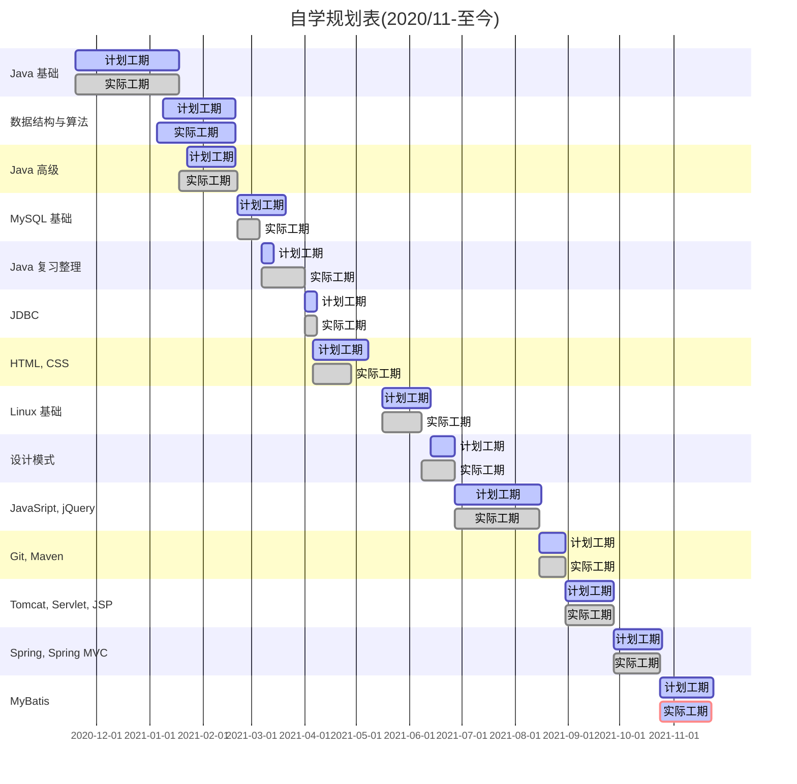

# MyNotes

<b>自学，看书为主，视频为辅。</b>

学习时间安排：

-   工作日
    11:30-2:00
    20:30-23:00 
-   周六 14:00-23:00 
-   周日 9:00-13:00, 18:00-23:00

#### **计划任务**

- [ ] Vue

- [ ] Redis

- [ ] 微服务

- [ ] MySQL 优化

- [ ] JVM

- [ ] 计算机组成原理

- [ ] 操作系统

- [ ] 计算机网络

- [ ] 数据结构与算法

- [ ] 数据库原理

- [ ] 编译原理

#### **参考书目**

1. [Java从小白到大牛](https://book.douban.com/subject/30582203/)
2. [MySQL必知必会](https://book.douban.com/subject/3354490/)
3. [HTML5与CSS3基础教程（第8版）](https://book.douban.com/subject/25878992/)
4. [JavaScript高级程序设计（第4版）](https://book.douban.com/subject/35175321/)
5. [研磨设计模式](https://book.douban.com/subject/5343318/)
6. [connector-j-8.0-en.a4](https://dev.mysql.com/doc/connector-j/8.0/en/)
7. [maven_the_reference_guide](https://lemus.webs.upv.es/wordpress/wp-content/uploads/2018/03/maven_the_reference_guide.pdf)
8. [maven 实战](https://book.douban.com/subject/5345682/)
9. [Pro Git](https://git-scm.com/book/en/v2)
10. [Tomcat与Java Web开发技术详解（第3版）](https://book.douban.com/subject/34780582/)
11. [Spring实战（第4版）](https://book.douban.com/subject/26767354/)
12. [Spring MVC学习指南（第2版）](https://book.douban.com/subject/30188611/)
13. [MyBatis从入门到精通](https://book.douban.com/subject/27074809/)
14. [MyBatis技术内幕](https://book.douban.com/subject/27087564/)

#### **参考视频**

1. [尚硅谷Java零基础入门教程](https://www.bilibili.com/video/BV1Kb411W75N?spm_id_from=333.999.0.0)
2. [MySQL基础教程](https://www.bilibili.com/video/BV1xW411u7ax?spm_id_from=333.999.0.0)

#### **官方文档**

1. [Spring Web MVC](https://docs.spring.io/spring-framework/docs/current/reference/html/web.html#mvc)
2. [Thymeleaf](https://www.thymeleaf.org/doc/tutorials/3.0/usingthymeleaf.html)
3. [MyBatis](https://mybatis.org/mybatis-3/)

持续更新中......

